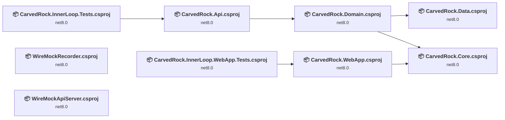
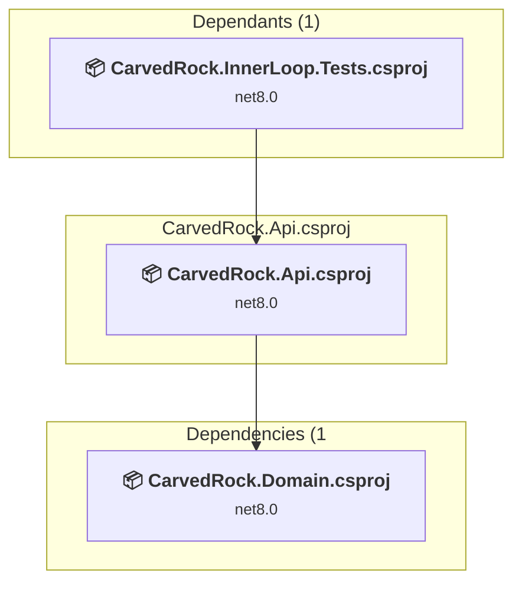
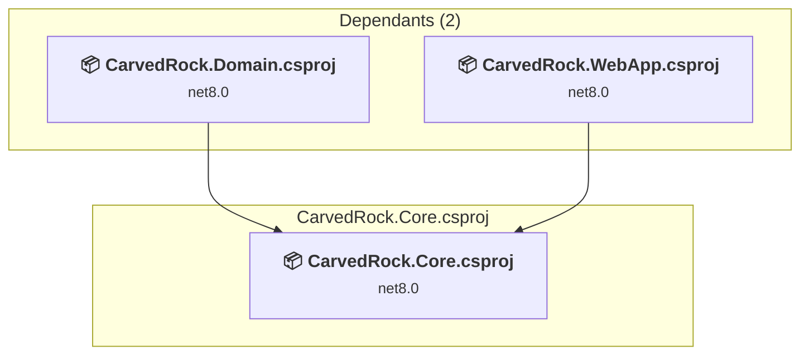
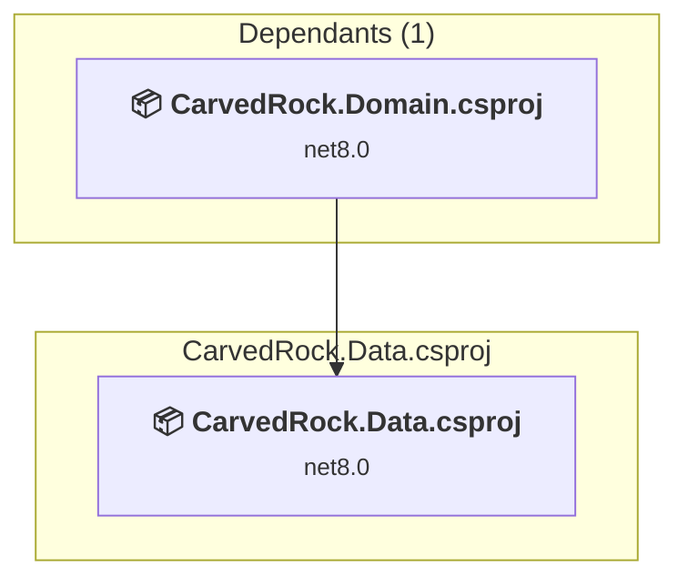
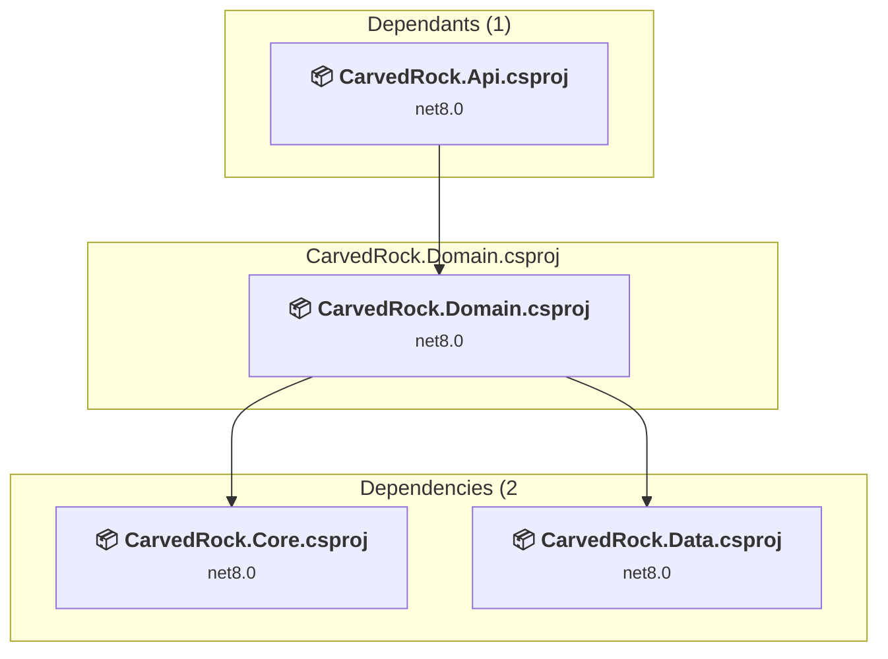
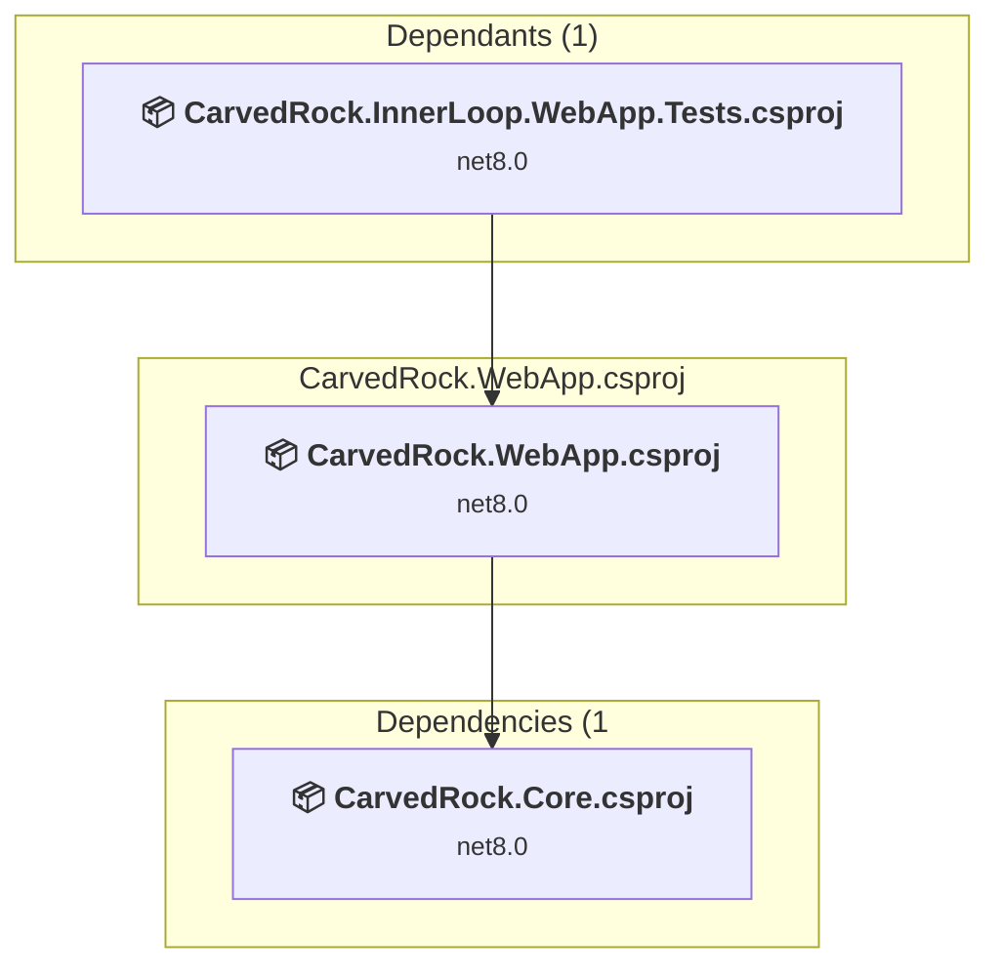
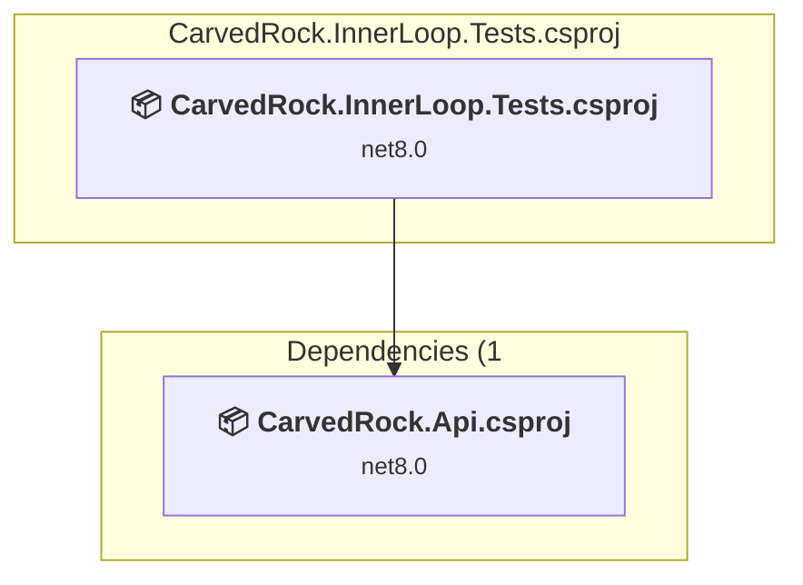
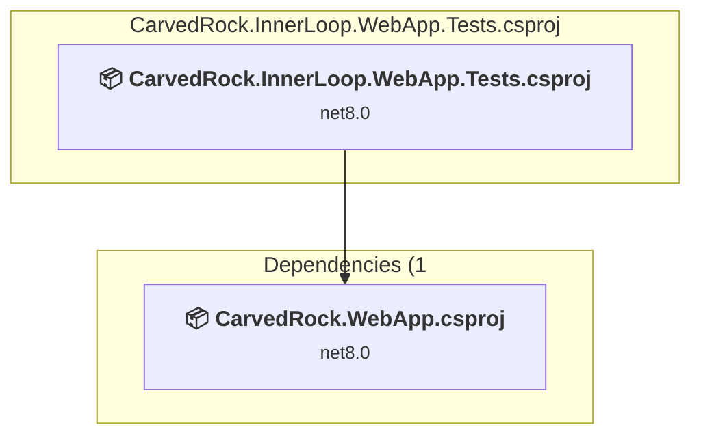
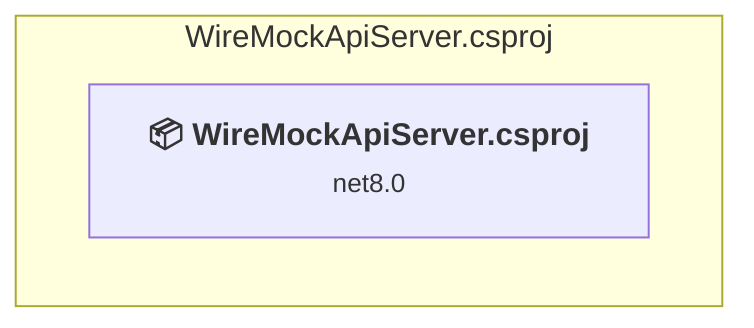
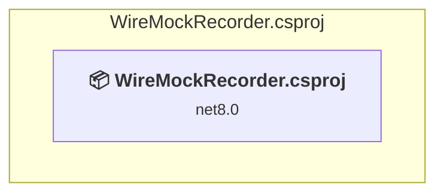

# Projects and dependencies analysis

This document provides a comprehensive overview of the projects and their dependencies in the context of upgrading to .NETCoreApp,Version=v10.0.

## Table of Contents

- [Executive Summary](#executive-Summary)
  - [Highlevel Metrics](#highlevel-metrics)
  - [Projects Compatibility](#projects-compatibility)
  - [Package Compatibility](#package-compatibility)
  - [API Compatibility](#api-compatibility)
  - [Binding Redirect Configuration](#binding-redirect-configuration)
- [Aggregate NuGet packages details](#aggregate-nuget-packages-details)
- [Top API Migration Challenges](#top-api-migration-challenges)
  - [Technologies and Features](#technologies-and-features)
  - [Most Frequent API Issues](#most-frequent-api-issues)
- [Projects Relationship Graph](#projects-relationship-graph)
- [Project Details](#project-details)

  - [CarvedRock.Api\CarvedRock.Api.csproj](#carvedrockapicarvedrockapicsproj)
  - [CarvedRock.Core\CarvedRock.Core.csproj](#carvedrockcorecarvedrockcorecsproj)
  - [CarvedRock.Data\CarvedRock.Data.csproj](#carvedrockdatacarvedrockdatacsproj)
  - [CarvedRock.Domain\CarvedRock.Domain.csproj](#carvedrockdomaincarvedrockdomaincsproj)
  - [CarvedRock.WebApp\CarvedRock.WebApp.csproj](#carvedrockwebappcarvedrockwebappcsproj)
  - [tests\CarvedRock.InnerLoop.Tests\CarvedRock.InnerLoop.Tests.csproj](#testscarvedrockinnerlooptestscarvedrockinnerlooptestscsproj)
  - [tests\CarvedRock.InnerLoop.WebApp.Tests\CarvedRock.InnerLoop.WebApp.Tests.csproj](#testscarvedrockinnerloopwebapptestscarvedrockinnerloopwebapptestscsproj)
  - [tools\WireMockApiServer\WireMockApiServer.csproj](#toolswiremockapiserverwiremockapiservercsproj)
  - [tools\WireMockRecorder\WireMockRecorder.csproj](#toolswiremockrecorderwiremockrecordercsproj)

## Executive Summary

### Highlevel Metrics

| Metric | Count | Status |
| :--- | :---: | :--- |
| Total Projects | 9 | All require upgrade |
| Total NuGet Packages | 427 | 14 need upgrade |
| Total Code Files | 73 |  |
| Total Code Files with Incidents | 25 |  |
| Total Lines of Code | 3513 |  |
| Total Number of Issues | 109 |  |
| Estimated LOC to modify | 83+ | at least 2.4% of codebase |

### Projects Compatibility

| Project | Target Framework | Difficulty | Package Issues | API Issues | Binding Issues | Est. LOC Impact | Description |
| :--- | :---: | :---: | :---: | :---: | :---: | :---: | :--- |
| [CarvedRock.Api\CarvedRock.Api.csproj](#carvedrockapicarvedrockapicsproj) | net8.0 | 🟢 Low | 4 | 15 | 0 | 15+ | AspNetCore, Sdk Style = True |
| [CarvedRock.Core\CarvedRock.Core.csproj](#carvedrockcorecarvedrockcorecsproj) | net8.0 | 🟢 Low | 0 | 0 | 0 |  | ClassLibrary, Sdk Style = True |
| [CarvedRock.Data\CarvedRock.Data.csproj](#carvedrockdatacarvedrockdatacsproj) | net8.0 | 🟢 Low | 4 | 0 | 0 |  | ClassLibrary, Sdk Style = True |
| [CarvedRock.Domain\CarvedRock.Domain.csproj](#carvedrockdomaincarvedrockdomaincsproj) | net8.0 | 🟢 Low | 2 | 2 | 0 | 2+ | ClassLibrary, Sdk Style = True |
| [CarvedRock.WebApp\CarvedRock.WebApp.csproj](#carvedrockwebappcarvedrockwebappcsproj) | net8.0 | 🟢 Low | 1 | 34 | 0 | 34+ | AspNetCore, Sdk Style = True |
| [tests\CarvedRock.InnerLoop.Tests\CarvedRock.InnerLoop.Tests.csproj](#testscarvedrockinnerlooptestscarvedrockinnerlooptestscsproj) | net8.0 | 🟢 Low | 2 | 12 | 0 | 12+ | AspNetCore, Sdk Style = True |
| [tests\CarvedRock.InnerLoop.WebApp.Tests\CarvedRock.InnerLoop.WebApp.Tests.csproj](#testscarvedrockinnerloopwebapptestscarvedrockinnerloopwebapptestscsproj) | net8.0 | 🟢 Low | 3 | 15 | 0 | 15+ | AspNetCore, Sdk Style = True |
| [tools\WireMockApiServer\WireMockApiServer.csproj](#toolswiremockapiserverwiremockapiservercsproj) | net8.0 | 🟢 Low | 0 | 0 | 0 |  | DotNetCoreApp, Sdk Style = True |
| [tools\WireMockRecorder\WireMockRecorder.csproj](#toolswiremockrecorderwiremockrecordercsproj) | net8.0 | 🟢 Low | 1 | 5 | 0 | 5+ | DotNetCoreApp, Sdk Style = True |

### Package Compatibility

| Status | Count | Percentage |
| :--- | :---: | :---: |
| ✅ Compatible | 413 | 96.7% |
| ⚠️ Incompatible | 1 | 0.2% |
| 🔄 Upgrade Recommended | 13 | 3.0% |
| ***Total NuGet Packages*** | ***427*** | ***100%*** |

### API Compatibility

| Category | Count | Impact |
| :--- | :---: | :--- |
| 🔴 Binary Incompatible | 13 | High - Require code changes |
| 🟡 Source Incompatible | 19 | Medium - Needs re-compilation and potential conflicting API error fixing |
| 🔵 Behavioral change | 51 | Low - Behavioral changes that may require testing at runtime |
| ✅ Compatible | 7205 |  |
| ***Total APIs Analyzed*** | ***7288*** |  |

## Aggregate NuGet packages details

| Package | Current Version | Suggested Version | Projects | Description |
| :--- | :---: | :---: | :--- | :--- |
| AngleSharp | 1.1.2 | 1.8.2 | [CarvedRock.InnerLoop.WebApp.Tests.csproj](#testscarvedrockinnerloopwebapptestscarvedrockinnerloopwebapptestscsproj) | NuGet package contains security vulnerability |
| AnyOf | 0.3.0 |  | [CarvedRock.InnerLoop.Tests.csproj](#testscarvedrockinnerlooptestscarvedrockinnerlooptestscsproj) [CarvedRock.InnerLoop.WebApp.Tests.csproj](#testscarvedrockinnerloopwebapptestscarvedrockinnerloopwebapptestscsproj) [WireMockApiServer.csproj](#toolswiremockapiserverwiremockapiservercsproj) [WireMockRecorder.csproj](#toolswiremockrecorderwiremockrecordercsproj) | ✅Compatible |
| AspNetCore.HealthChecks.OpenIdConnectServer | 7.0.0 |  | [CarvedRock.InnerLoop.WebApp.Tests.csproj](#testscarvedrockinnerloopwebapptestscarvedrockinnerloopwebapptestscsproj) [CarvedRock.WebApp.csproj](#carvedrockwebappcarvedrockwebappcsproj) | ✅Compatible |
| AutoMapper | 13.0.1 | 16.2.0 | [CarvedRock.Api.csproj](#carvedrockapicarvedrockapicsproj) [CarvedRock.Domain.csproj](#carvedrockdomaincarvedrockdomaincsproj) [CarvedRock.InnerLoop.Tests.csproj](#testscarvedrockinnerlooptestscarvedrockinnerlooptestscsproj) | NuGet package contains security vulnerability |
| Azure.Core | 1.35.0 |  | [CarvedRock.Api.csproj](#carvedrockapicarvedrockapicsproj) [CarvedRock.Data.csproj](#carvedrockdatacarvedrockdatacsproj) [CarvedRock.Domain.csproj](#carvedrockdomaincarvedrockdomaincsproj) [CarvedRock.InnerLoop.Tests.csproj](#testscarvedrockinnerlooptestscarvedrockinnerlooptestscsproj) | ✅Compatible |
| Azure.Identity | 1.10.3 |  | [CarvedRock.Api.csproj](#carvedrockapicarvedrockapicsproj) [CarvedRock.Data.csproj](#carvedrockdatacarvedrockdatacsproj) [CarvedRock.Domain.csproj](#carvedrockdomaincarvedrockdomaincsproj) [CarvedRock.InnerLoop.Tests.csproj](#testscarvedrockinnerlooptestscarvedrockinnerlooptestscsproj) | ✅Compatible |
| Bogus | 35.5.0 |  | [CarvedRock.InnerLoop.Tests.csproj](#testscarvedrockinnerlooptestscarvedrockinnerlooptestscsproj) [CarvedRock.InnerLoop.WebApp.Tests.csproj](#testscarvedrockinnerloopwebapptestscarvedrockinnerloopwebapptestscsproj) | ✅Compatible |
| BouncyCastle.Cryptography | 2.2.1 |  | [CarvedRock.InnerLoop.Tests.csproj](#testscarvedrockinnerlooptestscarvedrockinnerlooptestscsproj) | ✅Compatible |
| Castle.Core | 5.1.1 |  | [CarvedRock.InnerLoop.Tests.csproj](#testscarvedrockinnerlooptestscarvedrockinnerlooptestscsproj) [CarvedRock.InnerLoop.WebApp.Tests.csproj](#testscarvedrockinnerloopwebapptestscarvedrockinnerloopwebapptestscsproj) | ✅Compatible |
| coverlet.collector | 6.0.1 |  | [CarvedRock.InnerLoop.Tests.csproj](#testscarvedrockinnerlooptestscarvedrockinnerlooptestscsproj) | ✅Compatible |
| coverlet.collector | 6.0.2 |  | [CarvedRock.InnerLoop.WebApp.Tests.csproj](#testscarvedrockinnerloopwebapptestscarvedrockinnerloopwebapptestscsproj) | ✅Compatible |
| Docker.DotNet | 3.125.15 |  | [CarvedRock.InnerLoop.Tests.csproj](#testscarvedrockinnerlooptestscarvedrockinnerlooptestscsproj) [CarvedRock.InnerLoop.WebApp.Tests.csproj](#testscarvedrockinnerloopwebapptestscarvedrockinnerloopwebapptestscsproj) | ✅Compatible |
| Docker.DotNet.X509 | 3.125.15 |  | [CarvedRock.InnerLoop.Tests.csproj](#testscarvedrockinnerlooptestscarvedrockinnerlooptestscsproj) [CarvedRock.InnerLoop.WebApp.Tests.csproj](#testscarvedrockinnerloopwebapptestscarvedrockinnerloopwebapptestscsproj) | ✅Compatible |
| Fare | 2.2.0 |  | [CarvedRock.InnerLoop.Tests.csproj](#testscarvedrockinnerlooptestscarvedrockinnerlooptestscsproj) [CarvedRock.InnerLoop.WebApp.Tests.csproj](#testscarvedrockinnerloopwebapptestscarvedrockinnerloopwebapptestscsproj) [WireMockApiServer.csproj](#toolswiremockapiserverwiremockapiservercsproj) [WireMockRecorder.csproj](#toolswiremockrecorderwiremockrecordercsproj) | ✅Compatible |
| FluentValidation | 11.9.0 |  | [CarvedRock.Api.csproj](#carvedrockapicarvedrockapicsproj) [CarvedRock.Domain.csproj](#carvedrockdomaincarvedrockdomaincsproj) [CarvedRock.InnerLoop.Tests.csproj](#testscarvedrockinnerlooptestscarvedrockinnerlooptestscsproj) | ✅Compatible |
| FluentValidation.DependencyInjectionExtensions | 11.9.0 |  | [CarvedRock.Api.csproj](#carvedrockapicarvedrockapicsproj) [CarvedRock.Domain.csproj](#carvedrockdomaincarvedrockdomaincsproj) [CarvedRock.InnerLoop.Tests.csproj](#testscarvedrockinnerlooptestscarvedrockinnerlooptestscsproj) | ✅Compatible |
| GraphQL | 7.5.0 |  | [CarvedRock.InnerLoop.Tests.csproj](#testscarvedrockinnerlooptestscarvedrockinnerlooptestscsproj) [CarvedRock.InnerLoop.WebApp.Tests.csproj](#testscarvedrockinnerloopwebapptestscarvedrockinnerloopwebapptestscsproj) [WireMockApiServer.csproj](#toolswiremockapiserverwiremockapiservercsproj) [WireMockRecorder.csproj](#toolswiremockrecorderwiremockrecordercsproj) | ✅Compatible |
| GraphQL.NewtonsoftJson | 7.5.0 |  | [CarvedRock.InnerLoop.Tests.csproj](#testscarvedrockinnerlooptestscarvedrockinnerlooptestscsproj) [CarvedRock.InnerLoop.WebApp.Tests.csproj](#testscarvedrockinnerloopwebapptestscarvedrockinnerloopwebapptestscsproj) [WireMockApiServer.csproj](#toolswiremockapiserverwiremockapiservercsproj) [WireMockRecorder.csproj](#toolswiremockrecorderwiremockrecordercsproj) | ✅Compatible |
| GraphQL-Parser | 8.3.0 |  | [CarvedRock.InnerLoop.Tests.csproj](#testscarvedrockinnerlooptestscarvedrockinnerlooptestscsproj) [CarvedRock.InnerLoop.WebApp.Tests.csproj](#testscarvedrockinnerloopwebapptestscarvedrockinnerloopwebapptestscsproj) [WireMockApiServer.csproj](#toolswiremockapiserverwiremockapiservercsproj) [WireMockRecorder.csproj](#toolswiremockrecorderwiremockrecordercsproj) | ✅Compatible |
| Handlebars.Net | 2.1.4 |  | [CarvedRock.InnerLoop.Tests.csproj](#testscarvedrockinnerlooptestscarvedrockinnerlooptestscsproj) [CarvedRock.InnerLoop.WebApp.Tests.csproj](#testscarvedrockinnerloopwebapptestscarvedrockinnerloopwebapptestscsproj) [WireMockApiServer.csproj](#toolswiremockapiserverwiremockapiservercsproj) [WireMockRecorder.csproj](#toolswiremockrecorderwiremockrecordercsproj) | ✅Compatible |
| Handlebars.Net.Helpers | 2.4.1.4 |  | [CarvedRock.InnerLoop.Tests.csproj](#testscarvedrockinnerlooptestscarvedrockinnerlooptestscsproj) [CarvedRock.InnerLoop.WebApp.Tests.csproj](#testscarvedrockinnerloopwebapptestscarvedrockinnerloopwebapptestscsproj) [WireMockApiServer.csproj](#toolswiremockapiserverwiremockapiservercsproj) [WireMockRecorder.csproj](#toolswiremockrecorderwiremockrecordercsproj) | ✅Compatible |
| Handlebars.Net.Helpers.Core | 2.4.1.4 |  | [CarvedRock.InnerLoop.Tests.csproj](#testscarvedrockinnerlooptestscarvedrockinnerlooptestscsproj) [CarvedRock.InnerLoop.WebApp.Tests.csproj](#testscarvedrockinnerloopwebapptestscarvedrockinnerloopwebapptestscsproj) [WireMockApiServer.csproj](#toolswiremockapiserverwiremockapiservercsproj) [WireMockRecorder.csproj](#toolswiremockrecorderwiremockrecordercsproj) | ✅Compatible |
| Handlebars.Net.Helpers.DynamicLinq | 2.4.1.4 |  | [CarvedRock.InnerLoop.Tests.csproj](#testscarvedrockinnerlooptestscarvedrockinnerlooptestscsproj) [CarvedRock.InnerLoop.WebApp.Tests.csproj](#testscarvedrockinnerloopwebapptestscarvedrockinnerloopwebapptestscsproj) [WireMockApiServer.csproj](#toolswiremockapiserverwiremockapiservercsproj) [WireMockRecorder.csproj](#toolswiremockrecorderwiremockrecordercsproj) | ✅Compatible |
| Handlebars.Net.Helpers.Humanizer | 2.4.1.4 |  | [CarvedRock.InnerLoop.Tests.csproj](#testscarvedrockinnerlooptestscarvedrockinnerlooptestscsproj) [CarvedRock.InnerLoop.WebApp.Tests.csproj](#testscarvedrockinnerloopwebapptestscarvedrockinnerloopwebapptestscsproj) [WireMockApiServer.csproj](#toolswiremockapiserverwiremockapiservercsproj) [WireMockRecorder.csproj](#toolswiremockrecorderwiremockrecordercsproj) | ✅Compatible |
| Handlebars.Net.Helpers.Json | 2.4.1.4 |  | [CarvedRock.InnerLoop.Tests.csproj](#testscarvedrockinnerlooptestscarvedrockinnerlooptestscsproj) [CarvedRock.InnerLoop.WebApp.Tests.csproj](#testscarvedrockinnerloopwebapptestscarvedrockinnerloopwebapptestscsproj) [WireMockApiServer.csproj](#toolswiremockapiserverwiremockapiservercsproj) [WireMockRecorder.csproj](#toolswiremockrecorderwiremockrecordercsproj) | ✅Compatible |
| Handlebars.Net.Helpers.Random | 2.4.1.4 |  | [CarvedRock.InnerLoop.Tests.csproj](#testscarvedrockinnerlooptestscarvedrockinnerlooptestscsproj) [CarvedRock.InnerLoop.WebApp.Tests.csproj](#testscarvedrockinnerloopwebapptestscarvedrockinnerloopwebapptestscsproj) [WireMockApiServer.csproj](#toolswiremockapiserverwiremockapiservercsproj) [WireMockRecorder.csproj](#toolswiremockrecorderwiremockrecordercsproj) | ✅Compatible |
| Handlebars.Net.Helpers.Xeger | 2.4.1.4 |  | [CarvedRock.InnerLoop.Tests.csproj](#testscarvedrockinnerlooptestscarvedrockinnerlooptestscsproj) [CarvedRock.InnerLoop.WebApp.Tests.csproj](#testscarvedrockinnerloopwebapptestscarvedrockinnerloopwebapptestscsproj) [WireMockApiServer.csproj](#toolswiremockapiserverwiremockapiservercsproj) [WireMockRecorder.csproj](#toolswiremockrecorderwiremockrecordercsproj) | ✅Compatible |
| Handlebars.Net.Helpers.XPath | 2.4.1.4 |  | [CarvedRock.InnerLoop.Tests.csproj](#testscarvedrockinnerlooptestscarvedrockinnerlooptestscsproj) [CarvedRock.InnerLoop.WebApp.Tests.csproj](#testscarvedrockinnerloopwebapptestscarvedrockinnerloopwebapptestscsproj) [WireMockApiServer.csproj](#toolswiremockapiserverwiremockapiservercsproj) [WireMockRecorder.csproj](#toolswiremockrecorderwiremockrecordercsproj) | ✅Compatible |
| Humanizer | 2.14.1 |  | [CarvedRock.Api.csproj](#carvedrockapicarvedrockapicsproj) [CarvedRock.InnerLoop.Tests.csproj](#testscarvedrockinnerlooptestscarvedrockinnerlooptestscsproj) [CarvedRock.InnerLoop.WebApp.Tests.csproj](#testscarvedrockinnerloopwebapptestscarvedrockinnerloopwebapptestscsproj) [WireMockApiServer.csproj](#toolswiremockapiserverwiremockapiservercsproj) [WireMockRecorder.csproj](#toolswiremockrecorderwiremockrecordercsproj) | ✅Compatible |
| Humanizer.Core | 2.14.1 |  | [CarvedRock.Api.csproj](#carvedrockapicarvedrockapicsproj) [CarvedRock.Data.csproj](#carvedrockdatacarvedrockdatacsproj) [CarvedRock.InnerLoop.Tests.csproj](#testscarvedrockinnerlooptestscarvedrockinnerlooptestscsproj) [CarvedRock.InnerLoop.WebApp.Tests.csproj](#testscarvedrockinnerloopwebapptestscarvedrockinnerloopwebapptestscsproj) [WireMockApiServer.csproj](#toolswiremockapiserverwiremockapiservercsproj) [WireMockRecorder.csproj](#toolswiremockrecorderwiremockrecordercsproj) | ✅Compatible |
| Humanizer.Core.af | 2.14.1 |  | [CarvedRock.Api.csproj](#carvedrockapicarvedrockapicsproj) [CarvedRock.InnerLoop.Tests.csproj](#testscarvedrockinnerlooptestscarvedrockinnerlooptestscsproj) [CarvedRock.InnerLoop.WebApp.Tests.csproj](#testscarvedrockinnerloopwebapptestscarvedrockinnerloopwebapptestscsproj) [WireMockApiServer.csproj](#toolswiremockapiserverwiremockapiservercsproj) [WireMockRecorder.csproj](#toolswiremockrecorderwiremockrecordercsproj) | ✅Compatible |
| Humanizer.Core.ar | 2.14.1 |  | [CarvedRock.Api.csproj](#carvedrockapicarvedrockapicsproj) [CarvedRock.InnerLoop.Tests.csproj](#testscarvedrockinnerlooptestscarvedrockinnerlooptestscsproj) [CarvedRock.InnerLoop.WebApp.Tests.csproj](#testscarvedrockinnerloopwebapptestscarvedrockinnerloopwebapptestscsproj) [WireMockApiServer.csproj](#toolswiremockapiserverwiremockapiservercsproj) [WireMockRecorder.csproj](#toolswiremockrecorderwiremockrecordercsproj) | ✅Compatible |
| Humanizer.Core.az | 2.14.1 |  | [CarvedRock.Api.csproj](#carvedrockapicarvedrockapicsproj) [CarvedRock.InnerLoop.Tests.csproj](#testscarvedrockinnerlooptestscarvedrockinnerlooptestscsproj) [CarvedRock.InnerLoop.WebApp.Tests.csproj](#testscarvedrockinnerloopwebapptestscarvedrockinnerloopwebapptestscsproj) [WireMockApiServer.csproj](#toolswiremockapiserverwiremockapiservercsproj) [WireMockRecorder.csproj](#toolswiremockrecorderwiremockrecordercsproj) | ✅Compatible |
| Humanizer.Core.bg | 2.14.1 |  | [CarvedRock.Api.csproj](#carvedrockapicarvedrockapicsproj) [CarvedRock.InnerLoop.Tests.csproj](#testscarvedrockinnerlooptestscarvedrockinnerlooptestscsproj) [CarvedRock.InnerLoop.WebApp.Tests.csproj](#testscarvedrockinnerloopwebapptestscarvedrockinnerloopwebapptestscsproj) [WireMockApiServer.csproj](#toolswiremockapiserverwiremockapiservercsproj) [WireMockRecorder.csproj](#toolswiremockrecorderwiremockrecordercsproj) | ✅Compatible |
| Humanizer.Core.bn-BD | 2.14.1 |  | [CarvedRock.Api.csproj](#carvedrockapicarvedrockapicsproj) [CarvedRock.InnerLoop.Tests.csproj](#testscarvedrockinnerlooptestscarvedrockinnerlooptestscsproj) [CarvedRock.InnerLoop.WebApp.Tests.csproj](#testscarvedrockinnerloopwebapptestscarvedrockinnerloopwebapptestscsproj) [WireMockApiServer.csproj](#toolswiremockapiserverwiremockapiservercsproj) [WireMockRecorder.csproj](#toolswiremockrecorderwiremockrecordercsproj) | ✅Compatible |
| Humanizer.Core.cs | 2.14.1 |  | [CarvedRock.Api.csproj](#carvedrockapicarvedrockapicsproj) [CarvedRock.InnerLoop.Tests.csproj](#testscarvedrockinnerlooptestscarvedrockinnerlooptestscsproj) [CarvedRock.InnerLoop.WebApp.Tests.csproj](#testscarvedrockinnerloopwebapptestscarvedrockinnerloopwebapptestscsproj) [WireMockApiServer.csproj](#toolswiremockapiserverwiremockapiservercsproj) [WireMockRecorder.csproj](#toolswiremockrecorderwiremockrecordercsproj) | ✅Compatible |
| Humanizer.Core.da | 2.14.1 |  | [CarvedRock.Api.csproj](#carvedrockapicarvedrockapicsproj) [CarvedRock.InnerLoop.Tests.csproj](#testscarvedrockinnerlooptestscarvedrockinnerlooptestscsproj) [CarvedRock.InnerLoop.WebApp.Tests.csproj](#testscarvedrockinnerloopwebapptestscarvedrockinnerloopwebapptestscsproj) [WireMockApiServer.csproj](#toolswiremockapiserverwiremockapiservercsproj) [WireMockRecorder.csproj](#toolswiremockrecorderwiremockrecordercsproj) | ✅Compatible |
| Humanizer.Core.de | 2.14.1 |  | [CarvedRock.Api.csproj](#carvedrockapicarvedrockapicsproj) [CarvedRock.InnerLoop.Tests.csproj](#testscarvedrockinnerlooptestscarvedrockinnerlooptestscsproj) [CarvedRock.InnerLoop.WebApp.Tests.csproj](#testscarvedrockinnerloopwebapptestscarvedrockinnerloopwebapptestscsproj) [WireMockApiServer.csproj](#toolswiremockapiserverwiremockapiservercsproj) [WireMockRecorder.csproj](#toolswiremockrecorderwiremockrecordercsproj) | ✅Compatible |
| Humanizer.Core.el | 2.14.1 |  | [CarvedRock.Api.csproj](#carvedrockapicarvedrockapicsproj) [CarvedRock.InnerLoop.Tests.csproj](#testscarvedrockinnerlooptestscarvedrockinnerlooptestscsproj) [CarvedRock.InnerLoop.WebApp.Tests.csproj](#testscarvedrockinnerloopwebapptestscarvedrockinnerloopwebapptestscsproj) [WireMockApiServer.csproj](#toolswiremockapiserverwiremockapiservercsproj) [WireMockRecorder.csproj](#toolswiremockrecorderwiremockrecordercsproj) | ✅Compatible |
| Humanizer.Core.es | 2.14.1 |  | [CarvedRock.Api.csproj](#carvedrockapicarvedrockapicsproj) [CarvedRock.InnerLoop.Tests.csproj](#testscarvedrockinnerlooptestscarvedrockinnerlooptestscsproj) [CarvedRock.InnerLoop.WebApp.Tests.csproj](#testscarvedrockinnerloopwebapptestscarvedrockinnerloopwebapptestscsproj) [WireMockApiServer.csproj](#toolswiremockapiserverwiremockapiservercsproj) [WireMockRecorder.csproj](#toolswiremockrecorderwiremockrecordercsproj) | ✅Compatible |
| Humanizer.Core.fa | 2.14.1 |  | [CarvedRock.Api.csproj](#carvedrockapicarvedrockapicsproj) [CarvedRock.InnerLoop.Tests.csproj](#testscarvedrockinnerlooptestscarvedrockinnerlooptestscsproj) [CarvedRock.InnerLoop.WebApp.Tests.csproj](#testscarvedrockinnerloopwebapptestscarvedrockinnerloopwebapptestscsproj) [WireMockApiServer.csproj](#toolswiremockapiserverwiremockapiservercsproj) [WireMockRecorder.csproj](#toolswiremockrecorderwiremockrecordercsproj) | ✅Compatible |
| Humanizer.Core.fi-FI | 2.14.1 |  | [CarvedRock.Api.csproj](#carvedrockapicarvedrockapicsproj) [CarvedRock.InnerLoop.Tests.csproj](#testscarvedrockinnerlooptestscarvedrockinnerlooptestscsproj) [CarvedRock.InnerLoop.WebApp.Tests.csproj](#testscarvedrockinnerloopwebapptestscarvedrockinnerloopwebapptestscsproj) [WireMockApiServer.csproj](#toolswiremockapiserverwiremockapiservercsproj) [WireMockRecorder.csproj](#toolswiremockrecorderwiremockrecordercsproj) | ✅Compatible |
| Humanizer.Core.fr | 2.14.1 |  | [CarvedRock.Api.csproj](#carvedrockapicarvedrockapicsproj) [CarvedRock.InnerLoop.Tests.csproj](#testscarvedrockinnerlooptestscarvedrockinnerlooptestscsproj) [CarvedRock.InnerLoop.WebApp.Tests.csproj](#testscarvedrockinnerloopwebapptestscarvedrockinnerloopwebapptestscsproj) [WireMockApiServer.csproj](#toolswiremockapiserverwiremockapiservercsproj) [WireMockRecorder.csproj](#toolswiremockrecorderwiremockrecordercsproj) | ✅Compatible |
| Humanizer.Core.fr-BE | 2.14.1 |  | [CarvedRock.Api.csproj](#carvedrockapicarvedrockapicsproj) [CarvedRock.InnerLoop.Tests.csproj](#testscarvedrockinnerlooptestscarvedrockinnerlooptestscsproj) [CarvedRock.InnerLoop.WebApp.Tests.csproj](#testscarvedrockinnerloopwebapptestscarvedrockinnerloopwebapptestscsproj) [WireMockApiServer.csproj](#toolswiremockapiserverwiremockapiservercsproj) [WireMockRecorder.csproj](#toolswiremockrecorderwiremockrecordercsproj) | ✅Compatible |
| Humanizer.Core.he | 2.14.1 |  | [CarvedRock.Api.csproj](#carvedrockapicarvedrockapicsproj) [CarvedRock.InnerLoop.Tests.csproj](#testscarvedrockinnerlooptestscarvedrockinnerlooptestscsproj) [CarvedRock.InnerLoop.WebApp.Tests.csproj](#testscarvedrockinnerloopwebapptestscarvedrockinnerloopwebapptestscsproj) [WireMockApiServer.csproj](#toolswiremockapiserverwiremockapiservercsproj) [WireMockRecorder.csproj](#toolswiremockrecorderwiremockrecordercsproj) | ✅Compatible |
| Humanizer.Core.hr | 2.14.1 |  | [CarvedRock.Api.csproj](#carvedrockapicarvedrockapicsproj) [CarvedRock.InnerLoop.Tests.csproj](#testscarvedrockinnerlooptestscarvedrockinnerlooptestscsproj) [CarvedRock.InnerLoop.WebApp.Tests.csproj](#testscarvedrockinnerloopwebapptestscarvedrockinnerloopwebapptestscsproj) [WireMockApiServer.csproj](#toolswiremockapiserverwiremockapiservercsproj) [WireMockRecorder.csproj](#toolswiremockrecorderwiremockrecordercsproj) | ✅Compatible |
| Humanizer.Core.hu | 2.14.1 |  | [CarvedRock.Api.csproj](#carvedrockapicarvedrockapicsproj) [CarvedRock.InnerLoop.Tests.csproj](#testscarvedrockinnerlooptestscarvedrockinnerlooptestscsproj) [CarvedRock.InnerLoop.WebApp.Tests.csproj](#testscarvedrockinnerloopwebapptestscarvedrockinnerloopwebapptestscsproj) [WireMockApiServer.csproj](#toolswiremockapiserverwiremockapiservercsproj) [WireMockRecorder.csproj](#toolswiremockrecorderwiremockrecordercsproj) | ✅Compatible |
| Humanizer.Core.hy | 2.14.1 |  | [CarvedRock.Api.csproj](#carvedrockapicarvedrockapicsproj) [CarvedRock.InnerLoop.Tests.csproj](#testscarvedrockinnerlooptestscarvedrockinnerlooptestscsproj) [CarvedRock.InnerLoop.WebApp.Tests.csproj](#testscarvedrockinnerloopwebapptestscarvedrockinnerloopwebapptestscsproj) [WireMockApiServer.csproj](#toolswiremockapiserverwiremockapiservercsproj) [WireMockRecorder.csproj](#toolswiremockrecorderwiremockrecordercsproj) | ✅Compatible |
| Humanizer.Core.id | 2.14.1 |  | [CarvedRock.Api.csproj](#carvedrockapicarvedrockapicsproj) [CarvedRock.InnerLoop.Tests.csproj](#testscarvedrockinnerlooptestscarvedrockinnerlooptestscsproj) [CarvedRock.InnerLoop.WebApp.Tests.csproj](#testscarvedrockinnerloopwebapptestscarvedrockinnerloopwebapptestscsproj) [WireMockApiServer.csproj](#toolswiremockapiserverwiremockapiservercsproj) [WireMockRecorder.csproj](#toolswiremockrecorderwiremockrecordercsproj) | ✅Compatible |
| Humanizer.Core.is | 2.14.1 |  | [CarvedRock.Api.csproj](#carvedrockapicarvedrockapicsproj) [CarvedRock.InnerLoop.Tests.csproj](#testscarvedrockinnerlooptestscarvedrockinnerlooptestscsproj) [CarvedRock.InnerLoop.WebApp.Tests.csproj](#testscarvedrockinnerloopwebapptestscarvedrockinnerloopwebapptestscsproj) [WireMockApiServer.csproj](#toolswiremockapiserverwiremockapiservercsproj) [WireMockRecorder.csproj](#toolswiremockrecorderwiremockrecordercsproj) | ✅Compatible |
| Humanizer.Core.it | 2.14.1 |  | [CarvedRock.Api.csproj](#carvedrockapicarvedrockapicsproj) [CarvedRock.InnerLoop.Tests.csproj](#testscarvedrockinnerlooptestscarvedrockinnerlooptestscsproj) [CarvedRock.InnerLoop.WebApp.Tests.csproj](#testscarvedrockinnerloopwebapptestscarvedrockinnerloopwebapptestscsproj) [WireMockApiServer.csproj](#toolswiremockapiserverwiremockapiservercsproj) [WireMockRecorder.csproj](#toolswiremockrecorderwiremockrecordercsproj) | ✅Compatible |
| Humanizer.Core.ja | 2.14.1 |  | [CarvedRock.Api.csproj](#carvedrockapicarvedrockapicsproj) [CarvedRock.InnerLoop.Tests.csproj](#testscarvedrockinnerlooptestscarvedrockinnerlooptestscsproj) [CarvedRock.InnerLoop.WebApp.Tests.csproj](#testscarvedrockinnerloopwebapptestscarvedrockinnerloopwebapptestscsproj) [WireMockApiServer.csproj](#toolswiremockapiserverwiremockapiservercsproj) [WireMockRecorder.csproj](#toolswiremockrecorderwiremockrecordercsproj) | ✅Compatible |
| Humanizer.Core.ko-KR | 2.14.1 |  | [CarvedRock.Api.csproj](#carvedrockapicarvedrockapicsproj) [CarvedRock.InnerLoop.Tests.csproj](#testscarvedrockinnerlooptestscarvedrockinnerlooptestscsproj) [CarvedRock.InnerLoop.WebApp.Tests.csproj](#testscarvedrockinnerloopwebapptestscarvedrockinnerloopwebapptestscsproj) [WireMockApiServer.csproj](#toolswiremockapiserverwiremockapiservercsproj) [WireMockRecorder.csproj](#toolswiremockrecorderwiremockrecordercsproj) | ✅Compatible |
| Humanizer.Core.ku | 2.14.1 |  | [CarvedRock.Api.csproj](#carvedrockapicarvedrockapicsproj) [CarvedRock.InnerLoop.Tests.csproj](#testscarvedrockinnerlooptestscarvedrockinnerlooptestscsproj) [CarvedRock.InnerLoop.WebApp.Tests.csproj](#testscarvedrockinnerloopwebapptestscarvedrockinnerloopwebapptestscsproj) [WireMockApiServer.csproj](#toolswiremockapiserverwiremockapiservercsproj) [WireMockRecorder.csproj](#toolswiremockrecorderwiremockrecordercsproj) | ✅Compatible |
| Humanizer.Core.lv | 2.14.1 |  | [CarvedRock.Api.csproj](#carvedrockapicarvedrockapicsproj) [CarvedRock.InnerLoop.Tests.csproj](#testscarvedrockinnerlooptestscarvedrockinnerlooptestscsproj) [CarvedRock.InnerLoop.WebApp.Tests.csproj](#testscarvedrockinnerloopwebapptestscarvedrockinnerloopwebapptestscsproj) [WireMockApiServer.csproj](#toolswiremockapiserverwiremockapiservercsproj) [WireMockRecorder.csproj](#toolswiremockrecorderwiremockrecordercsproj) | ✅Compatible |
| Humanizer.Core.ms-MY | 2.14.1 |  | [CarvedRock.Api.csproj](#carvedrockapicarvedrockapicsproj) [CarvedRock.InnerLoop.Tests.csproj](#testscarvedrockinnerlooptestscarvedrockinnerlooptestscsproj) [CarvedRock.InnerLoop.WebApp.Tests.csproj](#testscarvedrockinnerloopwebapptestscarvedrockinnerloopwebapptestscsproj) [WireMockApiServer.csproj](#toolswiremockapiserverwiremockapiservercsproj) [WireMockRecorder.csproj](#toolswiremockrecorderwiremockrecordercsproj) | ✅Compatible |
| Humanizer.Core.mt | 2.14.1 |  | [CarvedRock.Api.csproj](#carvedrockapicarvedrockapicsproj) [CarvedRock.InnerLoop.Tests.csproj](#testscarvedrockinnerlooptestscarvedrockinnerlooptestscsproj) [CarvedRock.InnerLoop.WebApp.Tests.csproj](#testscarvedrockinnerloopwebapptestscarvedrockinnerloopwebapptestscsproj) [WireMockApiServer.csproj](#toolswiremockapiserverwiremockapiservercsproj) [WireMockRecorder.csproj](#toolswiremockrecorderwiremockrecordercsproj) | ✅Compatible |
| Humanizer.Core.nb | 2.14.1 |  | [CarvedRock.Api.csproj](#carvedrockapicarvedrockapicsproj) [CarvedRock.InnerLoop.Tests.csproj](#testscarvedrockinnerlooptestscarvedrockinnerlooptestscsproj) [CarvedRock.InnerLoop.WebApp.Tests.csproj](#testscarvedrockinnerloopwebapptestscarvedrockinnerloopwebapptestscsproj) [WireMockApiServer.csproj](#toolswiremockapiserverwiremockapiservercsproj) [WireMockRecorder.csproj](#toolswiremockrecorderwiremockrecordercsproj) | ✅Compatible |
| Humanizer.Core.nb-NO | 2.14.1 |  | [CarvedRock.Api.csproj](#carvedrockapicarvedrockapicsproj) [CarvedRock.InnerLoop.Tests.csproj](#testscarvedrockinnerlooptestscarvedrockinnerlooptestscsproj) [CarvedRock.InnerLoop.WebApp.Tests.csproj](#testscarvedrockinnerloopwebapptestscarvedrockinnerloopwebapptestscsproj) [WireMockApiServer.csproj](#toolswiremockapiserverwiremockapiservercsproj) [WireMockRecorder.csproj](#toolswiremockrecorderwiremockrecordercsproj) | ✅Compatible |
| Humanizer.Core.nl | 2.14.1 |  | [CarvedRock.Api.csproj](#carvedrockapicarvedrockapicsproj) [CarvedRock.InnerLoop.Tests.csproj](#testscarvedrockinnerlooptestscarvedrockinnerlooptestscsproj) [CarvedRock.InnerLoop.WebApp.Tests.csproj](#testscarvedrockinnerloopwebapptestscarvedrockinnerloopwebapptestscsproj) [WireMockApiServer.csproj](#toolswiremockapiserverwiremockapiservercsproj) [WireMockRecorder.csproj](#toolswiremockrecorderwiremockrecordercsproj) | ✅Compatible |
| Humanizer.Core.pl | 2.14.1 |  | [CarvedRock.Api.csproj](#carvedrockapicarvedrockapicsproj) [CarvedRock.InnerLoop.Tests.csproj](#testscarvedrockinnerlooptestscarvedrockinnerlooptestscsproj) [CarvedRock.InnerLoop.WebApp.Tests.csproj](#testscarvedrockinnerloopwebapptestscarvedrockinnerloopwebapptestscsproj) [WireMockApiServer.csproj](#toolswiremockapiserverwiremockapiservercsproj) [WireMockRecorder.csproj](#toolswiremockrecorderwiremockrecordercsproj) | ✅Compatible |
| Humanizer.Core.pt | 2.14.1 |  | [CarvedRock.Api.csproj](#carvedrockapicarvedrockapicsproj) [CarvedRock.InnerLoop.Tests.csproj](#testscarvedrockinnerlooptestscarvedrockinnerlooptestscsproj) [CarvedRock.InnerLoop.WebApp.Tests.csproj](#testscarvedrockinnerloopwebapptestscarvedrockinnerloopwebapptestscsproj) [WireMockApiServer.csproj](#toolswiremockapiserverwiremockapiservercsproj) [WireMockRecorder.csproj](#toolswiremockrecorderwiremockrecordercsproj) | ✅Compatible |
| Humanizer.Core.ro | 2.14.1 |  | [CarvedRock.Api.csproj](#carvedrockapicarvedrockapicsproj) [CarvedRock.InnerLoop.Tests.csproj](#testscarvedrockinnerlooptestscarvedrockinnerlooptestscsproj) [CarvedRock.InnerLoop.WebApp.Tests.csproj](#testscarvedrockinnerloopwebapptestscarvedrockinnerloopwebapptestscsproj) [WireMockApiServer.csproj](#toolswiremockapiserverwiremockapiservercsproj) [WireMockRecorder.csproj](#toolswiremockrecorderwiremockrecordercsproj) | ✅Compatible |
| Humanizer.Core.ru | 2.14.1 |  | [CarvedRock.Api.csproj](#carvedrockapicarvedrockapicsproj) [CarvedRock.InnerLoop.Tests.csproj](#testscarvedrockinnerlooptestscarvedrockinnerlooptestscsproj) [CarvedRock.InnerLoop.WebApp.Tests.csproj](#testscarvedrockinnerloopwebapptestscarvedrockinnerloopwebapptestscsproj) [WireMockApiServer.csproj](#toolswiremockapiserverwiremockapiservercsproj) [WireMockRecorder.csproj](#toolswiremockrecorderwiremockrecordercsproj) | ✅Compatible |
| Humanizer.Core.sk | 2.14.1 |  | [CarvedRock.Api.csproj](#carvedrockapicarvedrockapicsproj) [CarvedRock.InnerLoop.Tests.csproj](#testscarvedrockinnerlooptestscarvedrockinnerlooptestscsproj) [CarvedRock.InnerLoop.WebApp.Tests.csproj](#testscarvedrockinnerloopwebapptestscarvedrockinnerloopwebapptestscsproj) [WireMockApiServer.csproj](#toolswiremockapiserverwiremockapiservercsproj) [WireMockRecorder.csproj](#toolswiremockrecorderwiremockrecordercsproj) | ✅Compatible |
| Humanizer.Core.sl | 2.14.1 |  | [CarvedRock.Api.csproj](#carvedrockapicarvedrockapicsproj) [CarvedRock.InnerLoop.Tests.csproj](#testscarvedrockinnerlooptestscarvedrockinnerlooptestscsproj) [CarvedRock.InnerLoop.WebApp.Tests.csproj](#testscarvedrockinnerloopwebapptestscarvedrockinnerloopwebapptestscsproj) [WireMockApiServer.csproj](#toolswiremockapiserverwiremockapiservercsproj) [WireMockRecorder.csproj](#toolswiremockrecorderwiremockrecordercsproj) | ✅Compatible |
| Humanizer.Core.sr | 2.14.1 |  | [CarvedRock.Api.csproj](#carvedrockapicarvedrockapicsproj) [CarvedRock.InnerLoop.Tests.csproj](#testscarvedrockinnerlooptestscarvedrockinnerlooptestscsproj) [CarvedRock.InnerLoop.WebApp.Tests.csproj](#testscarvedrockinnerloopwebapptestscarvedrockinnerloopwebapptestscsproj) [WireMockApiServer.csproj](#toolswiremockapiserverwiremockapiservercsproj) [WireMockRecorder.csproj](#toolswiremockrecorderwiremockrecordercsproj) | ✅Compatible |
| Humanizer.Core.sr-Latn | 2.14.1 |  | [CarvedRock.Api.csproj](#carvedrockapicarvedrockapicsproj) [CarvedRock.InnerLoop.Tests.csproj](#testscarvedrockinnerlooptestscarvedrockinnerlooptestscsproj) [CarvedRock.InnerLoop.WebApp.Tests.csproj](#testscarvedrockinnerloopwebapptestscarvedrockinnerloopwebapptestscsproj) [WireMockApiServer.csproj](#toolswiremockapiserverwiremockapiservercsproj) [WireMockRecorder.csproj](#toolswiremockrecorderwiremockrecordercsproj) | ✅Compatible |
| Humanizer.Core.sv | 2.14.1 |  | [CarvedRock.Api.csproj](#carvedrockapicarvedrockapicsproj) [CarvedRock.InnerLoop.Tests.csproj](#testscarvedrockinnerlooptestscarvedrockinnerlooptestscsproj) [CarvedRock.InnerLoop.WebApp.Tests.csproj](#testscarvedrockinnerloopwebapptestscarvedrockinnerloopwebapptestscsproj) [WireMockApiServer.csproj](#toolswiremockapiserverwiremockapiservercsproj) [WireMockRecorder.csproj](#toolswiremockrecorderwiremockrecordercsproj) | ✅Compatible |
| Humanizer.Core.th-TH | 2.14.1 |  | [CarvedRock.Api.csproj](#carvedrockapicarvedrockapicsproj) [CarvedRock.InnerLoop.Tests.csproj](#testscarvedrockinnerlooptestscarvedrockinnerlooptestscsproj) [CarvedRock.InnerLoop.WebApp.Tests.csproj](#testscarvedrockinnerloopwebapptestscarvedrockinnerloopwebapptestscsproj) [WireMockApiServer.csproj](#toolswiremockapiserverwiremockapiservercsproj) [WireMockRecorder.csproj](#toolswiremockrecorderwiremockrecordercsproj) | ✅Compatible |
| Humanizer.Core.tr | 2.14.1 |  | [CarvedRock.Api.csproj](#carvedrockapicarvedrockapicsproj) [CarvedRock.InnerLoop.Tests.csproj](#testscarvedrockinnerlooptestscarvedrockinnerlooptestscsproj) [CarvedRock.InnerLoop.WebApp.Tests.csproj](#testscarvedrockinnerloopwebapptestscarvedrockinnerloopwebapptestscsproj) [WireMockApiServer.csproj](#toolswiremockapiserverwiremockapiservercsproj) [WireMockRecorder.csproj](#toolswiremockrecorderwiremockrecordercsproj) | ✅Compatible |
| Humanizer.Core.uk | 2.14.1 |  | [CarvedRock.Api.csproj](#carvedrockapicarvedrockapicsproj) [CarvedRock.InnerLoop.Tests.csproj](#testscarvedrockinnerlooptestscarvedrockinnerlooptestscsproj) [CarvedRock.InnerLoop.WebApp.Tests.csproj](#testscarvedrockinnerloopwebapptestscarvedrockinnerloopwebapptestscsproj) [WireMockApiServer.csproj](#toolswiremockapiserverwiremockapiservercsproj) [WireMockRecorder.csproj](#toolswiremockrecorderwiremockrecordercsproj) | ✅Compatible |
| Humanizer.Core.uz-Cyrl-UZ | 2.14.1 |  | [CarvedRock.Api.csproj](#carvedrockapicarvedrockapicsproj) [CarvedRock.InnerLoop.Tests.csproj](#testscarvedrockinnerlooptestscarvedrockinnerlooptestscsproj) [CarvedRock.InnerLoop.WebApp.Tests.csproj](#testscarvedrockinnerloopwebapptestscarvedrockinnerloopwebapptestscsproj) [WireMockApiServer.csproj](#toolswiremockapiserverwiremockapiservercsproj) [WireMockRecorder.csproj](#toolswiremockrecorderwiremockrecordercsproj) | ✅Compatible |
| Humanizer.Core.uz-Latn-UZ | 2.14.1 |  | [CarvedRock.Api.csproj](#carvedrockapicarvedrockapicsproj) [CarvedRock.InnerLoop.Tests.csproj](#testscarvedrockinnerlooptestscarvedrockinnerlooptestscsproj) [CarvedRock.InnerLoop.WebApp.Tests.csproj](#testscarvedrockinnerloopwebapptestscarvedrockinnerloopwebapptestscsproj) [WireMockApiServer.csproj](#toolswiremockapiserverwiremockapiservercsproj) [WireMockRecorder.csproj](#toolswiremockrecorderwiremockrecordercsproj) | ✅Compatible |
| Humanizer.Core.vi | 2.14.1 |  | [CarvedRock.Api.csproj](#carvedrockapicarvedrockapicsproj) [CarvedRock.InnerLoop.Tests.csproj](#testscarvedrockinnerlooptestscarvedrockinnerlooptestscsproj) [CarvedRock.InnerLoop.WebApp.Tests.csproj](#testscarvedrockinnerloopwebapptestscarvedrockinnerloopwebapptestscsproj) [WireMockApiServer.csproj](#toolswiremockapiserverwiremockapiservercsproj) [WireMockRecorder.csproj](#toolswiremockrecorderwiremockrecordercsproj) | ✅Compatible |
| Humanizer.Core.zh-CN | 2.14.1 |  | [CarvedRock.Api.csproj](#carvedrockapicarvedrockapicsproj) [CarvedRock.InnerLoop.Tests.csproj](#testscarvedrockinnerlooptestscarvedrockinnerlooptestscsproj) [CarvedRock.InnerLoop.WebApp.Tests.csproj](#testscarvedrockinnerloopwebapptestscarvedrockinnerloopwebapptestscsproj) [WireMockApiServer.csproj](#toolswiremockapiserverwiremockapiservercsproj) [WireMockRecorder.csproj](#toolswiremockrecorderwiremockrecordercsproj) | ✅Compatible |
| Humanizer.Core.zh-Hans | 2.14.1 |  | [CarvedRock.Api.csproj](#carvedrockapicarvedrockapicsproj) [CarvedRock.InnerLoop.Tests.csproj](#testscarvedrockinnerlooptestscarvedrockinnerlooptestscsproj) [CarvedRock.InnerLoop.WebApp.Tests.csproj](#testscarvedrockinnerloopwebapptestscarvedrockinnerloopwebapptestscsproj) [WireMockApiServer.csproj](#toolswiremockapiserverwiremockapiservercsproj) [WireMockRecorder.csproj](#toolswiremockrecorderwiremockrecordercsproj) | ✅Compatible |
| Humanizer.Core.zh-Hant | 2.14.1 |  | [CarvedRock.Api.csproj](#carvedrockapicarvedrockapicsproj) [CarvedRock.InnerLoop.Tests.csproj](#testscarvedrockinnerlooptestscarvedrockinnerlooptestscsproj) [CarvedRock.InnerLoop.WebApp.Tests.csproj](#testscarvedrockinnerloopwebapptestscarvedrockinnerloopwebapptestscsproj) [WireMockApiServer.csproj](#toolswiremockapiserverwiremockapiservercsproj) [WireMockRecorder.csproj](#toolswiremockrecorderwiremockrecordercsproj) | ✅Compatible |
| IdentityModel | 6.2.0 |  | [CarvedRock.Api.csproj](#carvedrockapicarvedrockapicsproj) [CarvedRock.InnerLoop.Tests.csproj](#testscarvedrockinnerlooptestscarvedrockinnerlooptestscsproj) | ✅Compatible |
| JmesPath.Net | 1.0.125 |  | [CarvedRock.InnerLoop.Tests.csproj](#testscarvedrockinnerlooptestscarvedrockinnerlooptestscsproj) [CarvedRock.InnerLoop.WebApp.Tests.csproj](#testscarvedrockinnerloopwebapptestscarvedrockinnerloopwebapptestscsproj) [WireMockApiServer.csproj](#toolswiremockapiserverwiremockapiservercsproj) [WireMockRecorder.csproj](#toolswiremockrecorderwiremockrecordercsproj) | ✅Compatible |
| JsonConverter.Abstractions | 0.5.0 |  | [CarvedRock.InnerLoop.Tests.csproj](#testscarvedrockinnerlooptestscarvedrockinnerlooptestscsproj) [CarvedRock.InnerLoop.WebApp.Tests.csproj](#testscarvedrockinnerloopwebapptestscarvedrockinnerloopwebapptestscsproj) [WireMockApiServer.csproj](#toolswiremockapiserverwiremockapiservercsproj) [WireMockRecorder.csproj](#toolswiremockrecorderwiremockrecordercsproj) | ✅Compatible |
| JsonConverter.Newtonsoft.Json | 0.5.0 |  | [CarvedRock.InnerLoop.Tests.csproj](#testscarvedrockinnerlooptestscarvedrockinnerlooptestscsproj) [CarvedRock.InnerLoop.WebApp.Tests.csproj](#testscarvedrockinnerloopwebapptestscarvedrockinnerloopwebapptestscsproj) [WireMockApiServer.csproj](#toolswiremockapiserverwiremockapiservercsproj) [WireMockRecorder.csproj](#toolswiremockrecorderwiremockrecordercsproj) | ✅Compatible |
| MetadataReferenceService.Abstractions | 0.0.1 |  | [CarvedRock.InnerLoop.Tests.csproj](#testscarvedrockinnerlooptestscarvedrockinnerlooptestscsproj) [CarvedRock.InnerLoop.WebApp.Tests.csproj](#testscarvedrockinnerloopwebapptestscarvedrockinnerloopwebapptestscsproj) [WireMockApiServer.csproj](#toolswiremockapiserverwiremockapiservercsproj) [WireMockRecorder.csproj](#toolswiremockrecorderwiremockrecordercsproj) | ✅Compatible |
| MetadataReferenceService.Default | 0.0.1 |  | [CarvedRock.InnerLoop.Tests.csproj](#testscarvedrockinnerlooptestscarvedrockinnerlooptestscsproj) [CarvedRock.InnerLoop.WebApp.Tests.csproj](#testscarvedrockinnerloopwebapptestscarvedrockinnerloopwebapptestscsproj) [WireMockApiServer.csproj](#toolswiremockapiserverwiremockapiservercsproj) [WireMockRecorder.csproj](#toolswiremockrecorderwiremockrecordercsproj) | ✅Compatible |
| Microsoft.AspNetCore.Authentication.JwtBearer | 8.0.0 | 10.0.12 | [CarvedRock.Api.csproj](#carvedrockapicarvedrockapicsproj) [CarvedRock.InnerLoop.Tests.csproj](#testscarvedrockinnerlooptestscarvedrockinnerlooptestscsproj) | NuGet package upgrade is recommended |
| Microsoft.AspNetCore.Authentication.OpenIdConnect | 8.0.0 | 10.0.12 | [CarvedRock.InnerLoop.WebApp.Tests.csproj](#testscarvedrockinnerloopwebapptestscarvedrockinnerloopwebapptestscsproj) [CarvedRock.WebApp.csproj](#carvedrockwebappcarvedrockwebappcsproj) | NuGet package upgrade is recommended |
| Microsoft.AspNetCore.Mvc.Testing | 8.0.2 | 10.0.12 | [CarvedRock.InnerLoop.Tests.csproj](#testscarvedrockinnerlooptestscarvedrockinnerlooptestscsproj) | NuGet package upgrade is recommended |
| Microsoft.AspNetCore.Mvc.Testing | 8.0.3 | 10.0.12 | [CarvedRock.InnerLoop.WebApp.Tests.csproj](#testscarvedrockinnerloopwebapptestscarvedrockinnerloopwebapptestscsproj) | NuGet package upgrade is recommended |
| Microsoft.AspNetCore.Razor.Language | 6.0.24 |  | [CarvedRock.Api.csproj](#carvedrockapicarvedrockapicsproj) [CarvedRock.InnerLoop.Tests.csproj](#testscarvedrockinnerlooptestscarvedrockinnerlooptestscsproj) | ✅Compatible |
| Microsoft.AspNetCore.TestHost | 8.0.2 |  | [CarvedRock.InnerLoop.Tests.csproj](#testscarvedrockinnerlooptestscarvedrockinnerlooptestscsproj) | ✅Compatible |
| Microsoft.AspNetCore.TestHost | 8.0.3 |  | [CarvedRock.InnerLoop.WebApp.Tests.csproj](#testscarvedrockinnerloopwebapptestscarvedrockinnerloopwebapptestscsproj) | ✅Compatible |
| Microsoft.Bcl.AsyncInterfaces | 1.1.1 |  | [CarvedRock.Domain.csproj](#carvedrockdomaincarvedrockdomaincsproj) | ✅Compatible |
| Microsoft.Bcl.AsyncInterfaces | 6.0.0 |  | [CarvedRock.Data.csproj](#carvedrockdatacarvedrockdatacsproj) | ✅Compatible |
| Microsoft.Bcl.AsyncInterfaces | 7.0.0 |  | [CarvedRock.Api.csproj](#carvedrockapicarvedrockapicsproj) [CarvedRock.InnerLoop.Tests.csproj](#testscarvedrockinnerlooptestscarvedrockinnerlooptestscsproj) | ✅Compatible |
| Microsoft.Build | 17.8.3 |  | [CarvedRock.Api.csproj](#carvedrockapicarvedrockapicsproj) [CarvedRock.InnerLoop.Tests.csproj](#testscarvedrockinnerlooptestscarvedrockinnerlooptestscsproj) | ✅Compatible |
| Microsoft.Build.Framework | 17.8.3 |  | [CarvedRock.Api.csproj](#carvedrockapicarvedrockapicsproj) [CarvedRock.InnerLoop.Tests.csproj](#testscarvedrockinnerlooptestscarvedrockinnerlooptestscsproj) | ✅Compatible |
| Microsoft.CodeAnalysis.Analyzers | 3.3.3 |  | [CarvedRock.Data.csproj](#carvedrockdatacarvedrockdatacsproj) | ✅Compatible |
| Microsoft.CodeAnalysis.Analyzers | 3.3.4 |  | [CarvedRock.Api.csproj](#carvedrockapicarvedrockapicsproj) [CarvedRock.InnerLoop.Tests.csproj](#testscarvedrockinnerlooptestscarvedrockinnerlooptestscsproj) [CarvedRock.InnerLoop.WebApp.Tests.csproj](#testscarvedrockinnerloopwebapptestscarvedrockinnerloopwebapptestscsproj) [WireMockApiServer.csproj](#toolswiremockapiserverwiremockapiservercsproj) [WireMockRecorder.csproj](#toolswiremockrecorderwiremockrecordercsproj) | ✅Compatible |
| Microsoft.CodeAnalysis.AnalyzerUtilities | 3.3.0 |  | [CarvedRock.Api.csproj](#carvedrockapicarvedrockapicsproj) [CarvedRock.InnerLoop.Tests.csproj](#testscarvedrockinnerlooptestscarvedrockinnerlooptestscsproj) | ✅Compatible |
| Microsoft.CodeAnalysis.Common | 4.5.0 |  | [CarvedRock.Data.csproj](#carvedrockdatacarvedrockdatacsproj) | ✅Compatible |
| Microsoft.CodeAnalysis.Common | 4.8.0 |  | [CarvedRock.InnerLoop.Tests.csproj](#testscarvedrockinnerlooptestscarvedrockinnerlooptestscsproj) [CarvedRock.InnerLoop.WebApp.Tests.csproj](#testscarvedrockinnerloopwebapptestscarvedrockinnerloopwebapptestscsproj) [WireMockApiServer.csproj](#toolswiremockapiserverwiremockapiservercsproj) [WireMockRecorder.csproj](#toolswiremockrecorderwiremockrecordercsproj) | ✅Compatible |
| Microsoft.CodeAnalysis.Common | 4.8.0-3.final |  | [CarvedRock.Api.csproj](#carvedrockapicarvedrockapicsproj) | ✅Compatible |
| Microsoft.CodeAnalysis.CSharp | 4.5.0 |  | [CarvedRock.Data.csproj](#carvedrockdatacarvedrockdatacsproj) | ✅Compatible |
| Microsoft.CodeAnalysis.CSharp | 4.8.0 |  | [CarvedRock.InnerLoop.Tests.csproj](#testscarvedrockinnerlooptestscarvedrockinnerlooptestscsproj) [CarvedRock.InnerLoop.WebApp.Tests.csproj](#testscarvedrockinnerloopwebapptestscarvedrockinnerloopwebapptestscsproj) [WireMockApiServer.csproj](#toolswiremockapiserverwiremockapiservercsproj) [WireMockRecorder.csproj](#toolswiremockrecorderwiremockrecordercsproj) | ✅Compatible |
| Microsoft.CodeAnalysis.CSharp | 4.8.0-3.final |  | [CarvedRock.Api.csproj](#carvedrockapicarvedrockapicsproj) | ✅Compatible |
| Microsoft.CodeAnalysis.CSharp.Features | 4.8.0 |  | [CarvedRock.InnerLoop.Tests.csproj](#testscarvedrockinnerlooptestscarvedrockinnerlooptestscsproj) | ✅Compatible |
| Microsoft.CodeAnalysis.CSharp.Features | 4.8.0-3.final |  | [CarvedRock.Api.csproj](#carvedrockapicarvedrockapicsproj) | ✅Compatible |
| Microsoft.CodeAnalysis.CSharp.Workspaces | 4.5.0 |  | [CarvedRock.Data.csproj](#carvedrockdatacarvedrockdatacsproj) | ✅Compatible |
| Microsoft.CodeAnalysis.CSharp.Workspaces | 4.8.0 |  | [CarvedRock.InnerLoop.Tests.csproj](#testscarvedrockinnerlooptestscarvedrockinnerlooptestscsproj) | ✅Compatible |
| Microsoft.CodeAnalysis.CSharp.Workspaces | 4.8.0-3.final |  | [CarvedRock.Api.csproj](#carvedrockapicarvedrockapicsproj) | ✅Compatible |
| Microsoft.CodeAnalysis.Elfie | 1.0.0 |  | [CarvedRock.Api.csproj](#carvedrockapicarvedrockapicsproj) [CarvedRock.InnerLoop.Tests.csproj](#testscarvedrockinnerlooptestscarvedrockinnerlooptestscsproj) | ✅Compatible |
| Microsoft.CodeAnalysis.Features | 4.8.0 |  | [CarvedRock.InnerLoop.Tests.csproj](#testscarvedrockinnerlooptestscarvedrockinnerlooptestscsproj) | ✅Compatible |
| Microsoft.CodeAnalysis.Features | 4.8.0-3.final |  | [CarvedRock.Api.csproj](#carvedrockapicarvedrockapicsproj) | ✅Compatible |
| Microsoft.CodeAnalysis.Razor | 6.0.24 |  | [CarvedRock.Api.csproj](#carvedrockapicarvedrockapicsproj) [CarvedRock.InnerLoop.Tests.csproj](#testscarvedrockinnerlooptestscarvedrockinnerlooptestscsproj) | ✅Compatible |
| Microsoft.CodeAnalysis.Scripting.Common | 4.8.0 |  | [CarvedRock.InnerLoop.Tests.csproj](#testscarvedrockinnerlooptestscarvedrockinnerlooptestscsproj) | ✅Compatible |
| Microsoft.CodeAnalysis.Scripting.Common | 4.8.0-3.final |  | [CarvedRock.Api.csproj](#carvedrockapicarvedrockapicsproj) | ✅Compatible |
| Microsoft.CodeAnalysis.Workspaces.Common | 4.5.0 |  | [CarvedRock.Data.csproj](#carvedrockdatacarvedrockdatacsproj) | ✅Compatible |
| Microsoft.CodeAnalysis.Workspaces.Common | 4.8.0 |  | [CarvedRock.InnerLoop.Tests.csproj](#testscarvedrockinnerlooptestscarvedrockinnerlooptestscsproj) | ✅Compatible |
| Microsoft.CodeAnalysis.Workspaces.Common | 4.8.0-3.final |  | [CarvedRock.Api.csproj](#carvedrockapicarvedrockapicsproj) | ✅Compatible |
| Microsoft.CodeCoverage | 17.9.0 |  | [CarvedRock.InnerLoop.Tests.csproj](#testscarvedrockinnerlooptestscarvedrockinnerlooptestscsproj) [CarvedRock.InnerLoop.WebApp.Tests.csproj](#testscarvedrockinnerloopwebapptestscarvedrockinnerloopwebapptestscsproj) | ✅Compatible |
| Microsoft.CSharp | 4.5.0 |  | [CarvedRock.Data.csproj](#carvedrockdatacarvedrockdatacsproj) [CarvedRock.Domain.csproj](#carvedrockdomaincarvedrockdomaincsproj) | ✅Compatible |
| Microsoft.CSharp | 4.7.0 |  | [CarvedRock.InnerLoop.Tests.csproj](#testscarvedrockinnerlooptestscarvedrockinnerlooptestscsproj) [CarvedRock.InnerLoop.WebApp.Tests.csproj](#testscarvedrockinnerloopwebapptestscarvedrockinnerloopwebapptestscsproj) [WireMockApiServer.csproj](#toolswiremockapiserverwiremockapiservercsproj) [WireMockRecorder.csproj](#toolswiremockrecorderwiremockrecordercsproj) | ✅Compatible |
| Microsoft.Data.SqlClient | 5.1.4 |  | [CarvedRock.Api.csproj](#carvedrockapicarvedrockapicsproj) [CarvedRock.Data.csproj](#carvedrockdatacarvedrockdatacsproj) [CarvedRock.Domain.csproj](#carvedrockdomaincarvedrockdomaincsproj) [CarvedRock.InnerLoop.Tests.csproj](#testscarvedrockinnerlooptestscarvedrockinnerlooptestscsproj) | ✅Compatible |
| Microsoft.Data.SqlClient.SNI.runtime | 5.1.1 |  | [CarvedRock.Api.csproj](#carvedrockapicarvedrockapicsproj) [CarvedRock.Data.csproj](#carvedrockdatacarvedrockdatacsproj) [CarvedRock.Domain.csproj](#carvedrockdomaincarvedrockdomaincsproj) [CarvedRock.InnerLoop.Tests.csproj](#testscarvedrockinnerlooptestscarvedrockinnerlooptestscsproj) | ✅Compatible |
| Microsoft.Data.Sqlite.Core | 8.0.0 |  | [CarvedRock.Api.csproj](#carvedrockapicarvedrockapicsproj) [CarvedRock.Data.csproj](#carvedrockdatacarvedrockdatacsproj) [CarvedRock.Domain.csproj](#carvedrockdomaincarvedrockdomaincsproj) [CarvedRock.InnerLoop.Tests.csproj](#testscarvedrockinnerlooptestscarvedrockinnerlooptestscsproj) | ✅Compatible |
| Microsoft.DiaSymReader | 2.0.0 |  | [CarvedRock.Api.csproj](#carvedrockapicarvedrockapicsproj) [CarvedRock.InnerLoop.Tests.csproj](#testscarvedrockinnerlooptestscarvedrockinnerlooptestscsproj) | ✅Compatible |
| Microsoft.DotNet.Scaffolding.Shared | 8.0.1 |  | [CarvedRock.Api.csproj](#carvedrockapicarvedrockapicsproj) [CarvedRock.InnerLoop.Tests.csproj](#testscarvedrockinnerlooptestscarvedrockinnerlooptestscsproj) | ✅Compatible |
| Microsoft.EntityFrameworkCore | 8.0.2 |  | [CarvedRock.Api.csproj](#carvedrockapicarvedrockapicsproj) [CarvedRock.Data.csproj](#carvedrockdatacarvedrockdatacsproj) [CarvedRock.Domain.csproj](#carvedrockdomaincarvedrockdomaincsproj) [CarvedRock.InnerLoop.Tests.csproj](#testscarvedrockinnerlooptestscarvedrockinnerlooptestscsproj) | ✅Compatible |
| Microsoft.EntityFrameworkCore.Abstractions | 8.0.2 |  | [CarvedRock.Api.csproj](#carvedrockapicarvedrockapicsproj) [CarvedRock.Data.csproj](#carvedrockdatacarvedrockdatacsproj) [CarvedRock.Domain.csproj](#carvedrockdomaincarvedrockdomaincsproj) [CarvedRock.InnerLoop.Tests.csproj](#testscarvedrockinnerlooptestscarvedrockinnerlooptestscsproj) | ✅Compatible |
| Microsoft.EntityFrameworkCore.Analyzers | 8.0.2 |  | [CarvedRock.Api.csproj](#carvedrockapicarvedrockapicsproj) [CarvedRock.Data.csproj](#carvedrockdatacarvedrockdatacsproj) [CarvedRock.Domain.csproj](#carvedrockdomaincarvedrockdomaincsproj) [CarvedRock.InnerLoop.Tests.csproj](#testscarvedrockinnerlooptestscarvedrockinnerlooptestscsproj) | ✅Compatible |
| Microsoft.EntityFrameworkCore.Design | 8.0.0 | 10.0.12 | [CarvedRock.Api.csproj](#carvedrockapicarvedrockapicsproj) [CarvedRock.Data.csproj](#carvedrockdatacarvedrockdatacsproj) | NuGet package upgrade is recommended |
| Microsoft.EntityFrameworkCore.Relational | 8.0.2 |  | [CarvedRock.Api.csproj](#carvedrockapicarvedrockapicsproj) [CarvedRock.Data.csproj](#carvedrockdatacarvedrockdatacsproj) [CarvedRock.Domain.csproj](#carvedrockdomaincarvedrockdomaincsproj) [CarvedRock.InnerLoop.Tests.csproj](#testscarvedrockinnerlooptestscarvedrockinnerlooptestscsproj) | ✅Compatible |
| Microsoft.EntityFrameworkCore.Sqlite | 8.0.0 | 10.0.12 | [CarvedRock.Api.csproj](#carvedrockapicarvedrockapicsproj) [CarvedRock.Data.csproj](#carvedrockdatacarvedrockdatacsproj) [CarvedRock.Domain.csproj](#carvedrockdomaincarvedrockdomaincsproj) [CarvedRock.InnerLoop.Tests.csproj](#testscarvedrockinnerlooptestscarvedrockinnerlooptestscsproj) | NuGet package upgrade is recommended |
| Microsoft.EntityFrameworkCore.Sqlite.Core | 8.0.0 |  | [CarvedRock.Api.csproj](#carvedrockapicarvedrockapicsproj) [CarvedRock.Data.csproj](#carvedrockdatacarvedrockdatacsproj) [CarvedRock.Domain.csproj](#carvedrockdomaincarvedrockdomaincsproj) [CarvedRock.InnerLoop.Tests.csproj](#testscarvedrockinnerlooptestscarvedrockinnerlooptestscsproj) | ✅Compatible |
| Microsoft.EntityFrameworkCore.SqlServer | 8.0.2 | 10.0.12 | [CarvedRock.Api.csproj](#carvedrockapicarvedrockapicsproj) [CarvedRock.Data.csproj](#carvedrockdatacarvedrockdatacsproj) [CarvedRock.Domain.csproj](#carvedrockdomaincarvedrockdomaincsproj) [CarvedRock.InnerLoop.Tests.csproj](#testscarvedrockinnerlooptestscarvedrockinnerlooptestscsproj) | NuGet package upgrade is recommended |
| Microsoft.Extensions.ApiDescription.Server | 6.0.5 |  | [CarvedRock.Api.csproj](#carvedrockapicarvedrockapicsproj) [CarvedRock.InnerLoop.Tests.csproj](#testscarvedrockinnerlooptestscarvedrockinnerlooptestscsproj) | ✅Compatible |
| Microsoft.Extensions.Caching.Abstractions | 8.0.0 |  | [CarvedRock.Api.csproj](#carvedrockapicarvedrockapicsproj) [CarvedRock.Data.csproj](#carvedrockdatacarvedrockdatacsproj) [CarvedRock.Domain.csproj](#carvedrockdomaincarvedrockdomaincsproj) [CarvedRock.InnerLoop.Tests.csproj](#testscarvedrockinnerlooptestscarvedrockinnerlooptestscsproj) | ✅Compatible |
| Microsoft.Extensions.Caching.Memory | 8.0.0 |  | [CarvedRock.Api.csproj](#carvedrockapicarvedrockapicsproj) [CarvedRock.Data.csproj](#carvedrockdatacarvedrockdatacsproj) [CarvedRock.Domain.csproj](#carvedrockdomaincarvedrockdomaincsproj) [CarvedRock.InnerLoop.Tests.csproj](#testscarvedrockinnerlooptestscarvedrockinnerlooptestscsproj) | ✅Compatible |
| Microsoft.Extensions.Configuration | 6.0.0 |  | [WireMockRecorder.csproj](#toolswiremockrecorderwiremockrecordercsproj) | ✅Compatible |
| Microsoft.Extensions.Configuration | 8.0.0 |  | [CarvedRock.InnerLoop.Tests.csproj](#testscarvedrockinnerlooptestscarvedrockinnerlooptestscsproj) [CarvedRock.InnerLoop.WebApp.Tests.csproj](#testscarvedrockinnerloopwebapptestscarvedrockinnerloopwebapptestscsproj) | ✅Compatible |
| Microsoft.Extensions.Configuration.Abstractions | 6.0.0 |  | [WireMockRecorder.csproj](#toolswiremockrecorderwiremockrecordercsproj) | ✅Compatible |
| Microsoft.Extensions.Configuration.Abstractions | 8.0.0 |  | [CarvedRock.Api.csproj](#carvedrockapicarvedrockapicsproj) [CarvedRock.Data.csproj](#carvedrockdatacarvedrockdatacsproj) [CarvedRock.Domain.csproj](#carvedrockdomaincarvedrockdomaincsproj) [CarvedRock.InnerLoop.Tests.csproj](#testscarvedrockinnerlooptestscarvedrockinnerlooptestscsproj) [CarvedRock.InnerLoop.WebApp.Tests.csproj](#testscarvedrockinnerloopwebapptestscarvedrockinnerloopwebapptestscsproj) [CarvedRock.WebApp.csproj](#carvedrockwebappcarvedrockwebappcsproj) | ✅Compatible |
| Microsoft.Extensions.Configuration.Binder | 8.0.0 |  | [CarvedRock.Api.csproj](#carvedrockapicarvedrockapicsproj) [CarvedRock.InnerLoop.Tests.csproj](#testscarvedrockinnerlooptestscarvedrockinnerlooptestscsproj) [CarvedRock.InnerLoop.WebApp.Tests.csproj](#testscarvedrockinnerloopwebapptestscarvedrockinnerloopwebapptestscsproj) [CarvedRock.WebApp.csproj](#carvedrockwebappcarvedrockwebappcsproj) | ✅Compatible |
| Microsoft.Extensions.Configuration.CommandLine | 8.0.0 |  | [CarvedRock.InnerLoop.Tests.csproj](#testscarvedrockinnerlooptestscarvedrockinnerlooptestscsproj) [CarvedRock.InnerLoop.WebApp.Tests.csproj](#testscarvedrockinnerloopwebapptestscarvedrockinnerloopwebapptestscsproj) | ✅Compatible |
| Microsoft.Extensions.Configuration.EnvironmentVariables | 8.0.0 |  | [CarvedRock.InnerLoop.Tests.csproj](#testscarvedrockinnerlooptestscarvedrockinnerlooptestscsproj) [CarvedRock.InnerLoop.WebApp.Tests.csproj](#testscarvedrockinnerloopwebapptestscarvedrockinnerloopwebapptestscsproj) | ✅Compatible |
| Microsoft.Extensions.Configuration.FileExtensions | 6.0.0 |  | [WireMockRecorder.csproj](#toolswiremockrecorderwiremockrecordercsproj) | ✅Compatible |
| Microsoft.Extensions.Configuration.FileExtensions | 8.0.0 |  | [CarvedRock.InnerLoop.Tests.csproj](#testscarvedrockinnerlooptestscarvedrockinnerlooptestscsproj) [CarvedRock.InnerLoop.WebApp.Tests.csproj](#testscarvedrockinnerloopwebapptestscarvedrockinnerloopwebapptestscsproj) | ✅Compatible |
| Microsoft.Extensions.Configuration.Json | 6.0.0 |  | [WireMockRecorder.csproj](#toolswiremockrecorderwiremockrecordercsproj) | ✅Compatible |
| Microsoft.Extensions.Configuration.Json | 8.0.0 |  | [CarvedRock.InnerLoop.Tests.csproj](#testscarvedrockinnerlooptestscarvedrockinnerlooptestscsproj) [CarvedRock.InnerLoop.WebApp.Tests.csproj](#testscarvedrockinnerloopwebapptestscarvedrockinnerloopwebapptestscsproj) | ✅Compatible |
| Microsoft.Extensions.Configuration.UserSecrets | 6.0.1 | 10.0.12 | [WireMockRecorder.csproj](#toolswiremockrecorderwiremockrecordercsproj) | NuGet package upgrade is recommended |
| Microsoft.Extensions.Configuration.UserSecrets | 8.0.0 |  | [CarvedRock.InnerLoop.Tests.csproj](#testscarvedrockinnerlooptestscarvedrockinnerlooptestscsproj) [CarvedRock.InnerLoop.WebApp.Tests.csproj](#testscarvedrockinnerloopwebapptestscarvedrockinnerloopwebapptestscsproj) | ✅Compatible |
| Microsoft.Extensions.DependencyInjection | 8.0.0 |  | [CarvedRock.Api.csproj](#carvedrockapicarvedrockapicsproj) [CarvedRock.Data.csproj](#carvedrockdatacarvedrockdatacsproj) [CarvedRock.Domain.csproj](#carvedrockdomaincarvedrockdomaincsproj) [CarvedRock.InnerLoop.Tests.csproj](#testscarvedrockinnerlooptestscarvedrockinnerlooptestscsproj) [CarvedRock.InnerLoop.WebApp.Tests.csproj](#testscarvedrockinnerloopwebapptestscarvedrockinnerloopwebapptestscsproj) [CarvedRock.WebApp.csproj](#carvedrockwebappcarvedrockwebappcsproj) | ✅Compatible |
| Microsoft.Extensions.DependencyInjection.Abstractions | 8.0.0 |  | [CarvedRock.Api.csproj](#carvedrockapicarvedrockapicsproj) [CarvedRock.Data.csproj](#carvedrockdatacarvedrockdatacsproj) [CarvedRock.Domain.csproj](#carvedrockdomaincarvedrockdomaincsproj) [CarvedRock.InnerLoop.Tests.csproj](#testscarvedrockinnerlooptestscarvedrockinnerlooptestscsproj) [CarvedRock.InnerLoop.WebApp.Tests.csproj](#testscarvedrockinnerloopwebapptestscarvedrockinnerloopwebapptestscsproj) [CarvedRock.WebApp.csproj](#carvedrockwebappcarvedrockwebappcsproj) | ✅Compatible |
| Microsoft.Extensions.DependencyModel | 8.0.0 |  | [CarvedRock.Api.csproj](#carvedrockapicarvedrockapicsproj) [CarvedRock.Data.csproj](#carvedrockdatacarvedrockdatacsproj) [CarvedRock.Domain.csproj](#carvedrockdomaincarvedrockdomaincsproj) [CarvedRock.InnerLoop.Tests.csproj](#testscarvedrockinnerlooptestscarvedrockinnerlooptestscsproj) [CarvedRock.InnerLoop.WebApp.Tests.csproj](#testscarvedrockinnerloopwebapptestscarvedrockinnerloopwebapptestscsproj) [CarvedRock.WebApp.csproj](#carvedrockwebappcarvedrockwebappcsproj) | ✅Compatible |
| Microsoft.Extensions.Diagnostics | 8.0.0 |  | [CarvedRock.InnerLoop.Tests.csproj](#testscarvedrockinnerlooptestscarvedrockinnerlooptestscsproj) [CarvedRock.InnerLoop.WebApp.Tests.csproj](#testscarvedrockinnerloopwebapptestscarvedrockinnerloopwebapptestscsproj) | ✅Compatible |
| Microsoft.Extensions.Diagnostics.Abstractions | 8.0.0 |  | [CarvedRock.Api.csproj](#carvedrockapicarvedrockapicsproj) [CarvedRock.InnerLoop.Tests.csproj](#testscarvedrockinnerlooptestscarvedrockinnerlooptestscsproj) [CarvedRock.InnerLoop.WebApp.Tests.csproj](#testscarvedrockinnerloopwebapptestscarvedrockinnerloopwebapptestscsproj) [CarvedRock.WebApp.csproj](#carvedrockwebappcarvedrockwebappcsproj) | ✅Compatible |
| Microsoft.Extensions.Diagnostics.HealthChecks | 7.0.9 |  | [CarvedRock.InnerLoop.WebApp.Tests.csproj](#testscarvedrockinnerloopwebapptestscarvedrockinnerloopwebapptestscsproj) [CarvedRock.WebApp.csproj](#carvedrockwebappcarvedrockwebappcsproj) | ✅Compatible |
| Microsoft.Extensions.Diagnostics.HealthChecks | 8.0.0 |  | [CarvedRock.Api.csproj](#carvedrockapicarvedrockapicsproj) [CarvedRock.InnerLoop.Tests.csproj](#testscarvedrockinnerlooptestscarvedrockinnerlooptestscsproj) | ✅Compatible |
| Microsoft.Extensions.Diagnostics.HealthChecks.Abstractions | 7.0.9 |  | [CarvedRock.InnerLoop.WebApp.Tests.csproj](#testscarvedrockinnerloopwebapptestscarvedrockinnerloopwebapptestscsproj) [CarvedRock.WebApp.csproj](#carvedrockwebappcarvedrockwebappcsproj) | ✅Compatible |
| Microsoft.Extensions.Diagnostics.HealthChecks.Abstractions | 8.0.0 |  | [CarvedRock.Api.csproj](#carvedrockapicarvedrockapicsproj) [CarvedRock.InnerLoop.Tests.csproj](#testscarvedrockinnerlooptestscarvedrockinnerlooptestscsproj) | ✅Compatible |
| Microsoft.Extensions.Diagnostics.HealthChecks.EntityFrameworkCore | 8.0.0 | 10.0.12 | [CarvedRock.Api.csproj](#carvedrockapicarvedrockapicsproj) [CarvedRock.InnerLoop.Tests.csproj](#testscarvedrockinnerlooptestscarvedrockinnerlooptestscsproj) | NuGet package upgrade is recommended |
| Microsoft.Extensions.FileProviders.Abstractions | 6.0.0 |  | [WireMockRecorder.csproj](#toolswiremockrecorderwiremockrecordercsproj) | ✅Compatible |
| Microsoft.Extensions.FileProviders.Abstractions | 8.0.0 |  | [CarvedRock.Api.csproj](#carvedrockapicarvedrockapicsproj) [CarvedRock.InnerLoop.Tests.csproj](#testscarvedrockinnerlooptestscarvedrockinnerlooptestscsproj) [CarvedRock.InnerLoop.WebApp.Tests.csproj](#testscarvedrockinnerloopwebapptestscarvedrockinnerloopwebapptestscsproj) [CarvedRock.WebApp.csproj](#carvedrockwebappcarvedrockwebappcsproj) | ✅Compatible |
| Microsoft.Extensions.FileProviders.Physical | 6.0.0 |  | [WireMockRecorder.csproj](#toolswiremockrecorderwiremockrecordercsproj) | ✅Compatible |
| Microsoft.Extensions.FileProviders.Physical | 8.0.0 |  | [CarvedRock.InnerLoop.Tests.csproj](#testscarvedrockinnerlooptestscarvedrockinnerlooptestscsproj) [CarvedRock.InnerLoop.WebApp.Tests.csproj](#testscarvedrockinnerloopwebapptestscarvedrockinnerloopwebapptestscsproj) | ✅Compatible |
| Microsoft.Extensions.FileSystemGlobbing | 6.0.0 |  | [WireMockRecorder.csproj](#toolswiremockrecorderwiremockrecordercsproj) | ✅Compatible |
| Microsoft.Extensions.FileSystemGlobbing | 8.0.0 |  | [CarvedRock.InnerLoop.Tests.csproj](#testscarvedrockinnerlooptestscarvedrockinnerlooptestscsproj) [CarvedRock.InnerLoop.WebApp.Tests.csproj](#testscarvedrockinnerloopwebapptestscarvedrockinnerloopwebapptestscsproj) | ✅Compatible |
| Microsoft.Extensions.Hosting | 8.0.0 |  | [CarvedRock.InnerLoop.Tests.csproj](#testscarvedrockinnerlooptestscarvedrockinnerlooptestscsproj) [CarvedRock.InnerLoop.WebApp.Tests.csproj](#testscarvedrockinnerloopwebapptestscarvedrockinnerloopwebapptestscsproj) | ✅Compatible |
| Microsoft.Extensions.Hosting.Abstractions | 8.0.0 |  | [CarvedRock.Api.csproj](#carvedrockapicarvedrockapicsproj) [CarvedRock.InnerLoop.Tests.csproj](#testscarvedrockinnerlooptestscarvedrockinnerlooptestscsproj) [CarvedRock.InnerLoop.WebApp.Tests.csproj](#testscarvedrockinnerloopwebapptestscarvedrockinnerloopwebapptestscsproj) [CarvedRock.WebApp.csproj](#carvedrockwebappcarvedrockwebappcsproj) | ✅Compatible |
| Microsoft.Extensions.Http | 7.0.0 |  | [CarvedRock.InnerLoop.WebApp.Tests.csproj](#testscarvedrockinnerloopwebapptestscarvedrockinnerloopwebapptestscsproj) [CarvedRock.WebApp.csproj](#carvedrockwebappcarvedrockwebappcsproj) | ✅Compatible |
| Microsoft.Extensions.Logging | 8.0.0 |  | [CarvedRock.Api.csproj](#carvedrockapicarvedrockapicsproj) [CarvedRock.Data.csproj](#carvedrockdatacarvedrockdatacsproj) [CarvedRock.Domain.csproj](#carvedrockdomaincarvedrockdomaincsproj) [CarvedRock.InnerLoop.Tests.csproj](#testscarvedrockinnerlooptestscarvedrockinnerlooptestscsproj) [CarvedRock.InnerLoop.WebApp.Tests.csproj](#testscarvedrockinnerloopwebapptestscarvedrockinnerloopwebapptestscsproj) [CarvedRock.WebApp.csproj](#carvedrockwebappcarvedrockwebappcsproj) | ✅Compatible |
| Microsoft.Extensions.Logging.Abstractions | 8.0.0 | 10.0.12 | [CarvedRock.Api.csproj](#carvedrockapicarvedrockapicsproj) [CarvedRock.Data.csproj](#carvedrockdatacarvedrockdatacsproj) [CarvedRock.Domain.csproj](#carvedrockdomaincarvedrockdomaincsproj) [CarvedRock.InnerLoop.Tests.csproj](#testscarvedrockinnerlooptestscarvedrockinnerlooptestscsproj) [CarvedRock.InnerLoop.WebApp.Tests.csproj](#testscarvedrockinnerloopwebapptestscarvedrockinnerloopwebapptestscsproj) [CarvedRock.WebApp.csproj](#carvedrockwebappcarvedrockwebappcsproj) | NuGet package upgrade is recommended |
| Microsoft.Extensions.Logging.Configuration | 8.0.0 |  | [CarvedRock.InnerLoop.Tests.csproj](#testscarvedrockinnerlooptestscarvedrockinnerlooptestscsproj) [CarvedRock.InnerLoop.WebApp.Tests.csproj](#testscarvedrockinnerloopwebapptestscarvedrockinnerloopwebapptestscsproj) | ✅Compatible |
| Microsoft.Extensions.Logging.Console | 8.0.0 |  | [CarvedRock.InnerLoop.Tests.csproj](#testscarvedrockinnerlooptestscarvedrockinnerlooptestscsproj) [CarvedRock.InnerLoop.WebApp.Tests.csproj](#testscarvedrockinnerloopwebapptestscarvedrockinnerloopwebapptestscsproj) | ✅Compatible |
| Microsoft.Extensions.Logging.Debug | 8.0.0 |  | [CarvedRock.InnerLoop.Tests.csproj](#testscarvedrockinnerlooptestscarvedrockinnerlooptestscsproj) [CarvedRock.InnerLoop.WebApp.Tests.csproj](#testscarvedrockinnerloopwebapptestscarvedrockinnerloopwebapptestscsproj) | ✅Compatible |
| Microsoft.Extensions.Logging.EventLog | 8.0.0 |  | [CarvedRock.InnerLoop.Tests.csproj](#testscarvedrockinnerlooptestscarvedrockinnerlooptestscsproj) [CarvedRock.InnerLoop.WebApp.Tests.csproj](#testscarvedrockinnerloopwebapptestscarvedrockinnerloopwebapptestscsproj) | ✅Compatible |
| Microsoft.Extensions.Logging.EventSource | 8.0.0 |  | [CarvedRock.InnerLoop.Tests.csproj](#testscarvedrockinnerlooptestscarvedrockinnerlooptestscsproj) [CarvedRock.InnerLoop.WebApp.Tests.csproj](#testscarvedrockinnerloopwebapptestscarvedrockinnerloopwebapptestscsproj) | ✅Compatible |
| Microsoft.Extensions.Options | 8.0.0 |  | [CarvedRock.Api.csproj](#carvedrockapicarvedrockapicsproj) [CarvedRock.Data.csproj](#carvedrockdatacarvedrockdatacsproj) [CarvedRock.Domain.csproj](#carvedrockdomaincarvedrockdomaincsproj) [CarvedRock.InnerLoop.Tests.csproj](#testscarvedrockinnerlooptestscarvedrockinnerlooptestscsproj) [CarvedRock.InnerLoop.WebApp.Tests.csproj](#testscarvedrockinnerloopwebapptestscarvedrockinnerloopwebapptestscsproj) [CarvedRock.WebApp.csproj](#carvedrockwebappcarvedrockwebappcsproj) | ✅Compatible |
| Microsoft.Extensions.Options.ConfigurationExtensions | 8.0.0 |  | [CarvedRock.InnerLoop.Tests.csproj](#testscarvedrockinnerlooptestscarvedrockinnerlooptestscsproj) [CarvedRock.InnerLoop.WebApp.Tests.csproj](#testscarvedrockinnerloopwebapptestscarvedrockinnerloopwebapptestscsproj) | ✅Compatible |
| Microsoft.Extensions.Primitives | 6.0.0 |  | [WireMockRecorder.csproj](#toolswiremockrecorderwiremockrecordercsproj) | ✅Compatible |
| Microsoft.Extensions.Primitives | 8.0.0 |  | [CarvedRock.Api.csproj](#carvedrockapicarvedrockapicsproj) [CarvedRock.Data.csproj](#carvedrockdatacarvedrockdatacsproj) [CarvedRock.Domain.csproj](#carvedrockdomaincarvedrockdomaincsproj) [CarvedRock.InnerLoop.Tests.csproj](#testscarvedrockinnerlooptestscarvedrockinnerlooptestscsproj) [CarvedRock.InnerLoop.WebApp.Tests.csproj](#testscarvedrockinnerloopwebapptestscarvedrockinnerloopwebapptestscsproj) [CarvedRock.WebApp.csproj](#carvedrockwebappcarvedrockwebappcsproj) | ✅Compatible |
| Microsoft.Identity.Client | 4.56.0 |  | [CarvedRock.Api.csproj](#carvedrockapicarvedrockapicsproj) [CarvedRock.Data.csproj](#carvedrockdatacarvedrockdatacsproj) [CarvedRock.Domain.csproj](#carvedrockdomaincarvedrockdomaincsproj) [CarvedRock.InnerLoop.Tests.csproj](#testscarvedrockinnerlooptestscarvedrockinnerlooptestscsproj) | ✅Compatible |
| Microsoft.Identity.Client.Extensions.Msal | 4.56.0 |  | [CarvedRock.Api.csproj](#carvedrockapicarvedrockapicsproj) [CarvedRock.Data.csproj](#carvedrockdatacarvedrockdatacsproj) [CarvedRock.Domain.csproj](#carvedrockdomaincarvedrockdomaincsproj) [CarvedRock.InnerLoop.Tests.csproj](#testscarvedrockinnerlooptestscarvedrockinnerlooptestscsproj) | ✅Compatible |
| Microsoft.IdentityModel.Abstractions | 6.24.0 |  | [CarvedRock.Data.csproj](#carvedrockdatacarvedrockdatacsproj) [CarvedRock.Domain.csproj](#carvedrockdomaincarvedrockdomaincsproj) | ✅Compatible |
| Microsoft.IdentityModel.Abstractions | 6.34.0 |  | [WireMockApiServer.csproj](#toolswiremockapiserverwiremockapiservercsproj) [WireMockRecorder.csproj](#toolswiremockrecorderwiremockrecordercsproj) | ✅Compatible |
| Microsoft.IdentityModel.Abstractions | 7.0.3 |  | [CarvedRock.Api.csproj](#carvedrockapicarvedrockapicsproj) [CarvedRock.InnerLoop.Tests.csproj](#testscarvedrockinnerlooptestscarvedrockinnerlooptestscsproj) [CarvedRock.InnerLoop.WebApp.Tests.csproj](#testscarvedrockinnerloopwebapptestscarvedrockinnerloopwebapptestscsproj) [CarvedRock.WebApp.csproj](#carvedrockwebappcarvedrockwebappcsproj) | ✅Compatible |
| Microsoft.IdentityModel.JsonWebTokens | 6.24.0 |  | [CarvedRock.Data.csproj](#carvedrockdatacarvedrockdatacsproj) [CarvedRock.Domain.csproj](#carvedrockdomaincarvedrockdomaincsproj) | ✅Compatible |
| Microsoft.IdentityModel.JsonWebTokens | 6.34.0 |  | [WireMockApiServer.csproj](#toolswiremockapiserverwiremockapiservercsproj) [WireMockRecorder.csproj](#toolswiremockrecorderwiremockrecordercsproj) | ✅Compatible |
| Microsoft.IdentityModel.JsonWebTokens | 7.0.3 |  | [CarvedRock.Api.csproj](#carvedrockapicarvedrockapicsproj) [CarvedRock.InnerLoop.Tests.csproj](#testscarvedrockinnerlooptestscarvedrockinnerlooptestscsproj) [CarvedRock.InnerLoop.WebApp.Tests.csproj](#testscarvedrockinnerloopwebapptestscarvedrockinnerloopwebapptestscsproj) [CarvedRock.WebApp.csproj](#carvedrockwebappcarvedrockwebappcsproj) | ✅Compatible |
| Microsoft.IdentityModel.Logging | 6.24.0 |  | [CarvedRock.Data.csproj](#carvedrockdatacarvedrockdatacsproj) [CarvedRock.Domain.csproj](#carvedrockdomaincarvedrockdomaincsproj) | ✅Compatible |
| Microsoft.IdentityModel.Logging | 6.34.0 |  | [WireMockApiServer.csproj](#toolswiremockapiserverwiremockapiservercsproj) [WireMockRecorder.csproj](#toolswiremockrecorderwiremockrecordercsproj) | ✅Compatible |
| Microsoft.IdentityModel.Logging | 7.0.3 |  | [CarvedRock.Api.csproj](#carvedrockapicarvedrockapicsproj) [CarvedRock.InnerLoop.Tests.csproj](#testscarvedrockinnerlooptestscarvedrockinnerlooptestscsproj) [CarvedRock.InnerLoop.WebApp.Tests.csproj](#testscarvedrockinnerloopwebapptestscarvedrockinnerloopwebapptestscsproj) [CarvedRock.WebApp.csproj](#carvedrockwebappcarvedrockwebappcsproj) | ✅Compatible |
| Microsoft.IdentityModel.Protocols | 6.24.0 |  | [CarvedRock.Data.csproj](#carvedrockdatacarvedrockdatacsproj) [CarvedRock.Domain.csproj](#carvedrockdomaincarvedrockdomaincsproj) | ✅Compatible |
| Microsoft.IdentityModel.Protocols | 6.34.0 |  | [WireMockApiServer.csproj](#toolswiremockapiserverwiremockapiservercsproj) [WireMockRecorder.csproj](#toolswiremockrecorderwiremockrecordercsproj) | ✅Compatible |
| Microsoft.IdentityModel.Protocols | 7.0.3 |  | [CarvedRock.Api.csproj](#carvedrockapicarvedrockapicsproj) [CarvedRock.InnerLoop.Tests.csproj](#testscarvedrockinnerlooptestscarvedrockinnerlooptestscsproj) [CarvedRock.InnerLoop.WebApp.Tests.csproj](#testscarvedrockinnerloopwebapptestscarvedrockinnerloopwebapptestscsproj) [CarvedRock.WebApp.csproj](#carvedrockwebappcarvedrockwebappcsproj) | ✅Compatible |
| Microsoft.IdentityModel.Protocols.OpenIdConnect | 6.24.0 |  | [CarvedRock.Data.csproj](#carvedrockdatacarvedrockdatacsproj) [CarvedRock.Domain.csproj](#carvedrockdomaincarvedrockdomaincsproj) | ✅Compatible |
| Microsoft.IdentityModel.Protocols.OpenIdConnect | 6.34.0 |  | [WireMockApiServer.csproj](#toolswiremockapiserverwiremockapiservercsproj) [WireMockRecorder.csproj](#toolswiremockrecorderwiremockrecordercsproj) | ✅Compatible |
| Microsoft.IdentityModel.Protocols.OpenIdConnect | 7.0.3 |  | [CarvedRock.Api.csproj](#carvedrockapicarvedrockapicsproj) [CarvedRock.InnerLoop.Tests.csproj](#testscarvedrockinnerlooptestscarvedrockinnerlooptestscsproj) [CarvedRock.InnerLoop.WebApp.Tests.csproj](#testscarvedrockinnerloopwebapptestscarvedrockinnerloopwebapptestscsproj) [CarvedRock.WebApp.csproj](#carvedrockwebappcarvedrockwebappcsproj) | ✅Compatible |
| Microsoft.IdentityModel.Tokens | 6.24.0 |  | [CarvedRock.Data.csproj](#carvedrockdatacarvedrockdatacsproj) [CarvedRock.Domain.csproj](#carvedrockdomaincarvedrockdomaincsproj) | ✅Compatible |
| Microsoft.IdentityModel.Tokens | 6.34.0 |  | [WireMockApiServer.csproj](#toolswiremockapiserverwiremockapiservercsproj) [WireMockRecorder.csproj](#toolswiremockrecorderwiremockrecordercsproj) | ✅Compatible |
| Microsoft.IdentityModel.Tokens | 7.0.3 |  | [CarvedRock.Api.csproj](#carvedrockapicarvedrockapicsproj) [CarvedRock.InnerLoop.Tests.csproj](#testscarvedrockinnerlooptestscarvedrockinnerlooptestscsproj) [CarvedRock.InnerLoop.WebApp.Tests.csproj](#testscarvedrockinnerloopwebapptestscarvedrockinnerloopwebapptestscsproj) [CarvedRock.WebApp.csproj](#carvedrockwebappcarvedrockwebappcsproj) | ✅Compatible |
| Microsoft.NET.StringTools | 17.8.3 |  | [CarvedRock.Api.csproj](#carvedrockapicarvedrockapicsproj) [CarvedRock.InnerLoop.Tests.csproj](#testscarvedrockinnerlooptestscarvedrockinnerlooptestscsproj) | ✅Compatible |
| Microsoft.NET.Test.Sdk | 17.9.0 |  | [CarvedRock.InnerLoop.Tests.csproj](#testscarvedrockinnerlooptestscarvedrockinnerlooptestscsproj) [CarvedRock.InnerLoop.WebApp.Tests.csproj](#testscarvedrockinnerloopwebapptestscarvedrockinnerloopwebapptestscsproj) | ✅Compatible |
| Microsoft.NETCore.Platforms | 1.1.0 |  | [CarvedRock.Data.csproj](#carvedrockdatacarvedrockdatacsproj) [CarvedRock.Domain.csproj](#carvedrockdomaincarvedrockdomaincsproj) [CarvedRock.InnerLoop.WebApp.Tests.csproj](#testscarvedrockinnerloopwebapptestscarvedrockinnerloopwebapptestscsproj) [WireMockApiServer.csproj](#toolswiremockapiserverwiremockapiservercsproj) [WireMockRecorder.csproj](#toolswiremockrecorderwiremockrecordercsproj) | ✅Compatible |
| Microsoft.NETCore.Platforms | 5.0.0 |  | [CarvedRock.Api.csproj](#carvedrockapicarvedrockapicsproj) [CarvedRock.InnerLoop.Tests.csproj](#testscarvedrockinnerlooptestscarvedrockinnerlooptestscsproj) | ✅Compatible |
| Microsoft.NETCore.Targets | 1.1.0 |  | [CarvedRock.Data.csproj](#carvedrockdatacarvedrockdatacsproj) [CarvedRock.Domain.csproj](#carvedrockdomaincarvedrockdomaincsproj) [CarvedRock.InnerLoop.Tests.csproj](#testscarvedrockinnerlooptestscarvedrockinnerlooptestscsproj) [CarvedRock.InnerLoop.WebApp.Tests.csproj](#testscarvedrockinnerloopwebapptestscarvedrockinnerloopwebapptestscsproj) [WireMockApiServer.csproj](#toolswiremockapiserverwiremockapiservercsproj) [WireMockRecorder.csproj](#toolswiremockrecorderwiremockrecordercsproj) | ✅Compatible |
| Microsoft.OpenApi | 1.2.3 |  | [CarvedRock.Api.csproj](#carvedrockapicarvedrockapicsproj) [CarvedRock.InnerLoop.Tests.csproj](#testscarvedrockinnerlooptestscarvedrockinnerlooptestscsproj) [CarvedRock.InnerLoop.WebApp.Tests.csproj](#testscarvedrockinnerloopwebapptestscarvedrockinnerloopwebapptestscsproj) [WireMockApiServer.csproj](#toolswiremockapiserverwiremockapiservercsproj) [WireMockRecorder.csproj](#toolswiremockrecorderwiremockrecordercsproj) | ✅Compatible |
| Microsoft.OpenApi.Readers | 1.2.3 |  | [CarvedRock.InnerLoop.Tests.csproj](#testscarvedrockinnerlooptestscarvedrockinnerlooptestscsproj) [CarvedRock.InnerLoop.WebApp.Tests.csproj](#testscarvedrockinnerloopwebapptestscarvedrockinnerloopwebapptestscsproj) [WireMockApiServer.csproj](#toolswiremockapiserverwiremockapiservercsproj) [WireMockRecorder.csproj](#toolswiremockrecorderwiremockrecordercsproj) | ✅Compatible |
| Microsoft.SqlServer.Server | 1.0.0 |  | [CarvedRock.Api.csproj](#carvedrockapicarvedrockapicsproj) [CarvedRock.Data.csproj](#carvedrockdatacarvedrockdatacsproj) [CarvedRock.Domain.csproj](#carvedrockdomaincarvedrockdomaincsproj) [CarvedRock.InnerLoop.Tests.csproj](#testscarvedrockinnerlooptestscarvedrockinnerlooptestscsproj) | ✅Compatible |
| Microsoft.TestPlatform.ObjectModel | 17.9.0 |  | [CarvedRock.InnerLoop.Tests.csproj](#testscarvedrockinnerlooptestscarvedrockinnerlooptestscsproj) [CarvedRock.InnerLoop.WebApp.Tests.csproj](#testscarvedrockinnerloopwebapptestscarvedrockinnerloopwebapptestscsproj) | ✅Compatible |
| Microsoft.TestPlatform.TestHost | 17.9.0 |  | [CarvedRock.InnerLoop.Tests.csproj](#testscarvedrockinnerlooptestscarvedrockinnerlooptestscsproj) [CarvedRock.InnerLoop.WebApp.Tests.csproj](#testscarvedrockinnerloopwebapptestscarvedrockinnerloopwebapptestscsproj) | ✅Compatible |
| Microsoft.VisualStudio.Web.CodeGeneration | 8.0.1 |  | [CarvedRock.Api.csproj](#carvedrockapicarvedrockapicsproj) [CarvedRock.InnerLoop.Tests.csproj](#testscarvedrockinnerlooptestscarvedrockinnerlooptestscsproj) | ✅Compatible |
| Microsoft.VisualStudio.Web.CodeGeneration.Core | 8.0.1 |  | [CarvedRock.Api.csproj](#carvedrockapicarvedrockapicsproj) [CarvedRock.InnerLoop.Tests.csproj](#testscarvedrockinnerlooptestscarvedrockinnerlooptestscsproj) | ✅Compatible |
| Microsoft.VisualStudio.Web.CodeGeneration.Design | 8.0.1 | 10.0.2 | [CarvedRock.Api.csproj](#carvedrockapicarvedrockapicsproj) [CarvedRock.InnerLoop.Tests.csproj](#testscarvedrockinnerlooptestscarvedrockinnerlooptestscsproj) | NuGet package upgrade is recommended |
| Microsoft.VisualStudio.Web.CodeGeneration.EntityFrameworkCore | 8.0.1 |  | [CarvedRock.Api.csproj](#carvedrockapicarvedrockapicsproj) [CarvedRock.InnerLoop.Tests.csproj](#testscarvedrockinnerlooptestscarvedrockinnerlooptestscsproj) | ✅Compatible |
| Microsoft.VisualStudio.Web.CodeGeneration.Templating | 8.0.1 |  | [CarvedRock.Api.csproj](#carvedrockapicarvedrockapicsproj) [CarvedRock.InnerLoop.Tests.csproj](#testscarvedrockinnerlooptestscarvedrockinnerlooptestscsproj) | ✅Compatible |
| Microsoft.VisualStudio.Web.CodeGeneration.Utils | 8.0.1 |  | [CarvedRock.Api.csproj](#carvedrockapicarvedrockapicsproj) [CarvedRock.InnerLoop.Tests.csproj](#testscarvedrockinnerlooptestscarvedrockinnerlooptestscsproj) | ✅Compatible |
| Microsoft.VisualStudio.Web.CodeGenerators.Mvc | 8.0.1 |  | [CarvedRock.Api.csproj](#carvedrockapicarvedrockapicsproj) [CarvedRock.InnerLoop.Tests.csproj](#testscarvedrockinnerlooptestscarvedrockinnerlooptestscsproj) | ✅Compatible |
| Microsoft.Win32.SystemEvents | 6.0.0 |  | [CarvedRock.Data.csproj](#carvedrockdatacarvedrockdatacsproj) [CarvedRock.Domain.csproj](#carvedrockdomaincarvedrockdomaincsproj) | ✅Compatible |
| Microsoft.Win32.SystemEvents | 7.0.0 |  | [CarvedRock.Api.csproj](#carvedrockapicarvedrockapicsproj) [CarvedRock.InnerLoop.Tests.csproj](#testscarvedrockinnerlooptestscarvedrockinnerlooptestscsproj) | ✅Compatible |
| MimeKitLite | 4.1.0.1 |  | [CarvedRock.InnerLoop.Tests.csproj](#testscarvedrockinnerlooptestscarvedrockinnerlooptestscsproj) [CarvedRock.InnerLoop.WebApp.Tests.csproj](#testscarvedrockinnerloopwebapptestscarvedrockinnerloopwebapptestscsproj) [WireMockApiServer.csproj](#toolswiremockapiserverwiremockapiservercsproj) [WireMockRecorder.csproj](#toolswiremockrecorderwiremockrecordercsproj) | ✅Compatible |
| Mono.TextTemplating | 2.2.1 |  | [CarvedRock.Data.csproj](#carvedrockdatacarvedrockdatacsproj) | ✅Compatible |
| Mono.TextTemplating | 2.3.1 |  | [CarvedRock.Api.csproj](#carvedrockapicarvedrockapicsproj) [CarvedRock.InnerLoop.Tests.csproj](#testscarvedrockinnerlooptestscarvedrockinnerlooptestscsproj) | ✅Compatible |
| Namotion.Reflection | 2.0.10 |  | [CarvedRock.InnerLoop.Tests.csproj](#testscarvedrockinnerlooptestscarvedrockinnerlooptestscsproj) [CarvedRock.InnerLoop.WebApp.Tests.csproj](#testscarvedrockinnerloopwebapptestscarvedrockinnerloopwebapptestscsproj) [WireMockApiServer.csproj](#toolswiremockapiserverwiremockapiservercsproj) [WireMockRecorder.csproj](#toolswiremockrecorderwiremockrecordercsproj) | ✅Compatible |
| Newtonsoft.Json | 13.0.3 |  | [CarvedRock.Api.csproj](#carvedrockapicarvedrockapicsproj) [CarvedRock.InnerLoop.Tests.csproj](#testscarvedrockinnerlooptestscarvedrockinnerlooptestscsproj) [CarvedRock.InnerLoop.WebApp.Tests.csproj](#testscarvedrockinnerloopwebapptestscarvedrockinnerloopwebapptestscsproj) [WireMockApiServer.csproj](#toolswiremockapiserverwiremockapiservercsproj) [WireMockRecorder.csproj](#toolswiremockrecorderwiremockrecordercsproj) | ✅Compatible |
| NJsonSchema | 10.7.2 |  | [CarvedRock.InnerLoop.Tests.csproj](#testscarvedrockinnerlooptestscarvedrockinnerlooptestscsproj) [CarvedRock.InnerLoop.WebApp.Tests.csproj](#testscarvedrockinnerloopwebapptestscarvedrockinnerloopwebapptestscsproj) [WireMockApiServer.csproj](#toolswiremockapiserverwiremockapiservercsproj) [WireMockRecorder.csproj](#toolswiremockrecorderwiremockrecordercsproj) | ✅Compatible |
| NJsonSchema.Extensions | 0.1.0 |  | [CarvedRock.InnerLoop.Tests.csproj](#testscarvedrockinnerlooptestscarvedrockinnerlooptestscsproj) [CarvedRock.InnerLoop.WebApp.Tests.csproj](#testscarvedrockinnerloopwebapptestscarvedrockinnerloopwebapptestscsproj) [WireMockApiServer.csproj](#toolswiremockapiserverwiremockapiservercsproj) [WireMockRecorder.csproj](#toolswiremockrecorderwiremockrecordercsproj) | ✅Compatible |
| Npgsql | 8.0.2 |  | [CarvedRock.Api.csproj](#carvedrockapicarvedrockapicsproj) [CarvedRock.Data.csproj](#carvedrockdatacarvedrockdatacsproj) [CarvedRock.Domain.csproj](#carvedrockdomaincarvedrockdomaincsproj) [CarvedRock.InnerLoop.Tests.csproj](#testscarvedrockinnerlooptestscarvedrockinnerlooptestscsproj) | ✅Compatible |
| Npgsql.EntityFrameworkCore.PostgreSQL | 8.0.2 |  | [CarvedRock.Api.csproj](#carvedrockapicarvedrockapicsproj) [CarvedRock.Data.csproj](#carvedrockdatacarvedrockdatacsproj) [CarvedRock.Domain.csproj](#carvedrockdomaincarvedrockdomaincsproj) [CarvedRock.InnerLoop.Tests.csproj](#testscarvedrockinnerlooptestscarvedrockinnerlooptestscsproj) | ✅Compatible |
| NSubstitute | 5.1.0 |  | [CarvedRock.InnerLoop.Tests.csproj](#testscarvedrockinnerlooptestscarvedrockinnerlooptestscsproj) [CarvedRock.InnerLoop.WebApp.Tests.csproj](#testscarvedrockinnerloopwebapptestscarvedrockinnerloopwebapptestscsproj) | ✅Compatible |
| NSwag.Core | 13.16.1 |  | [CarvedRock.InnerLoop.Tests.csproj](#testscarvedrockinnerlooptestscarvedrockinnerlooptestscsproj) [CarvedRock.InnerLoop.WebApp.Tests.csproj](#testscarvedrockinnerloopwebapptestscarvedrockinnerloopwebapptestscsproj) [WireMockApiServer.csproj](#toolswiremockapiserverwiremockapiservercsproj) [WireMockRecorder.csproj](#toolswiremockrecorderwiremockrecordercsproj) | ✅Compatible |
| NuGet.Common | 6.3.1 |  | [CarvedRock.Api.csproj](#carvedrockapicarvedrockapicsproj) [CarvedRock.InnerLoop.Tests.csproj](#testscarvedrockinnerlooptestscarvedrockinnerlooptestscsproj) | ✅Compatible |
| NuGet.Configuration | 6.3.1 |  | [CarvedRock.Api.csproj](#carvedrockapicarvedrockapicsproj) [CarvedRock.InnerLoop.Tests.csproj](#testscarvedrockinnerlooptestscarvedrockinnerlooptestscsproj) | ✅Compatible |
| NuGet.DependencyResolver.Core | 6.3.1 |  | [CarvedRock.Api.csproj](#carvedrockapicarvedrockapicsproj) [CarvedRock.InnerLoop.Tests.csproj](#testscarvedrockinnerlooptestscarvedrockinnerlooptestscsproj) | ✅Compatible |
| NuGet.Frameworks | 6.3.1 |  | [CarvedRock.Api.csproj](#carvedrockapicarvedrockapicsproj) [CarvedRock.InnerLoop.Tests.csproj](#testscarvedrockinnerlooptestscarvedrockinnerlooptestscsproj) | ✅Compatible |
| NuGet.LibraryModel | 6.3.1 |  | [CarvedRock.Api.csproj](#carvedrockapicarvedrockapicsproj) [CarvedRock.InnerLoop.Tests.csproj](#testscarvedrockinnerlooptestscarvedrockinnerlooptestscsproj) | ✅Compatible |
| NuGet.Packaging | 6.3.1 |  | [CarvedRock.Api.csproj](#carvedrockapicarvedrockapicsproj) [CarvedRock.InnerLoop.Tests.csproj](#testscarvedrockinnerlooptestscarvedrockinnerlooptestscsproj) | ✅Compatible |
| NuGet.ProjectModel | 6.3.1 |  | [CarvedRock.Api.csproj](#carvedrockapicarvedrockapicsproj) [CarvedRock.InnerLoop.Tests.csproj](#testscarvedrockinnerlooptestscarvedrockinnerlooptestscsproj) | ✅Compatible |
| NuGet.Protocol | 6.3.1 |  | [CarvedRock.Api.csproj](#carvedrockapicarvedrockapicsproj) [CarvedRock.InnerLoop.Tests.csproj](#testscarvedrockinnerlooptestscarvedrockinnerlooptestscsproj) | ✅Compatible |
| NuGet.Versioning | 6.3.1 |  | [CarvedRock.Api.csproj](#carvedrockapicarvedrockapicsproj) [CarvedRock.InnerLoop.Tests.csproj](#testscarvedrockinnerlooptestscarvedrockinnerlooptestscsproj) | ✅Compatible |
| OpenTelemetry.Api | 1.5.0 |  | [CarvedRock.Api.csproj](#carvedrockapicarvedrockapicsproj) [CarvedRock.InnerLoop.Tests.csproj](#testscarvedrockinnerlooptestscarvedrockinnerlooptestscsproj) | ✅Compatible |
| OpenTelemetry.Api.ProviderBuilderExtensions | 1.5.0 |  | [CarvedRock.Api.csproj](#carvedrockapicarvedrockapicsproj) [CarvedRock.InnerLoop.Tests.csproj](#testscarvedrockinnerlooptestscarvedrockinnerlooptestscsproj) | ✅Compatible |
| OpenTelemetry.Instrumentation.EntityFrameworkCore | 1.0.0-beta.7 |  | [CarvedRock.Api.csproj](#carvedrockapicarvedrockapicsproj) [CarvedRock.InnerLoop.Tests.csproj](#testscarvedrockinnerlooptestscarvedrockinnerlooptestscsproj) | ✅Compatible |
| ProtoBufJsonConverter | 0.3.0 |  | [CarvedRock.InnerLoop.Tests.csproj](#testscarvedrockinnerlooptestscarvedrockinnerlooptestscsproj) [CarvedRock.InnerLoop.WebApp.Tests.csproj](#testscarvedrockinnerloopwebapptestscarvedrockinnerloopwebapptestscsproj) [WireMockApiServer.csproj](#toolswiremockapiserverwiremockapiservercsproj) [WireMockRecorder.csproj](#toolswiremockrecorderwiremockrecordercsproj) | ✅Compatible |
| protobuf-net | 3.2.30 |  | [CarvedRock.InnerLoop.Tests.csproj](#testscarvedrockinnerlooptestscarvedrockinnerlooptestscsproj) [CarvedRock.InnerLoop.WebApp.Tests.csproj](#testscarvedrockinnerloopwebapptestscarvedrockinnerloopwebapptestscsproj) [WireMockApiServer.csproj](#toolswiremockapiserverwiremockapiservercsproj) [WireMockRecorder.csproj](#toolswiremockrecorderwiremockrecordercsproj) | ✅Compatible |
| protobuf-net.Core | 3.2.30 |  | [CarvedRock.InnerLoop.Tests.csproj](#testscarvedrockinnerlooptestscarvedrockinnerlooptestscsproj) [CarvedRock.InnerLoop.WebApp.Tests.csproj](#testscarvedrockinnerloopwebapptestscarvedrockinnerloopwebapptestscsproj) [WireMockApiServer.csproj](#toolswiremockapiserverwiremockapiservercsproj) [WireMockRecorder.csproj](#toolswiremockrecorderwiremockrecordercsproj) | ✅Compatible |
| protobuf-net.Reflection | 3.2.12 |  | [CarvedRock.InnerLoop.Tests.csproj](#testscarvedrockinnerlooptestscarvedrockinnerlooptestscsproj) [CarvedRock.InnerLoop.WebApp.Tests.csproj](#testscarvedrockinnerloopwebapptestscarvedrockinnerloopwebapptestscsproj) [WireMockApiServer.csproj](#toolswiremockapiserverwiremockapiservercsproj) [WireMockRecorder.csproj](#toolswiremockrecorderwiremockrecordercsproj) | ✅Compatible |
| RamlToOpenApiConverter | 0.6.1 |  | [CarvedRock.InnerLoop.Tests.csproj](#testscarvedrockinnerlooptestscarvedrockinnerlooptestscsproj) [CarvedRock.InnerLoop.WebApp.Tests.csproj](#testscarvedrockinnerloopwebapptestscarvedrockinnerloopwebapptestscsproj) [WireMockApiServer.csproj](#toolswiremockapiserverwiremockapiservercsproj) [WireMockRecorder.csproj](#toolswiremockrecorderwiremockrecordercsproj) | ✅Compatible |
| RandomDataGenerator.Net | 1.0.17 |  | [CarvedRock.InnerLoop.Tests.csproj](#testscarvedrockinnerlooptestscarvedrockinnerlooptestscsproj) [CarvedRock.InnerLoop.WebApp.Tests.csproj](#testscarvedrockinnerloopwebapptestscarvedrockinnerloopwebapptestscsproj) [WireMockApiServer.csproj](#toolswiremockapiserverwiremockapiservercsproj) [WireMockRecorder.csproj](#toolswiremockrecorderwiremockrecordercsproj) | ✅Compatible |
| RestEase | 1.5.7 |  | [CarvedRock.InnerLoop.Tests.csproj](#testscarvedrockinnerlooptestscarvedrockinnerlooptestscsproj) | ✅Compatible |
| runtime.debian.8-x64.runtime.native.System.Security.Cryptography.OpenSsl | 4.3.0 |  | [CarvedRock.InnerLoop.Tests.csproj](#testscarvedrockinnerlooptestscarvedrockinnerlooptestscsproj) [CarvedRock.InnerLoop.WebApp.Tests.csproj](#testscarvedrockinnerloopwebapptestscarvedrockinnerloopwebapptestscsproj) [WireMockApiServer.csproj](#toolswiremockapiserverwiremockapiservercsproj) [WireMockRecorder.csproj](#toolswiremockrecorderwiremockrecordercsproj) | ✅Compatible |
| runtime.fedora.23-x64.runtime.native.System.Security.Cryptography.OpenSsl | 4.3.0 |  | [CarvedRock.InnerLoop.Tests.csproj](#testscarvedrockinnerlooptestscarvedrockinnerlooptestscsproj) [CarvedRock.InnerLoop.WebApp.Tests.csproj](#testscarvedrockinnerloopwebapptestscarvedrockinnerloopwebapptestscsproj) [WireMockApiServer.csproj](#toolswiremockapiserverwiremockapiservercsproj) [WireMockRecorder.csproj](#toolswiremockrecorderwiremockrecordercsproj) | ✅Compatible |
| runtime.fedora.24-x64.runtime.native.System.Security.Cryptography.OpenSsl | 4.3.0 |  | [CarvedRock.InnerLoop.Tests.csproj](#testscarvedrockinnerlooptestscarvedrockinnerlooptestscsproj) [CarvedRock.InnerLoop.WebApp.Tests.csproj](#testscarvedrockinnerloopwebapptestscarvedrockinnerloopwebapptestscsproj) [WireMockApiServer.csproj](#toolswiremockapiserverwiremockapiservercsproj) [WireMockRecorder.csproj](#toolswiremockrecorderwiremockrecordercsproj) | ✅Compatible |
| runtime.native.System | 4.3.0 |  | [CarvedRock.InnerLoop.Tests.csproj](#testscarvedrockinnerlooptestscarvedrockinnerlooptestscsproj) [CarvedRock.InnerLoop.WebApp.Tests.csproj](#testscarvedrockinnerloopwebapptestscarvedrockinnerloopwebapptestscsproj) [WireMockApiServer.csproj](#toolswiremockapiserverwiremockapiservercsproj) [WireMockRecorder.csproj](#toolswiremockrecorderwiremockrecordercsproj) | ✅Compatible |
| runtime.native.System.Net.Http | 4.3.0 |  | [CarvedRock.InnerLoop.Tests.csproj](#testscarvedrockinnerlooptestscarvedrockinnerlooptestscsproj) [CarvedRock.InnerLoop.WebApp.Tests.csproj](#testscarvedrockinnerloopwebapptestscarvedrockinnerloopwebapptestscsproj) [WireMockApiServer.csproj](#toolswiremockapiserverwiremockapiservercsproj) [WireMockRecorder.csproj](#toolswiremockrecorderwiremockrecordercsproj) | ✅Compatible |
| runtime.native.System.Security.Cryptography.Apple | 4.3.0 |  | [CarvedRock.InnerLoop.Tests.csproj](#testscarvedrockinnerlooptestscarvedrockinnerlooptestscsproj) [CarvedRock.InnerLoop.WebApp.Tests.csproj](#testscarvedrockinnerloopwebapptestscarvedrockinnerloopwebapptestscsproj) [WireMockApiServer.csproj](#toolswiremockapiserverwiremockapiservercsproj) [WireMockRecorder.csproj](#toolswiremockrecorderwiremockrecordercsproj) | ✅Compatible |
| runtime.native.System.Security.Cryptography.OpenSsl | 4.3.0 |  | [CarvedRock.InnerLoop.Tests.csproj](#testscarvedrockinnerlooptestscarvedrockinnerlooptestscsproj) [CarvedRock.InnerLoop.WebApp.Tests.csproj](#testscarvedrockinnerloopwebapptestscarvedrockinnerloopwebapptestscsproj) [WireMockApiServer.csproj](#toolswiremockapiserverwiremockapiservercsproj) [WireMockRecorder.csproj](#toolswiremockrecorderwiremockrecordercsproj) | ✅Compatible |
| runtime.opensuse.13.2-x64.runtime.native.System.Security.Cryptography.OpenSsl | 4.3.0 |  | [CarvedRock.InnerLoop.Tests.csproj](#testscarvedrockinnerlooptestscarvedrockinnerlooptestscsproj) [CarvedRock.InnerLoop.WebApp.Tests.csproj](#testscarvedrockinnerloopwebapptestscarvedrockinnerloopwebapptestscsproj) [WireMockApiServer.csproj](#toolswiremockapiserverwiremockapiservercsproj) [WireMockRecorder.csproj](#toolswiremockrecorderwiremockrecordercsproj) | ✅Compatible |
| runtime.opensuse.42.1-x64.runtime.native.System.Security.Cryptography.OpenSsl | 4.3.0 |  | [CarvedRock.InnerLoop.Tests.csproj](#testscarvedrockinnerlooptestscarvedrockinnerlooptestscsproj) [CarvedRock.InnerLoop.WebApp.Tests.csproj](#testscarvedrockinnerloopwebapptestscarvedrockinnerloopwebapptestscsproj) [WireMockApiServer.csproj](#toolswiremockapiserverwiremockapiservercsproj) [WireMockRecorder.csproj](#toolswiremockrecorderwiremockrecordercsproj) | ✅Compatible |
| runtime.osx.10.10-x64.runtime.native.System.Security.Cryptography.Apple | 4.3.0 |  | [CarvedRock.InnerLoop.Tests.csproj](#testscarvedrockinnerlooptestscarvedrockinnerlooptestscsproj) [CarvedRock.InnerLoop.WebApp.Tests.csproj](#testscarvedrockinnerloopwebapptestscarvedrockinnerloopwebapptestscsproj) [WireMockApiServer.csproj](#toolswiremockapiserverwiremockapiservercsproj) [WireMockRecorder.csproj](#toolswiremockrecorderwiremockrecordercsproj) | ✅Compatible |
| runtime.osx.10.10-x64.runtime.native.System.Security.Cryptography.OpenSsl | 4.3.0 |  | [CarvedRock.InnerLoop.Tests.csproj](#testscarvedrockinnerlooptestscarvedrockinnerlooptestscsproj) [CarvedRock.InnerLoop.WebApp.Tests.csproj](#testscarvedrockinnerloopwebapptestscarvedrockinnerloopwebapptestscsproj) [WireMockApiServer.csproj](#toolswiremockapiserverwiremockapiservercsproj) [WireMockRecorder.csproj](#toolswiremockrecorderwiremockrecordercsproj) | ✅Compatible |
| runtime.rhel.7-x64.runtime.native.System.Security.Cryptography.OpenSsl | 4.3.0 |  | [CarvedRock.InnerLoop.Tests.csproj](#testscarvedrockinnerlooptestscarvedrockinnerlooptestscsproj) [CarvedRock.InnerLoop.WebApp.Tests.csproj](#testscarvedrockinnerloopwebapptestscarvedrockinnerloopwebapptestscsproj) [WireMockApiServer.csproj](#toolswiremockapiserverwiremockapiservercsproj) [WireMockRecorder.csproj](#toolswiremockrecorderwiremockrecordercsproj) | ✅Compatible |
| runtime.ubuntu.14.04-x64.runtime.native.System.Security.Cryptography.OpenSsl | 4.3.0 |  | [CarvedRock.InnerLoop.Tests.csproj](#testscarvedrockinnerlooptestscarvedrockinnerlooptestscsproj) [CarvedRock.InnerLoop.WebApp.Tests.csproj](#testscarvedrockinnerloopwebapptestscarvedrockinnerloopwebapptestscsproj) [WireMockApiServer.csproj](#toolswiremockapiserverwiremockapiservercsproj) [WireMockRecorder.csproj](#toolswiremockrecorderwiremockrecordercsproj) | ✅Compatible |
| runtime.ubuntu.16.04-x64.runtime.native.System.Security.Cryptography.OpenSsl | 4.3.0 |  | [CarvedRock.InnerLoop.Tests.csproj](#testscarvedrockinnerlooptestscarvedrockinnerlooptestscsproj) [CarvedRock.InnerLoop.WebApp.Tests.csproj](#testscarvedrockinnerloopwebapptestscarvedrockinnerloopwebapptestscsproj) [WireMockApiServer.csproj](#toolswiremockapiserverwiremockapiservercsproj) [WireMockRecorder.csproj](#toolswiremockrecorderwiremockrecordercsproj) | ✅Compatible |
| runtime.ubuntu.16.10-x64.runtime.native.System.Security.Cryptography.OpenSsl | 4.3.0 |  | [CarvedRock.InnerLoop.Tests.csproj](#testscarvedrockinnerlooptestscarvedrockinnerlooptestscsproj) [CarvedRock.InnerLoop.WebApp.Tests.csproj](#testscarvedrockinnerloopwebapptestscarvedrockinnerloopwebapptestscsproj) [WireMockApiServer.csproj](#toolswiremockapiserverwiremockapiservercsproj) [WireMockRecorder.csproj](#toolswiremockrecorderwiremockrecordercsproj) | ✅Compatible |
| Scriban.Signed | 5.5.0 |  | [CarvedRock.InnerLoop.Tests.csproj](#testscarvedrockinnerlooptestscarvedrockinnerlooptestscsproj) [CarvedRock.InnerLoop.WebApp.Tests.csproj](#testscarvedrockinnerloopwebapptestscarvedrockinnerloopwebapptestscsproj) [WireMockApiServer.csproj](#toolswiremockapiserverwiremockapiservercsproj) [WireMockRecorder.csproj](#toolswiremockrecorderwiremockrecordercsproj) | ✅Compatible |
| Serilog | 3.1.1 |  | [CarvedRock.Api.csproj](#carvedrockapicarvedrockapicsproj) [CarvedRock.InnerLoop.Tests.csproj](#testscarvedrockinnerlooptestscarvedrockinnerlooptestscsproj) [CarvedRock.InnerLoop.WebApp.Tests.csproj](#testscarvedrockinnerloopwebapptestscarvedrockinnerloopwebapptestscsproj) [CarvedRock.WebApp.csproj](#carvedrockwebappcarvedrockwebappcsproj) | ✅Compatible |
| Serilog.AspNetCore | 8.0.0 |  | [CarvedRock.Api.csproj](#carvedrockapicarvedrockapicsproj) [CarvedRock.InnerLoop.Tests.csproj](#testscarvedrockinnerlooptestscarvedrockinnerlooptestscsproj) [CarvedRock.InnerLoop.WebApp.Tests.csproj](#testscarvedrockinnerloopwebapptestscarvedrockinnerloopwebapptestscsproj) [CarvedRock.WebApp.csproj](#carvedrockwebappcarvedrockwebappcsproj) | ✅Compatible |
| Serilog.Enrichers.Span | 3.1.0 |  | [CarvedRock.Api.csproj](#carvedrockapicarvedrockapicsproj) [CarvedRock.InnerLoop.Tests.csproj](#testscarvedrockinnerlooptestscarvedrockinnerlooptestscsproj) [CarvedRock.InnerLoop.WebApp.Tests.csproj](#testscarvedrockinnerloopwebapptestscarvedrockinnerloopwebapptestscsproj) [CarvedRock.WebApp.csproj](#carvedrockwebappcarvedrockwebappcsproj) | ✅Compatible |
| Serilog.Exceptions | 8.4.0 |  | [CarvedRock.Api.csproj](#carvedrockapicarvedrockapicsproj) [CarvedRock.InnerLoop.Tests.csproj](#testscarvedrockinnerlooptestscarvedrockinnerlooptestscsproj) [CarvedRock.InnerLoop.WebApp.Tests.csproj](#testscarvedrockinnerloopwebapptestscarvedrockinnerloopwebapptestscsproj) [CarvedRock.WebApp.csproj](#carvedrockwebappcarvedrockwebappcsproj) | ✅Compatible |
| Serilog.Extensions.Hosting | 8.0.0 |  | [CarvedRock.Api.csproj](#carvedrockapicarvedrockapicsproj) [CarvedRock.InnerLoop.Tests.csproj](#testscarvedrockinnerlooptestscarvedrockinnerlooptestscsproj) [CarvedRock.InnerLoop.WebApp.Tests.csproj](#testscarvedrockinnerloopwebapptestscarvedrockinnerloopwebapptestscsproj) [CarvedRock.WebApp.csproj](#carvedrockwebappcarvedrockwebappcsproj) | ✅Compatible |
| Serilog.Extensions.Logging | 8.0.0 |  | [CarvedRock.Api.csproj](#carvedrockapicarvedrockapicsproj) [CarvedRock.InnerLoop.Tests.csproj](#testscarvedrockinnerlooptestscarvedrockinnerlooptestscsproj) [CarvedRock.InnerLoop.WebApp.Tests.csproj](#testscarvedrockinnerloopwebapptestscarvedrockinnerloopwebapptestscsproj) [CarvedRock.WebApp.csproj](#carvedrockwebappcarvedrockwebappcsproj) | ✅Compatible |
| Serilog.Formatting.Compact | 2.0.0 |  | [CarvedRock.Api.csproj](#carvedrockapicarvedrockapicsproj) [CarvedRock.InnerLoop.Tests.csproj](#testscarvedrockinnerlooptestscarvedrockinnerlooptestscsproj) [CarvedRock.InnerLoop.WebApp.Tests.csproj](#testscarvedrockinnerloopwebapptestscarvedrockinnerloopwebapptestscsproj) [CarvedRock.WebApp.csproj](#carvedrockwebappcarvedrockwebappcsproj) | ✅Compatible |
| Serilog.Settings.Configuration | 8.0.0 |  | [CarvedRock.Api.csproj](#carvedrockapicarvedrockapicsproj) [CarvedRock.InnerLoop.Tests.csproj](#testscarvedrockinnerlooptestscarvedrockinnerlooptestscsproj) [CarvedRock.InnerLoop.WebApp.Tests.csproj](#testscarvedrockinnerloopwebapptestscarvedrockinnerloopwebapptestscsproj) [CarvedRock.WebApp.csproj](#carvedrockwebappcarvedrockwebappcsproj) | ✅Compatible |
| Serilog.Sinks.Console | 5.0.0 |  | [CarvedRock.Api.csproj](#carvedrockapicarvedrockapicsproj) [CarvedRock.InnerLoop.Tests.csproj](#testscarvedrockinnerlooptestscarvedrockinnerlooptestscsproj) [CarvedRock.InnerLoop.WebApp.Tests.csproj](#testscarvedrockinnerloopwebapptestscarvedrockinnerloopwebapptestscsproj) [CarvedRock.WebApp.csproj](#carvedrockwebappcarvedrockwebappcsproj) | ✅Compatible |
| Serilog.Sinks.Debug | 2.0.0 |  | [CarvedRock.Api.csproj](#carvedrockapicarvedrockapicsproj) [CarvedRock.InnerLoop.Tests.csproj](#testscarvedrockinnerlooptestscarvedrockinnerlooptestscsproj) [CarvedRock.InnerLoop.WebApp.Tests.csproj](#testscarvedrockinnerloopwebapptestscarvedrockinnerloopwebapptestscsproj) [CarvedRock.WebApp.csproj](#carvedrockwebappcarvedrockwebappcsproj) | ✅Compatible |
| Serilog.Sinks.File | 5.0.0 |  | [CarvedRock.Api.csproj](#carvedrockapicarvedrockapicsproj) [CarvedRock.InnerLoop.Tests.csproj](#testscarvedrockinnerlooptestscarvedrockinnerlooptestscsproj) [CarvedRock.InnerLoop.WebApp.Tests.csproj](#testscarvedrockinnerloopwebapptestscarvedrockinnerloopwebapptestscsproj) [CarvedRock.WebApp.csproj](#carvedrockwebappcarvedrockwebappcsproj) | ✅Compatible |
| Serilog.Sinks.PeriodicBatching | 3.1.0 |  | [CarvedRock.Api.csproj](#carvedrockapicarvedrockapicsproj) [CarvedRock.InnerLoop.Tests.csproj](#testscarvedrockinnerlooptestscarvedrockinnerlooptestscsproj) [CarvedRock.InnerLoop.WebApp.Tests.csproj](#testscarvedrockinnerloopwebapptestscarvedrockinnerloopwebapptestscsproj) [CarvedRock.WebApp.csproj](#carvedrockwebappcarvedrockwebappcsproj) | ✅Compatible |
| Serilog.Sinks.Seq | 6.0.0 |  | [CarvedRock.Api.csproj](#carvedrockapicarvedrockapicsproj) [CarvedRock.InnerLoop.Tests.csproj](#testscarvedrockinnerlooptestscarvedrockinnerlooptestscsproj) [CarvedRock.InnerLoop.WebApp.Tests.csproj](#testscarvedrockinnerloopwebapptestscarvedrockinnerloopwebapptestscsproj) [CarvedRock.WebApp.csproj](#carvedrockwebappcarvedrockwebappcsproj) | ✅Compatible |
| SharpYaml | 1.6.5 |  | [CarvedRock.InnerLoop.Tests.csproj](#testscarvedrockinnerlooptestscarvedrockinnerlooptestscsproj) [CarvedRock.InnerLoop.WebApp.Tests.csproj](#testscarvedrockinnerloopwebapptestscarvedrockinnerloopwebapptestscsproj) [WireMockApiServer.csproj](#toolswiremockapiserverwiremockapiservercsproj) [WireMockRecorder.csproj](#toolswiremockrecorderwiremockrecordercsproj) | ✅Compatible |
| SharpZipLib | 1.4.2 |  | [CarvedRock.InnerLoop.Tests.csproj](#testscarvedrockinnerlooptestscarvedrockinnerlooptestscsproj) [CarvedRock.InnerLoop.WebApp.Tests.csproj](#testscarvedrockinnerloopwebapptestscarvedrockinnerloopwebapptestscsproj) | ✅Compatible |
| SimMetrics.Net | 1.0.5 |  | [CarvedRock.InnerLoop.Tests.csproj](#testscarvedrockinnerlooptestscarvedrockinnerlooptestscsproj) [CarvedRock.InnerLoop.WebApp.Tests.csproj](#testscarvedrockinnerloopwebapptestscarvedrockinnerloopwebapptestscsproj) [WireMockApiServer.csproj](#toolswiremockapiserverwiremockapiservercsproj) [WireMockRecorder.csproj](#toolswiremockrecorderwiremockrecordercsproj) | ✅Compatible |
| SQLitePCLRaw.bundle_e_sqlite3 | 2.1.6 |  | [CarvedRock.Api.csproj](#carvedrockapicarvedrockapicsproj) [CarvedRock.Data.csproj](#carvedrockdatacarvedrockdatacsproj) [CarvedRock.Domain.csproj](#carvedrockdomaincarvedrockdomaincsproj) [CarvedRock.InnerLoop.Tests.csproj](#testscarvedrockinnerlooptestscarvedrockinnerlooptestscsproj) | ✅Compatible |
| SQLitePCLRaw.core | 2.1.6 |  | [CarvedRock.Api.csproj](#carvedrockapicarvedrockapicsproj) [CarvedRock.Data.csproj](#carvedrockdatacarvedrockdatacsproj) [CarvedRock.Domain.csproj](#carvedrockdomaincarvedrockdomaincsproj) [CarvedRock.InnerLoop.Tests.csproj](#testscarvedrockinnerlooptestscarvedrockinnerlooptestscsproj) | ✅Compatible |
| SQLitePCLRaw.lib.e_sqlite3 | 2.1.6 |  | [CarvedRock.Api.csproj](#carvedrockapicarvedrockapicsproj) [CarvedRock.Data.csproj](#carvedrockdatacarvedrockdatacsproj) [CarvedRock.Domain.csproj](#carvedrockdomaincarvedrockdomaincsproj) [CarvedRock.InnerLoop.Tests.csproj](#testscarvedrockinnerlooptestscarvedrockinnerlooptestscsproj) | ✅Compatible |
| SQLitePCLRaw.provider.e_sqlite3 | 2.1.6 |  | [CarvedRock.Api.csproj](#carvedrockapicarvedrockapicsproj) [CarvedRock.Data.csproj](#carvedrockdatacarvedrockdatacsproj) [CarvedRock.Domain.csproj](#carvedrockdomaincarvedrockdomaincsproj) [CarvedRock.InnerLoop.Tests.csproj](#testscarvedrockinnerlooptestscarvedrockinnerlooptestscsproj) | ✅Compatible |
| SSH.NET | 2023.0.0 |  | [CarvedRock.InnerLoop.Tests.csproj](#testscarvedrockinnerlooptestscarvedrockinnerlooptestscsproj) [CarvedRock.InnerLoop.WebApp.Tests.csproj](#testscarvedrockinnerloopwebapptestscarvedrockinnerloopwebapptestscsproj) | ✅Compatible |
| SshNet.Security.Cryptography | 1.3.0 |  | [CarvedRock.InnerLoop.Tests.csproj](#testscarvedrockinnerlooptestscarvedrockinnerlooptestscsproj) [CarvedRock.InnerLoop.WebApp.Tests.csproj](#testscarvedrockinnerloopwebapptestscarvedrockinnerloopwebapptestscsproj) | ✅Compatible |
| Stef.Validation | 0.1.1 |  | [CarvedRock.InnerLoop.Tests.csproj](#testscarvedrockinnerlooptestscarvedrockinnerlooptestscsproj) [CarvedRock.InnerLoop.WebApp.Tests.csproj](#testscarvedrockinnerloopwebapptestscarvedrockinnerloopwebapptestscsproj) [WireMockApiServer.csproj](#toolswiremockapiserverwiremockapiservercsproj) [WireMockRecorder.csproj](#toolswiremockrecorderwiremockrecordercsproj) | ✅Compatible |
| Swashbuckle.AspNetCore | 6.5.0 |  | [CarvedRock.Api.csproj](#carvedrockapicarvedrockapicsproj) [CarvedRock.InnerLoop.Tests.csproj](#testscarvedrockinnerlooptestscarvedrockinnerlooptestscsproj) | ✅Compatible |
| Swashbuckle.AspNetCore.Annotations | 6.5.0 |  | [CarvedRock.Api.csproj](#carvedrockapicarvedrockapicsproj) [CarvedRock.InnerLoop.Tests.csproj](#testscarvedrockinnerlooptestscarvedrockinnerlooptestscsproj) | ✅Compatible |
| Swashbuckle.AspNetCore.Swagger | 6.5.0 |  | [CarvedRock.Api.csproj](#carvedrockapicarvedrockapicsproj) [CarvedRock.InnerLoop.Tests.csproj](#testscarvedrockinnerlooptestscarvedrockinnerlooptestscsproj) | ✅Compatible |
| Swashbuckle.AspNetCore.SwaggerGen | 6.5.0 |  | [CarvedRock.Api.csproj](#carvedrockapicarvedrockapicsproj) [CarvedRock.InnerLoop.Tests.csproj](#testscarvedrockinnerlooptestscarvedrockinnerlooptestscsproj) | ✅Compatible |
| Swashbuckle.AspNetCore.SwaggerUI | 6.5.0 |  | [CarvedRock.Api.csproj](#carvedrockapicarvedrockapicsproj) [CarvedRock.InnerLoop.Tests.csproj](#testscarvedrockinnerlooptestscarvedrockinnerlooptestscsproj) | ✅Compatible |
| System.Buffers | 4.5.1 |  | [CarvedRock.InnerLoop.Tests.csproj](#testscarvedrockinnerlooptestscarvedrockinnerlooptestscsproj) [CarvedRock.InnerLoop.WebApp.Tests.csproj](#testscarvedrockinnerloopwebapptestscarvedrockinnerloopwebapptestscsproj) [WireMockApiServer.csproj](#toolswiremockapiserverwiremockapiservercsproj) [WireMockRecorder.csproj](#toolswiremockrecorderwiremockrecordercsproj) | ✅Compatible |
| System.CodeDom | 4.4.0 |  | [CarvedRock.Data.csproj](#carvedrockdatacarvedrockdatacsproj) | ✅Compatible |
| System.CodeDom | 5.0.0 |  | [CarvedRock.Api.csproj](#carvedrockapicarvedrockapicsproj) [CarvedRock.InnerLoop.Tests.csproj](#testscarvedrockinnerlooptestscarvedrockinnerlooptestscsproj) | ✅Compatible |
| System.Collections | 4.3.0 |  | [CarvedRock.InnerLoop.Tests.csproj](#testscarvedrockinnerlooptestscarvedrockinnerlooptestscsproj) [CarvedRock.InnerLoop.WebApp.Tests.csproj](#testscarvedrockinnerloopwebapptestscarvedrockinnerloopwebapptestscsproj) [WireMockApiServer.csproj](#toolswiremockapiserverwiremockapiservercsproj) [WireMockRecorder.csproj](#toolswiremockrecorderwiremockrecordercsproj) | ✅Compatible |
| System.Collections.Concurrent | 4.3.0 |  | [CarvedRock.InnerLoop.Tests.csproj](#testscarvedrockinnerlooptestscarvedrockinnerlooptestscsproj) [CarvedRock.InnerLoop.WebApp.Tests.csproj](#testscarvedrockinnerloopwebapptestscarvedrockinnerloopwebapptestscsproj) [WireMockApiServer.csproj](#toolswiremockapiserverwiremockapiservercsproj) [WireMockRecorder.csproj](#toolswiremockrecorderwiremockrecordercsproj) | ✅Compatible |
| System.Collections.Immutable | 6.0.0 |  | [CarvedRock.Data.csproj](#carvedrockdatacarvedrockdatacsproj) | ✅Compatible |
| System.Collections.Immutable | 7.0.0 |  | [CarvedRock.Api.csproj](#carvedrockapicarvedrockapicsproj) [CarvedRock.InnerLoop.Tests.csproj](#testscarvedrockinnerlooptestscarvedrockinnerlooptestscsproj) [CarvedRock.InnerLoop.WebApp.Tests.csproj](#testscarvedrockinnerloopwebapptestscarvedrockinnerloopwebapptestscsproj) [WireMockApiServer.csproj](#toolswiremockapiserverwiremockapiservercsproj) [WireMockRecorder.csproj](#toolswiremockrecorderwiremockrecordercsproj) | ✅Compatible |
| System.Collections.NonGeneric | 4.3.0 |  | [CarvedRock.InnerLoop.Tests.csproj](#testscarvedrockinnerlooptestscarvedrockinnerlooptestscsproj) [CarvedRock.InnerLoop.WebApp.Tests.csproj](#testscarvedrockinnerloopwebapptestscarvedrockinnerloopwebapptestscsproj) [WireMockApiServer.csproj](#toolswiremockapiserverwiremockapiservercsproj) [WireMockRecorder.csproj](#toolswiremockrecorderwiremockrecordercsproj) | ✅Compatible |
| System.Collections.Specialized | 4.3.0 |  | [CarvedRock.InnerLoop.Tests.csproj](#testscarvedrockinnerlooptestscarvedrockinnerlooptestscsproj) [CarvedRock.InnerLoop.WebApp.Tests.csproj](#testscarvedrockinnerloopwebapptestscarvedrockinnerloopwebapptestscsproj) [WireMockApiServer.csproj](#toolswiremockapiserverwiremockapiservercsproj) [WireMockRecorder.csproj](#toolswiremockrecorderwiremockrecordercsproj) | ✅Compatible |
| System.ComponentModel | 4.3.0 |  | [CarvedRock.InnerLoop.Tests.csproj](#testscarvedrockinnerlooptestscarvedrockinnerlooptestscsproj) [CarvedRock.InnerLoop.WebApp.Tests.csproj](#testscarvedrockinnerloopwebapptestscarvedrockinnerloopwebapptestscsproj) [WireMockApiServer.csproj](#toolswiremockapiserverwiremockapiservercsproj) [WireMockRecorder.csproj](#toolswiremockrecorderwiremockrecordercsproj) | ✅Compatible |
| System.ComponentModel.Primitives | 4.3.0 |  | [CarvedRock.InnerLoop.Tests.csproj](#testscarvedrockinnerlooptestscarvedrockinnerlooptestscsproj) [CarvedRock.InnerLoop.WebApp.Tests.csproj](#testscarvedrockinnerloopwebapptestscarvedrockinnerloopwebapptestscsproj) [WireMockApiServer.csproj](#toolswiremockapiserverwiremockapiservercsproj) [WireMockRecorder.csproj](#toolswiremockrecorderwiremockrecordercsproj) | ✅Compatible |
| System.ComponentModel.TypeConverter | 4.3.0 |  | [CarvedRock.InnerLoop.Tests.csproj](#testscarvedrockinnerlooptestscarvedrockinnerlooptestscsproj) [CarvedRock.InnerLoop.WebApp.Tests.csproj](#testscarvedrockinnerloopwebapptestscarvedrockinnerloopwebapptestscsproj) [WireMockApiServer.csproj](#toolswiremockapiserverwiremockapiservercsproj) [WireMockRecorder.csproj](#toolswiremockrecorderwiremockrecordercsproj) | ✅Compatible |
| System.Composition | 6.0.0 |  | [CarvedRock.Data.csproj](#carvedrockdatacarvedrockdatacsproj) | ✅Compatible |
| System.Composition | 7.0.0 |  | [CarvedRock.Api.csproj](#carvedrockapicarvedrockapicsproj) [CarvedRock.InnerLoop.Tests.csproj](#testscarvedrockinnerlooptestscarvedrockinnerlooptestscsproj) | ✅Compatible |
| System.Composition.AttributedModel | 6.0.0 |  | [CarvedRock.Data.csproj](#carvedrockdatacarvedrockdatacsproj) | ✅Compatible |
| System.Composition.AttributedModel | 7.0.0 |  | [CarvedRock.Api.csproj](#carvedrockapicarvedrockapicsproj) [CarvedRock.InnerLoop.Tests.csproj](#testscarvedrockinnerlooptestscarvedrockinnerlooptestscsproj) | ✅Compatible |
| System.Composition.Convention | 6.0.0 |  | [CarvedRock.Data.csproj](#carvedrockdatacarvedrockdatacsproj) | ✅Compatible |
| System.Composition.Convention | 7.0.0 |  | [CarvedRock.Api.csproj](#carvedrockapicarvedrockapicsproj) [CarvedRock.InnerLoop.Tests.csproj](#testscarvedrockinnerlooptestscarvedrockinnerlooptestscsproj) | ✅Compatible |
| System.Composition.Hosting | 6.0.0 |  | [CarvedRock.Data.csproj](#carvedrockdatacarvedrockdatacsproj) | ✅Compatible |
| System.Composition.Hosting | 7.0.0 |  | [CarvedRock.Api.csproj](#carvedrockapicarvedrockapicsproj) [CarvedRock.InnerLoop.Tests.csproj](#testscarvedrockinnerlooptestscarvedrockinnerlooptestscsproj) | ✅Compatible |
| System.Composition.Runtime | 6.0.0 |  | [CarvedRock.Data.csproj](#carvedrockdatacarvedrockdatacsproj) | ✅Compatible |
| System.Composition.Runtime | 7.0.0 |  | [CarvedRock.Api.csproj](#carvedrockapicarvedrockapicsproj) [CarvedRock.InnerLoop.Tests.csproj](#testscarvedrockinnerlooptestscarvedrockinnerlooptestscsproj) | ✅Compatible |
| System.Composition.TypedParts | 6.0.0 |  | [CarvedRock.Data.csproj](#carvedrockdatacarvedrockdatacsproj) | ✅Compatible |
| System.Composition.TypedParts | 7.0.0 |  | [CarvedRock.Api.csproj](#carvedrockapicarvedrockapicsproj) [CarvedRock.InnerLoop.Tests.csproj](#testscarvedrockinnerlooptestscarvedrockinnerlooptestscsproj) | ✅Compatible |
| System.Configuration.ConfigurationManager | 6.0.1 |  | [CarvedRock.Data.csproj](#carvedrockdatacarvedrockdatacsproj) [CarvedRock.Domain.csproj](#carvedrockdomaincarvedrockdomaincsproj) | ✅Compatible |
| System.Configuration.ConfigurationManager | 7.0.0 |  | [CarvedRock.Api.csproj](#carvedrockapicarvedrockapicsproj) [CarvedRock.InnerLoop.Tests.csproj](#testscarvedrockinnerlooptestscarvedrockinnerlooptestscsproj) | ✅Compatible |
| System.Data.DataSetExtensions | 4.5.0 |  | [CarvedRock.Api.csproj](#carvedrockapicarvedrockapicsproj) [CarvedRock.InnerLoop.Tests.csproj](#testscarvedrockinnerlooptestscarvedrockinnerlooptestscsproj) | ✅Compatible |
| System.Diagnostics.Debug | 4.3.0 |  | [CarvedRock.InnerLoop.Tests.csproj](#testscarvedrockinnerlooptestscarvedrockinnerlooptestscsproj) [CarvedRock.InnerLoop.WebApp.Tests.csproj](#testscarvedrockinnerloopwebapptestscarvedrockinnerloopwebapptestscsproj) [WireMockApiServer.csproj](#toolswiremockapiserverwiremockapiservercsproj) [WireMockRecorder.csproj](#toolswiremockrecorderwiremockrecordercsproj) | ✅Compatible |
| System.Diagnostics.DiagnosticSource | 6.0.1 |  | [CarvedRock.Data.csproj](#carvedrockdatacarvedrockdatacsproj) [CarvedRock.Domain.csproj](#carvedrockdomaincarvedrockdomaincsproj) | ✅Compatible |
| System.Diagnostics.DiagnosticSource | 8.0.0 |  | [CarvedRock.Api.csproj](#carvedrockapicarvedrockapicsproj) [CarvedRock.InnerLoop.Tests.csproj](#testscarvedrockinnerlooptestscarvedrockinnerlooptestscsproj) [CarvedRock.InnerLoop.WebApp.Tests.csproj](#testscarvedrockinnerloopwebapptestscarvedrockinnerloopwebapptestscsproj) [CarvedRock.WebApp.csproj](#carvedrockwebappcarvedrockwebappcsproj) | ✅Compatible |
| System.Diagnostics.EventLog | 7.0.0 |  | [CarvedRock.Api.csproj](#carvedrockapicarvedrockapicsproj) | ✅Compatible |
| System.Diagnostics.EventLog | 8.0.0 |  | [CarvedRock.InnerLoop.Tests.csproj](#testscarvedrockinnerlooptestscarvedrockinnerlooptestscsproj) [CarvedRock.InnerLoop.WebApp.Tests.csproj](#testscarvedrockinnerloopwebapptestscarvedrockinnerloopwebapptestscsproj) | ✅Compatible |
| System.Diagnostics.Tracing | 4.3.0 |  | [CarvedRock.InnerLoop.Tests.csproj](#testscarvedrockinnerlooptestscarvedrockinnerlooptestscsproj) [CarvedRock.InnerLoop.WebApp.Tests.csproj](#testscarvedrockinnerloopwebapptestscarvedrockinnerloopwebapptestscsproj) [WireMockApiServer.csproj](#toolswiremockapiserverwiremockapiservercsproj) [WireMockRecorder.csproj](#toolswiremockrecorderwiremockrecordercsproj) | ✅Compatible |
| System.Drawing.Common | 6.0.0 |  | [CarvedRock.Data.csproj](#carvedrockdatacarvedrockdatacsproj) [CarvedRock.Domain.csproj](#carvedrockdomaincarvedrockdomaincsproj) | ✅Compatible |
| System.Drawing.Common | 7.0.0 |  | [CarvedRock.Api.csproj](#carvedrockapicarvedrockapicsproj) [CarvedRock.InnerLoop.Tests.csproj](#testscarvedrockinnerlooptestscarvedrockinnerlooptestscsproj) | ✅Compatible |
| System.Formats.Asn1 | 5.0.0 |  | [CarvedRock.Api.csproj](#carvedrockapicarvedrockapicsproj) [CarvedRock.Data.csproj](#carvedrockdatacarvedrockdatacsproj) [CarvedRock.Domain.csproj](#carvedrockdomaincarvedrockdomaincsproj) [CarvedRock.InnerLoop.Tests.csproj](#testscarvedrockinnerlooptestscarvedrockinnerlooptestscsproj) | ✅Compatible |
| System.Globalization | 4.3.0 |  | [CarvedRock.InnerLoop.Tests.csproj](#testscarvedrockinnerlooptestscarvedrockinnerlooptestscsproj) [CarvedRock.InnerLoop.WebApp.Tests.csproj](#testscarvedrockinnerloopwebapptestscarvedrockinnerloopwebapptestscsproj) [WireMockApiServer.csproj](#toolswiremockapiserverwiremockapiservercsproj) [WireMockRecorder.csproj](#toolswiremockrecorderwiremockrecordercsproj) | ✅Compatible |
| System.Globalization.Calendars | 4.3.0 |  | [CarvedRock.InnerLoop.Tests.csproj](#testscarvedrockinnerlooptestscarvedrockinnerlooptestscsproj) [CarvedRock.InnerLoop.WebApp.Tests.csproj](#testscarvedrockinnerloopwebapptestscarvedrockinnerloopwebapptestscsproj) [WireMockApiServer.csproj](#toolswiremockapiserverwiremockapiservercsproj) [WireMockRecorder.csproj](#toolswiremockrecorderwiremockrecordercsproj) | ✅Compatible |
| System.Globalization.Extensions | 4.3.0 |  | [CarvedRock.InnerLoop.Tests.csproj](#testscarvedrockinnerlooptestscarvedrockinnerlooptestscsproj) [CarvedRock.InnerLoop.WebApp.Tests.csproj](#testscarvedrockinnerloopwebapptestscarvedrockinnerloopwebapptestscsproj) [WireMockApiServer.csproj](#toolswiremockapiserverwiremockapiservercsproj) [WireMockRecorder.csproj](#toolswiremockrecorderwiremockrecordercsproj) | ✅Compatible |
| System.IdentityModel.Tokens.Jwt | 6.24.0 |  | [CarvedRock.Data.csproj](#carvedrockdatacarvedrockdatacsproj) [CarvedRock.Domain.csproj](#carvedrockdomaincarvedrockdomaincsproj) | ✅Compatible |
| System.IdentityModel.Tokens.Jwt | 6.34.0 |  | [WireMockApiServer.csproj](#toolswiremockapiserverwiremockapiservercsproj) [WireMockRecorder.csproj](#toolswiremockrecorderwiremockrecordercsproj) | ✅Compatible |
| System.IdentityModel.Tokens.Jwt | 7.0.3 |  | [CarvedRock.Api.csproj](#carvedrockapicarvedrockapicsproj) [CarvedRock.InnerLoop.Tests.csproj](#testscarvedrockinnerlooptestscarvedrockinnerlooptestscsproj) [CarvedRock.InnerLoop.WebApp.Tests.csproj](#testscarvedrockinnerloopwebapptestscarvedrockinnerloopwebapptestscsproj) [CarvedRock.WebApp.csproj](#carvedrockwebappcarvedrockwebappcsproj) | ✅Compatible |
| System.IO | 4.3.0 |  | [CarvedRock.InnerLoop.Tests.csproj](#testscarvedrockinnerlooptestscarvedrockinnerlooptestscsproj) [CarvedRock.InnerLoop.WebApp.Tests.csproj](#testscarvedrockinnerloopwebapptestscarvedrockinnerloopwebapptestscsproj) [WireMockApiServer.csproj](#toolswiremockapiserverwiremockapiservercsproj) [WireMockRecorder.csproj](#toolswiremockrecorderwiremockrecordercsproj) | ✅Compatible |
| System.IO.FileSystem | 4.3.0 |  | [CarvedRock.InnerLoop.Tests.csproj](#testscarvedrockinnerlooptestscarvedrockinnerlooptestscsproj) [CarvedRock.InnerLoop.WebApp.Tests.csproj](#testscarvedrockinnerloopwebapptestscarvedrockinnerloopwebapptestscsproj) [WireMockApiServer.csproj](#toolswiremockapiserverwiremockapiservercsproj) [WireMockRecorder.csproj](#toolswiremockrecorderwiremockrecordercsproj) | ✅Compatible |
| System.IO.FileSystem.AccessControl | 5.0.0 |  | [CarvedRock.Api.csproj](#carvedrockapicarvedrockapicsproj) [CarvedRock.Data.csproj](#carvedrockdatacarvedrockdatacsproj) [CarvedRock.Domain.csproj](#carvedrockdomaincarvedrockdomaincsproj) [CarvedRock.InnerLoop.Tests.csproj](#testscarvedrockinnerlooptestscarvedrockinnerlooptestscsproj) | ✅Compatible |
| System.IO.FileSystem.Primitives | 4.3.0 |  | [CarvedRock.InnerLoop.Tests.csproj](#testscarvedrockinnerlooptestscarvedrockinnerlooptestscsproj) [CarvedRock.InnerLoop.WebApp.Tests.csproj](#testscarvedrockinnerloopwebapptestscarvedrockinnerloopwebapptestscsproj) [WireMockApiServer.csproj](#toolswiremockapiserverwiremockapiservercsproj) [WireMockRecorder.csproj](#toolswiremockrecorderwiremockrecordercsproj) | ✅Compatible |
| System.IO.Pipelines | 6.0.3 |  | [CarvedRock.Data.csproj](#carvedrockdatacarvedrockdatacsproj) | ✅Compatible |
| System.IO.Pipelines | 7.0.0 |  | [CarvedRock.Api.csproj](#carvedrockapicarvedrockapicsproj) | ✅Compatible |
| System.IO.Pipelines | 8.0.0 |  | [CarvedRock.InnerLoop.Tests.csproj](#testscarvedrockinnerlooptestscarvedrockinnerlooptestscsproj) [CarvedRock.InnerLoop.WebApp.Tests.csproj](#testscarvedrockinnerloopwebapptestscarvedrockinnerloopwebapptestscsproj) | ✅Compatible |
| System.Linq | 4.3.0 |  | [CarvedRock.InnerLoop.Tests.csproj](#testscarvedrockinnerlooptestscarvedrockinnerlooptestscsproj) [CarvedRock.InnerLoop.WebApp.Tests.csproj](#testscarvedrockinnerloopwebapptestscarvedrockinnerloopwebapptestscsproj) [WireMockApiServer.csproj](#toolswiremockapiserverwiremockapiservercsproj) [WireMockRecorder.csproj](#toolswiremockrecorderwiremockrecordercsproj) | ✅Compatible |
| System.Linq.Dynamic.Core | 1.3.1 |  | [CarvedRock.InnerLoop.Tests.csproj](#testscarvedrockinnerlooptestscarvedrockinnerlooptestscsproj) [CarvedRock.InnerLoop.WebApp.Tests.csproj](#testscarvedrockinnerloopwebapptestscarvedrockinnerloopwebapptestscsproj) [WireMockApiServer.csproj](#toolswiremockapiserverwiremockapiservercsproj) [WireMockRecorder.csproj](#toolswiremockrecorderwiremockrecordercsproj) | ✅Compatible |
| System.Memory | 4.5.4 |  | [CarvedRock.Api.csproj](#carvedrockapicarvedrockapicsproj) [CarvedRock.Data.csproj](#carvedrockdatacarvedrockdatacsproj) [CarvedRock.Domain.csproj](#carvedrockdomaincarvedrockdomaincsproj) [CarvedRock.InnerLoop.Tests.csproj](#testscarvedrockinnerlooptestscarvedrockinnerlooptestscsproj) | ✅Compatible |
| System.Memory.Data | 1.0.2 |  | [CarvedRock.Api.csproj](#carvedrockapicarvedrockapicsproj) [CarvedRock.Data.csproj](#carvedrockdatacarvedrockdatacsproj) [CarvedRock.Domain.csproj](#carvedrockdomaincarvedrockdomaincsproj) [CarvedRock.InnerLoop.Tests.csproj](#testscarvedrockinnerlooptestscarvedrockinnerlooptestscsproj) | ✅Compatible |
| System.Numerics.Vectors | 4.5.0 |  | [CarvedRock.Api.csproj](#carvedrockapicarvedrockapicsproj) [CarvedRock.Data.csproj](#carvedrockdatacarvedrockdatacsproj) [CarvedRock.Domain.csproj](#carvedrockdomaincarvedrockdomaincsproj) [CarvedRock.InnerLoop.Tests.csproj](#testscarvedrockinnerlooptestscarvedrockinnerlooptestscsproj) | ✅Compatible |
| System.Reflection | 4.3.0 |  | [CarvedRock.InnerLoop.Tests.csproj](#testscarvedrockinnerlooptestscarvedrockinnerlooptestscsproj) [CarvedRock.InnerLoop.WebApp.Tests.csproj](#testscarvedrockinnerloopwebapptestscarvedrockinnerloopwebapptestscsproj) [WireMockApiServer.csproj](#toolswiremockapiserverwiremockapiservercsproj) [WireMockRecorder.csproj](#toolswiremockrecorderwiremockrecordercsproj) | ✅Compatible |
| System.Reflection.Emit | 4.3.0 |  | [CarvedRock.InnerLoop.Tests.csproj](#testscarvedrockinnerlooptestscarvedrockinnerlooptestscsproj) [CarvedRock.InnerLoop.WebApp.Tests.csproj](#testscarvedrockinnerloopwebapptestscarvedrockinnerloopwebapptestscsproj) [WireMockApiServer.csproj](#toolswiremockapiserverwiremockapiservercsproj) [WireMockRecorder.csproj](#toolswiremockrecorderwiremockrecordercsproj) | ✅Compatible |
| System.Reflection.Emit.ILGeneration | 4.3.0 |  | [CarvedRock.InnerLoop.Tests.csproj](#testscarvedrockinnerlooptestscarvedrockinnerlooptestscsproj) [CarvedRock.InnerLoop.WebApp.Tests.csproj](#testscarvedrockinnerloopwebapptestscarvedrockinnerloopwebapptestscsproj) [WireMockApiServer.csproj](#toolswiremockapiserverwiremockapiservercsproj) [WireMockRecorder.csproj](#toolswiremockrecorderwiremockrecordercsproj) | ✅Compatible |
| System.Reflection.Extensions | 4.3.0 |  | [CarvedRock.InnerLoop.Tests.csproj](#testscarvedrockinnerlooptestscarvedrockinnerlooptestscsproj) [CarvedRock.InnerLoop.WebApp.Tests.csproj](#testscarvedrockinnerloopwebapptestscarvedrockinnerloopwebapptestscsproj) [WireMockApiServer.csproj](#toolswiremockapiserverwiremockapiservercsproj) [WireMockRecorder.csproj](#toolswiremockrecorderwiremockrecordercsproj) | ✅Compatible |
| System.Reflection.Metadata | 6.0.1 |  | [CarvedRock.Data.csproj](#carvedrockdatacarvedrockdatacsproj) | ✅Compatible |
| System.Reflection.Metadata | 7.0.0 |  | [CarvedRock.Api.csproj](#carvedrockapicarvedrockapicsproj) [CarvedRock.InnerLoop.Tests.csproj](#testscarvedrockinnerlooptestscarvedrockinnerlooptestscsproj) [CarvedRock.InnerLoop.WebApp.Tests.csproj](#testscarvedrockinnerloopwebapptestscarvedrockinnerloopwebapptestscsproj) [WireMockApiServer.csproj](#toolswiremockapiserverwiremockapiservercsproj) [WireMockRecorder.csproj](#toolswiremockrecorderwiremockrecordercsproj) | ✅Compatible |
| System.Reflection.MetadataLoadContext | 7.0.0 |  | [CarvedRock.Api.csproj](#carvedrockapicarvedrockapicsproj) [CarvedRock.InnerLoop.Tests.csproj](#testscarvedrockinnerlooptestscarvedrockinnerlooptestscsproj) | ✅Compatible |
| System.Reflection.Primitives | 4.3.0 |  | [CarvedRock.InnerLoop.Tests.csproj](#testscarvedrockinnerlooptestscarvedrockinnerlooptestscsproj) [CarvedRock.InnerLoop.WebApp.Tests.csproj](#testscarvedrockinnerloopwebapptestscarvedrockinnerloopwebapptestscsproj) [WireMockApiServer.csproj](#toolswiremockapiserverwiremockapiservercsproj) [WireMockRecorder.csproj](#toolswiremockrecorderwiremockrecordercsproj) | ✅Compatible |
| System.Reflection.TypeExtensions | 4.3.0 |  | [WireMockApiServer.csproj](#toolswiremockapiserverwiremockapiservercsproj) [WireMockRecorder.csproj](#toolswiremockrecorderwiremockrecordercsproj) | ✅Compatible |
| System.Reflection.TypeExtensions | 4.7.0 |  | [CarvedRock.Api.csproj](#carvedrockapicarvedrockapicsproj) [CarvedRock.InnerLoop.Tests.csproj](#testscarvedrockinnerlooptestscarvedrockinnerlooptestscsproj) [CarvedRock.InnerLoop.WebApp.Tests.csproj](#testscarvedrockinnerloopwebapptestscarvedrockinnerloopwebapptestscsproj) [CarvedRock.WebApp.csproj](#carvedrockwebappcarvedrockwebappcsproj) | ✅Compatible |
| System.Resources.ResourceManager | 4.3.0 |  | [CarvedRock.InnerLoop.Tests.csproj](#testscarvedrockinnerlooptestscarvedrockinnerlooptestscsproj) [CarvedRock.InnerLoop.WebApp.Tests.csproj](#testscarvedrockinnerloopwebapptestscarvedrockinnerloopwebapptestscsproj) [WireMockApiServer.csproj](#toolswiremockapiserverwiremockapiservercsproj) [WireMockRecorder.csproj](#toolswiremockrecorderwiremockrecordercsproj) | ✅Compatible |
| System.Runtime | 4.3.0 |  | [CarvedRock.Data.csproj](#carvedrockdatacarvedrockdatacsproj) [CarvedRock.Domain.csproj](#carvedrockdomaincarvedrockdomaincsproj) [CarvedRock.InnerLoop.Tests.csproj](#testscarvedrockinnerlooptestscarvedrockinnerlooptestscsproj) [CarvedRock.InnerLoop.WebApp.Tests.csproj](#testscarvedrockinnerloopwebapptestscarvedrockinnerloopwebapptestscsproj) [WireMockApiServer.csproj](#toolswiremockapiserverwiremockapiservercsproj) [WireMockRecorder.csproj](#toolswiremockrecorderwiremockrecordercsproj) | ✅Compatible |
| System.Runtime.Caching | 6.0.0 |  | [CarvedRock.Api.csproj](#carvedrockapicarvedrockapicsproj) [CarvedRock.Data.csproj](#carvedrockdatacarvedrockdatacsproj) [CarvedRock.Domain.csproj](#carvedrockdomaincarvedrockdomaincsproj) [CarvedRock.InnerLoop.Tests.csproj](#testscarvedrockinnerlooptestscarvedrockinnerlooptestscsproj) | ✅Compatible |
| System.Runtime.CompilerServices.Unsafe | 6.0.0 |  | [CarvedRock.Api.csproj](#carvedrockapicarvedrockapicsproj) [CarvedRock.Data.csproj](#carvedrockdatacarvedrockdatacsproj) [CarvedRock.Domain.csproj](#carvedrockdomaincarvedrockdomaincsproj) [CarvedRock.InnerLoop.Tests.csproj](#testscarvedrockinnerlooptestscarvedrockinnerlooptestscsproj) [CarvedRock.InnerLoop.WebApp.Tests.csproj](#testscarvedrockinnerloopwebapptestscarvedrockinnerloopwebapptestscsproj) [WireMockApiServer.csproj](#toolswiremockapiserverwiremockapiservercsproj) [WireMockRecorder.csproj](#toolswiremockrecorderwiremockrecordercsproj) | ✅Compatible |
| System.Runtime.Extensions | 4.3.0 |  | [CarvedRock.InnerLoop.Tests.csproj](#testscarvedrockinnerlooptestscarvedrockinnerlooptestscsproj) [CarvedRock.InnerLoop.WebApp.Tests.csproj](#testscarvedrockinnerloopwebapptestscarvedrockinnerloopwebapptestscsproj) [WireMockApiServer.csproj](#toolswiremockapiserverwiremockapiservercsproj) [WireMockRecorder.csproj](#toolswiremockrecorderwiremockrecordercsproj) | ✅Compatible |
| System.Runtime.Handles | 4.3.0 |  | [CarvedRock.InnerLoop.Tests.csproj](#testscarvedrockinnerlooptestscarvedrockinnerlooptestscsproj) [CarvedRock.InnerLoop.WebApp.Tests.csproj](#testscarvedrockinnerloopwebapptestscarvedrockinnerloopwebapptestscsproj) [WireMockApiServer.csproj](#toolswiremockapiserverwiremockapiservercsproj) [WireMockRecorder.csproj](#toolswiremockrecorderwiremockrecordercsproj) | ✅Compatible |
| System.Runtime.InteropServices | 4.3.0 |  | [CarvedRock.InnerLoop.Tests.csproj](#testscarvedrockinnerlooptestscarvedrockinnerlooptestscsproj) [CarvedRock.InnerLoop.WebApp.Tests.csproj](#testscarvedrockinnerloopwebapptestscarvedrockinnerloopwebapptestscsproj) [WireMockApiServer.csproj](#toolswiremockapiserverwiremockapiservercsproj) [WireMockRecorder.csproj](#toolswiremockrecorderwiremockrecordercsproj) | ✅Compatible |
| System.Runtime.Numerics | 4.3.0 |  | [CarvedRock.InnerLoop.Tests.csproj](#testscarvedrockinnerlooptestscarvedrockinnerlooptestscsproj) [CarvedRock.InnerLoop.WebApp.Tests.csproj](#testscarvedrockinnerloopwebapptestscarvedrockinnerloopwebapptestscsproj) [WireMockApiServer.csproj](#toolswiremockapiserverwiremockapiservercsproj) [WireMockRecorder.csproj](#toolswiremockrecorderwiremockrecordercsproj) | ✅Compatible |
| System.Security.AccessControl | 5.0.0 |  | [CarvedRock.Api.csproj](#carvedrockapicarvedrockapicsproj) [CarvedRock.InnerLoop.Tests.csproj](#testscarvedrockinnerlooptestscarvedrockinnerlooptestscsproj) | ✅Compatible |
| System.Security.AccessControl | 6.0.0 |  | [CarvedRock.Data.csproj](#carvedrockdatacarvedrockdatacsproj) [CarvedRock.Domain.csproj](#carvedrockdomaincarvedrockdomaincsproj) | ✅Compatible |
| System.Security.Cryptography.Algorithms | 4.3.0 |  | [CarvedRock.InnerLoop.Tests.csproj](#testscarvedrockinnerlooptestscarvedrockinnerlooptestscsproj) [CarvedRock.InnerLoop.WebApp.Tests.csproj](#testscarvedrockinnerloopwebapptestscarvedrockinnerloopwebapptestscsproj) [WireMockApiServer.csproj](#toolswiremockapiserverwiremockapiservercsproj) [WireMockRecorder.csproj](#toolswiremockrecorderwiremockrecordercsproj) | ✅Compatible |
| System.Security.Cryptography.Cng | 4.3.0 |  | [CarvedRock.InnerLoop.WebApp.Tests.csproj](#testscarvedrockinnerloopwebapptestscarvedrockinnerloopwebapptestscsproj) | ✅Compatible |
| System.Security.Cryptography.Cng | 4.5.0 |  | [WireMockApiServer.csproj](#toolswiremockapiserverwiremockapiservercsproj) [WireMockRecorder.csproj](#toolswiremockrecorderwiremockrecordercsproj) | ✅Compatible |
| System.Security.Cryptography.Cng | 5.0.0 |  | [CarvedRock.Api.csproj](#carvedrockapicarvedrockapicsproj) [CarvedRock.Data.csproj](#carvedrockdatacarvedrockdatacsproj) [CarvedRock.Domain.csproj](#carvedrockdomaincarvedrockdomaincsproj) [CarvedRock.InnerLoop.Tests.csproj](#testscarvedrockinnerlooptestscarvedrockinnerlooptestscsproj) | ✅Compatible |
| System.Security.Cryptography.Csp | 4.3.0 |  | [CarvedRock.InnerLoop.Tests.csproj](#testscarvedrockinnerlooptestscarvedrockinnerlooptestscsproj) [CarvedRock.InnerLoop.WebApp.Tests.csproj](#testscarvedrockinnerloopwebapptestscarvedrockinnerloopwebapptestscsproj) [WireMockApiServer.csproj](#toolswiremockapiserverwiremockapiservercsproj) [WireMockRecorder.csproj](#toolswiremockrecorderwiremockrecordercsproj) | ✅Compatible |
| System.Security.Cryptography.Encoding | 4.3.0 |  | [CarvedRock.InnerLoop.Tests.csproj](#testscarvedrockinnerlooptestscarvedrockinnerlooptestscsproj) [CarvedRock.InnerLoop.WebApp.Tests.csproj](#testscarvedrockinnerloopwebapptestscarvedrockinnerloopwebapptestscsproj) [WireMockApiServer.csproj](#toolswiremockapiserverwiremockapiservercsproj) [WireMockRecorder.csproj](#toolswiremockrecorderwiremockrecordercsproj) | ✅Compatible |
| System.Security.Cryptography.OpenSsl | 4.3.0 |  | [CarvedRock.InnerLoop.Tests.csproj](#testscarvedrockinnerlooptestscarvedrockinnerlooptestscsproj) [CarvedRock.InnerLoop.WebApp.Tests.csproj](#testscarvedrockinnerloopwebapptestscarvedrockinnerloopwebapptestscsproj) [WireMockApiServer.csproj](#toolswiremockapiserverwiremockapiservercsproj) [WireMockRecorder.csproj](#toolswiremockrecorderwiremockrecordercsproj) | ✅Compatible |
| System.Security.Cryptography.Pkcs | 5.0.0 |  | [CarvedRock.Api.csproj](#carvedrockapicarvedrockapicsproj) [CarvedRock.InnerLoop.Tests.csproj](#testscarvedrockinnerlooptestscarvedrockinnerlooptestscsproj) | ✅Compatible |
| System.Security.Cryptography.Primitives | 4.3.0 |  | [CarvedRock.InnerLoop.Tests.csproj](#testscarvedrockinnerlooptestscarvedrockinnerlooptestscsproj) [CarvedRock.InnerLoop.WebApp.Tests.csproj](#testscarvedrockinnerloopwebapptestscarvedrockinnerloopwebapptestscsproj) [WireMockApiServer.csproj](#toolswiremockapiserverwiremockapiservercsproj) [WireMockRecorder.csproj](#toolswiremockrecorderwiremockrecordercsproj) | ✅Compatible |
| System.Security.Cryptography.ProtectedData | 6.0.0 |  | [CarvedRock.Data.csproj](#carvedrockdatacarvedrockdatacsproj) [CarvedRock.Domain.csproj](#carvedrockdomaincarvedrockdomaincsproj) | ✅Compatible |
| System.Security.Cryptography.ProtectedData | 7.0.0 |  | [CarvedRock.Api.csproj](#carvedrockapicarvedrockapicsproj) [CarvedRock.InnerLoop.Tests.csproj](#testscarvedrockinnerlooptestscarvedrockinnerlooptestscsproj) | ✅Compatible |
| System.Security.Cryptography.X509Certificates | 4.3.0 |  | [CarvedRock.InnerLoop.Tests.csproj](#testscarvedrockinnerlooptestscarvedrockinnerlooptestscsproj) [CarvedRock.InnerLoop.WebApp.Tests.csproj](#testscarvedrockinnerloopwebapptestscarvedrockinnerloopwebapptestscsproj) [WireMockApiServer.csproj](#toolswiremockapiserverwiremockapiservercsproj) [WireMockRecorder.csproj](#toolswiremockrecorderwiremockrecordercsproj) | ✅Compatible |
| System.Security.Permissions | 6.0.0 |  | [CarvedRock.Data.csproj](#carvedrockdatacarvedrockdatacsproj) [CarvedRock.Domain.csproj](#carvedrockdomaincarvedrockdomaincsproj) | ✅Compatible |
| System.Security.Permissions | 7.0.0 |  | [CarvedRock.Api.csproj](#carvedrockapicarvedrockapicsproj) [CarvedRock.InnerLoop.Tests.csproj](#testscarvedrockinnerlooptestscarvedrockinnerlooptestscsproj) | ✅Compatible |
| System.Security.Principal.Windows | 5.0.0 |  | [CarvedRock.Api.csproj](#carvedrockapicarvedrockapicsproj) [CarvedRock.Data.csproj](#carvedrockdatacarvedrockdatacsproj) [CarvedRock.Domain.csproj](#carvedrockdomaincarvedrockdomaincsproj) [CarvedRock.InnerLoop.Tests.csproj](#testscarvedrockinnerlooptestscarvedrockinnerlooptestscsproj) | ✅Compatible |
| System.Text.Encoding | 4.3.0 |  | [CarvedRock.Data.csproj](#carvedrockdatacarvedrockdatacsproj) [CarvedRock.Domain.csproj](#carvedrockdomaincarvedrockdomaincsproj) [CarvedRock.InnerLoop.Tests.csproj](#testscarvedrockinnerlooptestscarvedrockinnerlooptestscsproj) [CarvedRock.InnerLoop.WebApp.Tests.csproj](#testscarvedrockinnerloopwebapptestscarvedrockinnerloopwebapptestscsproj) [WireMockApiServer.csproj](#toolswiremockapiserverwiremockapiservercsproj) [WireMockRecorder.csproj](#toolswiremockrecorderwiremockrecordercsproj) | ✅Compatible |
| System.Text.Encoding.CodePages | 6.0.0 |  | [CarvedRock.Api.csproj](#carvedrockapicarvedrockapicsproj) [CarvedRock.Data.csproj](#carvedrockdatacarvedrockdatacsproj) [CarvedRock.Domain.csproj](#carvedrockdomaincarvedrockdomaincsproj) | ✅Compatible |
| System.Text.Encoding.CodePages | 7.0.0 |  | [CarvedRock.InnerLoop.Tests.csproj](#testscarvedrockinnerlooptestscarvedrockinnerlooptestscsproj) [WireMockApiServer.csproj](#toolswiremockapiserverwiremockapiservercsproj) [WireMockRecorder.csproj](#toolswiremockrecorderwiremockrecordercsproj) | ✅Compatible |
| System.Text.Encoding.CodePages | 8.0.0 |  | [CarvedRock.InnerLoop.WebApp.Tests.csproj](#testscarvedrockinnerloopwebapptestscarvedrockinnerloopwebapptestscsproj) | ✅Compatible |
| System.Text.Encodings.Web | 4.7.2 |  | [WireMockApiServer.csproj](#toolswiremockapiserverwiremockapiservercsproj) | ✅Compatible |
| System.Text.Encodings.Web | 6.0.0 |  | [WireMockRecorder.csproj](#toolswiremockrecorderwiremockrecordercsproj) | ✅Compatible |
| System.Text.Encodings.Web | 8.0.0 |  | [CarvedRock.Api.csproj](#carvedrockapicarvedrockapicsproj) [CarvedRock.Data.csproj](#carvedrockdatacarvedrockdatacsproj) [CarvedRock.Domain.csproj](#carvedrockdomaincarvedrockdomaincsproj) [CarvedRock.InnerLoop.Tests.csproj](#testscarvedrockinnerlooptestscarvedrockinnerlooptestscsproj) [CarvedRock.InnerLoop.WebApp.Tests.csproj](#testscarvedrockinnerloopwebapptestscarvedrockinnerloopwebapptestscsproj) [CarvedRock.WebApp.csproj](#carvedrockwebappcarvedrockwebappcsproj) | ✅Compatible |
| System.Text.Json | 4.7.2 |  | [WireMockApiServer.csproj](#toolswiremockapiserverwiremockapiservercsproj) | ✅Compatible |
| System.Text.Json | 6.0.0 |  | [WireMockRecorder.csproj](#toolswiremockrecorderwiremockrecordercsproj) | ✅Compatible |
| System.Text.Json | 8.0.0 |  | [CarvedRock.Api.csproj](#carvedrockapicarvedrockapicsproj) [CarvedRock.Data.csproj](#carvedrockdatacarvedrockdatacsproj) [CarvedRock.Domain.csproj](#carvedrockdomaincarvedrockdomaincsproj) [CarvedRock.InnerLoop.Tests.csproj](#testscarvedrockinnerlooptestscarvedrockinnerlooptestscsproj) [CarvedRock.InnerLoop.WebApp.Tests.csproj](#testscarvedrockinnerloopwebapptestscarvedrockinnerloopwebapptestscsproj) [CarvedRock.WebApp.csproj](#carvedrockwebappcarvedrockwebappcsproj) | ✅Compatible |
| System.Threading | 4.3.0 |  | [CarvedRock.InnerLoop.Tests.csproj](#testscarvedrockinnerlooptestscarvedrockinnerlooptestscsproj) [CarvedRock.InnerLoop.WebApp.Tests.csproj](#testscarvedrockinnerloopwebapptestscarvedrockinnerloopwebapptestscsproj) [WireMockApiServer.csproj](#toolswiremockapiserverwiremockapiservercsproj) [WireMockRecorder.csproj](#toolswiremockrecorderwiremockrecordercsproj) | ✅Compatible |
| System.Threading.Channels | 6.0.0 |  | [CarvedRock.Data.csproj](#carvedrockdatacarvedrockdatacsproj) | ✅Compatible |
| System.Threading.Channels | 7.0.0 |  | [CarvedRock.Api.csproj](#carvedrockapicarvedrockapicsproj) [CarvedRock.InnerLoop.Tests.csproj](#testscarvedrockinnerlooptestscarvedrockinnerlooptestscsproj) | ✅Compatible |
| System.Threading.Tasks | 4.3.0 |  | [CarvedRock.InnerLoop.Tests.csproj](#testscarvedrockinnerlooptestscarvedrockinnerlooptestscsproj) [CarvedRock.InnerLoop.WebApp.Tests.csproj](#testscarvedrockinnerloopwebapptestscarvedrockinnerloopwebapptestscsproj) [WireMockApiServer.csproj](#toolswiremockapiserverwiremockapiservercsproj) [WireMockRecorder.csproj](#toolswiremockrecorderwiremockrecordercsproj) | ✅Compatible |
| System.Threading.Tasks.Dataflow | 7.0.0 |  | [CarvedRock.Api.csproj](#carvedrockapicarvedrockapicsproj) [CarvedRock.InnerLoop.Tests.csproj](#testscarvedrockinnerlooptestscarvedrockinnerlooptestscsproj) | ✅Compatible |
| System.Threading.Tasks.Extensions | 4.5.4 |  | [CarvedRock.Api.csproj](#carvedrockapicarvedrockapicsproj) [CarvedRock.Data.csproj](#carvedrockdatacarvedrockdatacsproj) [CarvedRock.Domain.csproj](#carvedrockdomaincarvedrockdomaincsproj) [CarvedRock.InnerLoop.Tests.csproj](#testscarvedrockinnerlooptestscarvedrockinnerlooptestscsproj) [CarvedRock.InnerLoop.WebApp.Tests.csproj](#testscarvedrockinnerloopwebapptestscarvedrockinnerloopwebapptestscsproj) | ✅Compatible |
| System.Windows.Extensions | 6.0.0 |  | [CarvedRock.Data.csproj](#carvedrockdatacarvedrockdatacsproj) [CarvedRock.Domain.csproj](#carvedrockdomaincarvedrockdomaincsproj) | ✅Compatible |
| System.Windows.Extensions | 7.0.0 |  | [CarvedRock.Api.csproj](#carvedrockapicarvedrockapicsproj) [CarvedRock.InnerLoop.Tests.csproj](#testscarvedrockinnerlooptestscarvedrockinnerlooptestscsproj) | ✅Compatible |
| Testcontainers | 3.7.0 |  | [CarvedRock.InnerLoop.Tests.csproj](#testscarvedrockinnerlooptestscarvedrockinnerlooptestscsproj) | ✅Compatible |
| Testcontainers | 3.8.0 |  | [CarvedRock.InnerLoop.WebApp.Tests.csproj](#testscarvedrockinnerloopwebapptestscarvedrockinnerloopwebapptestscsproj) | ✅Compatible |
| Testcontainers.MsSql | 3.7.0 |  | [CarvedRock.InnerLoop.Tests.csproj](#testscarvedrockinnerlooptestscarvedrockinnerlooptestscsproj) | ✅Compatible |
| Testcontainers.PostgreSql | 3.7.0 |  | [CarvedRock.InnerLoop.Tests.csproj](#testscarvedrockinnerlooptestscarvedrockinnerlooptestscsproj) | ✅Compatible |
| TinyMapper | 3.0.3 |  | [CarvedRock.InnerLoop.Tests.csproj](#testscarvedrockinnerlooptestscarvedrockinnerlooptestscsproj) [CarvedRock.InnerLoop.WebApp.Tests.csproj](#testscarvedrockinnerloopwebapptestscarvedrockinnerloopwebapptestscsproj) [WireMockApiServer.csproj](#toolswiremockapiserverwiremockapiservercsproj) [WireMockRecorder.csproj](#toolswiremockrecorderwiremockrecordercsproj) | ✅Compatible |
| WireMock.Net | 1.5.49 |  | [CarvedRock.InnerLoop.Tests.csproj](#testscarvedrockinnerlooptestscarvedrockinnerlooptestscsproj) | ✅Compatible |
| WireMock.Net | 1.5.51 |  | [CarvedRock.InnerLoop.WebApp.Tests.csproj](#testscarvedrockinnerloopwebapptestscarvedrockinnerloopwebapptestscsproj) [WireMockApiServer.csproj](#toolswiremockapiserverwiremockapiservercsproj) [WireMockRecorder.csproj](#toolswiremockrecorderwiremockrecordercsproj) | ✅Compatible |
| WireMock.Net.Abstractions | 1.5.49 |  | [CarvedRock.InnerLoop.Tests.csproj](#testscarvedrockinnerlooptestscarvedrockinnerlooptestscsproj) | ✅Compatible |
| WireMock.Net.Abstractions | 1.5.51 |  | [CarvedRock.InnerLoop.WebApp.Tests.csproj](#testscarvedrockinnerloopwebapptestscarvedrockinnerloopwebapptestscsproj) [WireMockApiServer.csproj](#toolswiremockapiserverwiremockapiservercsproj) [WireMockRecorder.csproj](#toolswiremockrecorderwiremockrecordercsproj) | ✅Compatible |
| WireMock.Net.OpenApiParser | 1.5.49 |  | [CarvedRock.InnerLoop.Tests.csproj](#testscarvedrockinnerlooptestscarvedrockinnerlooptestscsproj) | ✅Compatible |
| WireMock.Net.OpenApiParser | 1.5.51 |  | [CarvedRock.InnerLoop.WebApp.Tests.csproj](#testscarvedrockinnerloopwebapptestscarvedrockinnerloopwebapptestscsproj) [WireMockApiServer.csproj](#toolswiremockapiserverwiremockapiservercsproj) [WireMockRecorder.csproj](#toolswiremockrecorderwiremockrecordercsproj) | ✅Compatible |
| WireMock.Net.RestClient | 1.5.49 |  | [CarvedRock.InnerLoop.Tests.csproj](#testscarvedrockinnerlooptestscarvedrockinnerlooptestscsproj) | ✅Compatible |
| WireMock.Net.StandAlone | 1.5.51 |  | [WireMockApiServer.csproj](#toolswiremockapiserverwiremockapiservercsproj) | ✅Compatible |
| WireMock.Org.Abstractions | 1.5.49 |  | [CarvedRock.InnerLoop.Tests.csproj](#testscarvedrockinnerlooptestscarvedrockinnerlooptestscsproj) | ✅Compatible |
| WireMock.Org.Abstractions | 1.5.51 |  | [CarvedRock.InnerLoop.WebApp.Tests.csproj](#testscarvedrockinnerloopwebapptestscarvedrockinnerloopwebapptestscsproj) [WireMockApiServer.csproj](#toolswiremockapiserverwiremockapiservercsproj) [WireMockRecorder.csproj](#toolswiremockrecorderwiremockrecordercsproj) | ✅Compatible |
| XPath2 | 1.1.4 |  | [CarvedRock.InnerLoop.Tests.csproj](#testscarvedrockinnerlooptestscarvedrockinnerlooptestscsproj) [CarvedRock.InnerLoop.WebApp.Tests.csproj](#testscarvedrockinnerloopwebapptestscarvedrockinnerloopwebapptestscsproj) [WireMockApiServer.csproj](#toolswiremockapiserverwiremockapiservercsproj) [WireMockRecorder.csproj](#toolswiremockrecorderwiremockrecordercsproj) | ✅Compatible |
| XPath2.Extensions | 1.1.4 |  | [CarvedRock.InnerLoop.Tests.csproj](#testscarvedrockinnerlooptestscarvedrockinnerlooptestscsproj) [CarvedRock.InnerLoop.WebApp.Tests.csproj](#testscarvedrockinnerloopwebapptestscarvedrockinnerloopwebapptestscsproj) [WireMockApiServer.csproj](#toolswiremockapiserverwiremockapiservercsproj) [WireMockRecorder.csproj](#toolswiremockrecorderwiremockrecordercsproj) | ✅Compatible |
| xunit | 2.7.0 |  | [CarvedRock.InnerLoop.Tests.csproj](#testscarvedrockinnerlooptestscarvedrockinnerlooptestscsproj) [CarvedRock.InnerLoop.WebApp.Tests.csproj](#testscarvedrockinnerloopwebapptestscarvedrockinnerloopwebapptestscsproj) | ⚠️NuGet package is deprecated |
| xunit.abstractions | 2.0.3 |  | [CarvedRock.InnerLoop.Tests.csproj](#testscarvedrockinnerlooptestscarvedrockinnerlooptestscsproj) [CarvedRock.InnerLoop.WebApp.Tests.csproj](#testscarvedrockinnerloopwebapptestscarvedrockinnerloopwebapptestscsproj) | ✅Compatible |
| xunit.analyzers | 1.11.0 |  | [CarvedRock.InnerLoop.Tests.csproj](#testscarvedrockinnerlooptestscarvedrockinnerlooptestscsproj) [CarvedRock.InnerLoop.WebApp.Tests.csproj](#testscarvedrockinnerloopwebapptestscarvedrockinnerloopwebapptestscsproj) | ✅Compatible |
| xunit.assert | 2.7.0 |  | [CarvedRock.InnerLoop.Tests.csproj](#testscarvedrockinnerlooptestscarvedrockinnerlooptestscsproj) [CarvedRock.InnerLoop.WebApp.Tests.csproj](#testscarvedrockinnerloopwebapptestscarvedrockinnerloopwebapptestscsproj) | ✅Compatible |
| xunit.core | 2.7.0 |  | [CarvedRock.InnerLoop.Tests.csproj](#testscarvedrockinnerlooptestscarvedrockinnerlooptestscsproj) [CarvedRock.InnerLoop.WebApp.Tests.csproj](#testscarvedrockinnerloopwebapptestscarvedrockinnerloopwebapptestscsproj) | ✅Compatible |
| xunit.extensibility.core | 2.7.0 |  | [CarvedRock.InnerLoop.Tests.csproj](#testscarvedrockinnerlooptestscarvedrockinnerlooptestscsproj) [CarvedRock.InnerLoop.WebApp.Tests.csproj](#testscarvedrockinnerloopwebapptestscarvedrockinnerloopwebapptestscsproj) | ✅Compatible |
| xunit.extensibility.execution | 2.7.0 |  | [CarvedRock.InnerLoop.Tests.csproj](#testscarvedrockinnerlooptestscarvedrockinnerlooptestscsproj) [CarvedRock.InnerLoop.WebApp.Tests.csproj](#testscarvedrockinnerloopwebapptestscarvedrockinnerloopwebapptestscsproj) | ✅Compatible |
| xunit.runner.visualstudio | 2.5.7 |  | [CarvedRock.InnerLoop.Tests.csproj](#testscarvedrockinnerlooptestscarvedrockinnerlooptestscsproj) [CarvedRock.InnerLoop.WebApp.Tests.csproj](#testscarvedrockinnerloopwebapptestscarvedrockinnerloopwebapptestscsproj) | ✅Compatible |
| YamlDotNet | 8.1.0 |  | [CarvedRock.InnerLoop.Tests.csproj](#testscarvedrockinnerlooptestscarvedrockinnerlooptestscsproj) [CarvedRock.InnerLoop.WebApp.Tests.csproj](#testscarvedrockinnerloopwebapptestscarvedrockinnerloopwebapptestscsproj) [WireMockApiServer.csproj](#toolswiremockapiserverwiremockapiservercsproj) [WireMockRecorder.csproj](#toolswiremockrecorderwiremockrecordercsproj) | ✅Compatible |

## Top API Migration Challenges

### Technologies and Features

| Technology | Issues | Percentage | Migration Path |
| :--- | :---: | :---: | :--- |
| IdentityModel & Claims-based Security | 4 | 4.8% | Windows Identity Foundation (WIF), SAML, and claims-based authentication APIs that have been replaced by modern identity libraries. WIF was the original identity framework for .NET Framework. Migrate to Microsoft.IdentityModel.* packages (modern identity stack). |

### Most Frequent API Issues

| API | Count | Percentage | Category |
| :--- | :---: | :---: | :--- |
| T:System.Uri | 29 | 34.9% | Behavioral Change |
| M:System.Uri.#ctor(System.String) | 8 | 9.6% | Behavioral Change |
| T:System.Net.Http.HttpContent | 8 | 9.6% | Behavioral Change |
| M:Microsoft.Extensions.Configuration.ConfigurationBinder.GetValue''1(Microsoft.Extensions.Configuration.IConfiguration,System.String) | 8 | 9.6% | Binary Incompatible |
| P:Microsoft.AspNetCore.Authentication.OpenIdConnect.OpenIdConnectOptions.Scope | 5 | 6.0% | Source Incompatible |
| T:System.IdentityModel.Tokens.Jwt.JwtSecurityTokenHandler | 2 | 2.4% | Binary Incompatible |
| F:System.IdentityModel.Tokens.Jwt.JwtSecurityTokenHandler.DefaultMapInboundClaims | 2 | 2.4% | Binary Incompatible |
| T:System.Text.Json.JsonDocument | 2 | 2.4% | Behavioral Change |
| M:Microsoft.AspNetCore.Builder.ExceptionHandlerExtensions.UseExceptionHandler(Microsoft.AspNetCore.Builder.IApplicationBuilder) | 1 | 1.2% | Behavioral Change |
| T:Microsoft.Extensions.DependencyInjection.ServiceCollectionExtensions | 1 | 1.2% | Binary Incompatible |
| P:Microsoft.AspNetCore.Authentication.JwtBearer.JwtBearerOptions.TokenValidationParameters | 1 | 1.2% | Source Incompatible |
| P:Microsoft.AspNetCore.Authentication.JwtBearer.JwtBearerOptions.Audience | 1 | 1.2% | Source Incompatible |
| P:Microsoft.AspNetCore.Authentication.JwtBearer.JwtBearerOptions.Authority | 1 | 1.2% | Source Incompatible |
| T:Microsoft.Extensions.DependencyInjection.JwtBearerExtensions | 1 | 1.2% | Source Incompatible |
| M:Microsoft.Extensions.DependencyInjection.JwtBearerExtensions.AddJwtBearer(Microsoft.AspNetCore.Authentication.AuthenticationBuilder,System.String,System.Action{Microsoft.AspNetCore.Authentication.JwtBearer.JwtBearerOptions}) | 1 | 1.2% | Source Incompatible |
| M:System.Uri.#ctor(System.String,System.UriKind) | 1 | 1.2% | Behavioral Change |
| M:System.TimeSpan.FromMilliseconds(System.Double) | 1 | 1.2% | Source Incompatible |
| M:Microsoft.AspNetCore.Builder.ExceptionHandlerExtensions.UseExceptionHandler(Microsoft.AspNetCore.Builder.IApplicationBuilder,System.String) | 1 | 1.2% | Behavioral Change |
| M:Microsoft.Extensions.DependencyInjection.HttpClientFactoryServiceCollectionExtensions.AddHttpClient(Microsoft.Extensions.DependencyInjection.IServiceCollection) | 1 | 1.2% | Behavioral Change |
| P:Microsoft.AspNetCore.Authentication.OpenIdConnect.OpenIdConnectOptions.TokenValidationParameters | 1 | 1.2% | Source Incompatible |
| P:Microsoft.AspNetCore.Authentication.OpenIdConnect.OpenIdConnectOptions.GetClaimsFromUserInfoEndpoint | 1 | 1.2% | Source Incompatible |
| P:Microsoft.AspNetCore.Authentication.OpenIdConnect.OpenIdConnectOptions.ResponseType | 1 | 1.2% | Source Incompatible |
| P:Microsoft.AspNetCore.Authentication.OpenIdConnect.OpenIdConnectOptions.ClientSecret | 1 | 1.2% | Source Incompatible |
| P:Microsoft.AspNetCore.Authentication.OpenIdConnect.OpenIdConnectOptions.ClientId | 1 | 1.2% | Source Incompatible |
| P:Microsoft.AspNetCore.Authentication.OpenIdConnect.OpenIdConnectOptions.Authority | 1 | 1.2% | Source Incompatible |
| T:Microsoft.Extensions.DependencyInjection.OpenIdConnectExtensions | 1 | 1.2% | Source Incompatible |
| M:Microsoft.Extensions.DependencyInjection.OpenIdConnectExtensions.AddOpenIdConnect(Microsoft.AspNetCore.Authentication.AuthenticationBuilder,System.String,System.Action{Microsoft.AspNetCore.Authentication.OpenIdConnect.OpenIdConnectOptions}) | 1 | 1.2% | Source Incompatible |

## Projects Relationship Graph

Legend:
📦 SDK-style project
⚙️ Classic project

## Project Details

### CarvedRock.Api\CarvedRock.Api.csproj

#### Project Info

- **Current Target Framework:** net8.0
- **Proposed Target Framework:** net10.0
- **SDK-style**: True
- **Project Kind:** AspNetCore
- **Dependencies**: 1
- **Dependants**: 1
- **Number of Files**: 5
- **Number of Files with Incidents**: 3
- **Lines of Code**: 284
- **Estimated LOC to modify**: 15+ (at least 5.3% of the project)

#### Dependency Graph

Legend:
📦 SDK-style project
⚙️ Classic project

### API Compatibility

| Category | Count | Impact |
| :--- | :---: | :--- |
| 🔴 Binary Incompatible | 3 | High - Require code changes |
| 🟡 Source Incompatible | 5 | Medium - Needs re-compilation and potential conflicting API error fixing |
| 🔵 Behavioral change | 7 | Low - Behavioral changes that may require testing at runtime |
| ✅ Compatible | 443 |  |
| ***Total APIs Analyzed*** | ***458*** |  |

#### Project Technologies and Features

| Technology | Issues | Percentage | Migration Path |
| :--- | :---: | :---: | :--- |
| IdentityModel & Claims-based Security | 2 | 13.3% | Windows Identity Foundation (WIF), SAML, and claims-based authentication APIs that have been replaced by modern identity libraries. WIF was the original identity framework for .NET Framework. Migrate to Microsoft.IdentityModel.* packages (modern identity stack). |

### CarvedRock.Core\CarvedRock.Core.csproj

#### Project Info

- **Current Target Framework:** net8.0
- **Proposed Target Framework:** net10.0
- **SDK-style**: True
- **Project Kind:** ClassLibrary
- **Dependencies**: 0
- **Dependants**: 2
- **Number of Files**: 3
- **Number of Files with Incidents**: 1
- **Lines of Code**: 43
- **Estimated LOC to modify**: 0+ (at least 0.0% of the project)

#### Dependency Graph

Legend:
📦 SDK-style project
⚙️ Classic project

### API Compatibility

| Category | Count | Impact |
| :--- | :---: | :--- |
| 🔴 Binary Incompatible | 0 | High - Require code changes |
| 🟡 Source Incompatible | 0 | Medium - Needs re-compilation and potential conflicting API error fixing |
| 🔵 Behavioral change | 0 | Low - Behavioral changes that may require testing at runtime |
| ✅ Compatible | 74 |  |
| ***Total APIs Analyzed*** | ***74*** |  |

### CarvedRock.Data\CarvedRock.Data.csproj

#### Project Info

- **Current Target Framework:** net8.0
- **Proposed Target Framework:** net10.0
- **SDK-style**: True
- **Project Kind:** ClassLibrary
- **Dependencies**: 0
- **Dependants**: 1
- **Number of Files**: 7
- **Number of Files with Incidents**: 1
- **Lines of Code**: 292
- **Estimated LOC to modify**: 0+ (at least 0.0% of the project)

#### Dependency Graph

Legend:
📦 SDK-style project
⚙️ Classic project

### API Compatibility

| Category | Count | Impact |
| :--- | :---: | :--- |
| 🔴 Binary Incompatible | 0 | High - Require code changes |
| 🟡 Source Incompatible | 0 | Medium - Needs re-compilation and potential conflicting API error fixing |
| 🔵 Behavioral change | 0 | Low - Behavioral changes that may require testing at runtime |
| ✅ Compatible | 308 |  |
| ***Total APIs Analyzed*** | ***308*** |  |

### CarvedRock.Domain\CarvedRock.Domain.csproj

#### Project Info

- **Current Target Framework:** net8.0
- **Proposed Target Framework:** net10.0
- **SDK-style**: True
- **Project Kind:** ClassLibrary
- **Dependencies**: 2
- **Dependants**: 1
- **Number of Files**: 4
- **Number of Files with Incidents**: 2
- **Lines of Code**: 113
- **Estimated LOC to modify**: 2+ (at least 1.8% of the project)

#### Dependency Graph

Legend:
📦 SDK-style project
⚙️ Classic project

### API Compatibility

| Category | Count | Impact |
| :--- | :---: | :--- |
| 🔴 Binary Incompatible | 0 | High - Require code changes |
| 🟡 Source Incompatible | 0 | Medium - Needs re-compilation and potential conflicting API error fixing |
| 🔵 Behavioral change | 2 | Low - Behavioral changes that may require testing at runtime |
| ✅ Compatible | 265 |  |
| ***Total APIs Analyzed*** | ***267*** |  |

### CarvedRock.WebApp\CarvedRock.WebApp.csproj

#### Project Info

- **Current Target Framework:** net8.0
- **Proposed Target Framework:** net10.0
- **SDK-style**: True
- **Project Kind:** AspNetCore
- **Dependencies**: 1
- **Dependants**: 1
- **Number of Files**: 42
- **Number of Files with Incidents**: 4
- **Lines of Code**: 1212
- **Estimated LOC to modify**: 34+ (at least 2.8% of the project)

#### Dependency Graph

Legend:
📦 SDK-style project
⚙️ Classic project

### API Compatibility

| Category | Count | Impact |
| :--- | :---: | :--- |
| 🔴 Binary Incompatible | 8 | High - Require code changes |
| 🟡 Source Incompatible | 13 | Medium - Needs re-compilation and potential conflicting API error fixing |
| 🔵 Behavioral change | 13 | Low - Behavioral changes that may require testing at runtime |
| ✅ Compatible | 3758 |  |
| ***Total APIs Analyzed*** | ***3792*** |  |

#### Project Technologies and Features

| Technology | Issues | Percentage | Migration Path |
| :--- | :---: | :---: | :--- |
| IdentityModel & Claims-based Security | 2 | 5.9% | Windows Identity Foundation (WIF), SAML, and claims-based authentication APIs that have been replaced by modern identity libraries. WIF was the original identity framework for .NET Framework. Migrate to Microsoft.IdentityModel.* packages (modern identity stack). |

### tests\CarvedRock.InnerLoop.Tests\CarvedRock.InnerLoop.Tests.csproj

#### Project Info

- **Current Target Framework:** net8.0
- **Proposed Target Framework:** net10.0
- **SDK-style**: True
- **Project Kind:** AspNetCore
- **Dependencies**: 1
- **Dependants**: 0
- **Number of Files**: 10
- **Number of Files with Incidents**: 4
- **Lines of Code**: 745
- **Estimated LOC to modify**: 12+ (at least 1.6% of the project)

#### Dependency Graph

Legend:
📦 SDK-style project
⚙️ Classic project

### API Compatibility

| Category | Count | Impact |
| :--- | :---: | :--- |
| 🔴 Binary Incompatible | 0 | High - Require code changes |
| 🟡 Source Incompatible | 0 | Medium - Needs re-compilation and potential conflicting API error fixing |
| 🔵 Behavioral change | 12 | Low - Behavioral changes that may require testing at runtime |
| ✅ Compatible | 1100 |  |
| ***Total APIs Analyzed*** | ***1112*** |  |

### tests\CarvedRock.InnerLoop.WebApp.Tests\CarvedRock.InnerLoop.WebApp.Tests.csproj

#### Project Info

- **Current Target Framework:** net8.0
- **Proposed Target Framework:** net10.0
- **SDK-style**: True
- **Project Kind:** AspNetCore
- **Dependencies**: 1
- **Dependants**: 0
- **Number of Files**: 15
- **Number of Files with Incidents**: 7
- **Lines of Code**: 780
- **Estimated LOC to modify**: 15+ (at least 1.9% of the project)

#### Dependency Graph

Legend:
📦 SDK-style project
⚙️ Classic project

### API Compatibility

| Category | Count | Impact |
| :--- | :---: | :--- |
| 🔴 Binary Incompatible | 0 | High - Require code changes |
| 🟡 Source Incompatible | 1 | Medium - Needs re-compilation and potential conflicting API error fixing |
| 🔵 Behavioral change | 14 | Low - Behavioral changes that may require testing at runtime |
| ✅ Compatible | 1196 |  |
| ***Total APIs Analyzed*** | ***1211*** |  |

### tools\WireMockApiServer\WireMockApiServer.csproj

#### Project Info

- **Current Target Framework:** net8.0
- **Proposed Target Framework:** net10.0
- **SDK-style**: True
- **Project Kind:** DotNetCoreApp
- **Dependencies**: 0
- **Dependants**: 0
- **Number of Files**: 2
- **Number of Files with Incidents**: 1
- **Lines of Code**: 12
- **Estimated LOC to modify**: 0+ (at least 0.0% of the project)

#### Dependency Graph

Legend:
📦 SDK-style project
⚙️ Classic project

### API Compatibility

| Category | Count | Impact |
| :--- | :---: | :--- |
| 🔴 Binary Incompatible | 0 | High - Require code changes |
| 🟡 Source Incompatible | 0 | Medium - Needs re-compilation and potential conflicting API error fixing |
| 🔵 Behavioral change | 0 | Low - Behavioral changes that may require testing at runtime |
| ✅ Compatible | 18 |  |
| ***Total APIs Analyzed*** | ***18*** |  |

### tools\WireMockRecorder\WireMockRecorder.csproj

#### Project Info

- **Current Target Framework:** net8.0
- **Proposed Target Framework:** net10.0
- **SDK-style**: True
- **Project Kind:** DotNetCoreApp
- **Dependencies**: 0
- **Dependants**: 0
- **Number of Files**: 1
- **Number of Files with Incidents**: 2
- **Lines of Code**: 32
- **Estimated LOC to modify**: 5+ (at least 15.6% of the project)

#### Dependency Graph

Legend:
📦 SDK-style project
⚙️ Classic project

### API Compatibility

| Category | Count | Impact |
| :--- | :---: | :--- |
| 🔴 Binary Incompatible | 2 | High - Require code changes |
| 🟡 Source Incompatible | 0 | Medium - Needs re-compilation and potential conflicting API error fixing |
| 🔵 Behavioral change | 3 | Low - Behavioral changes that may require testing at runtime |
| ✅ Compatible | 43 |  |
| ***Total APIs Analyzed*** | ***48*** |  |

